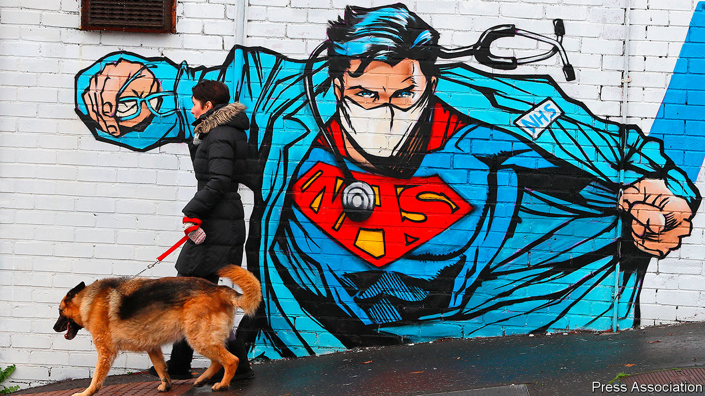
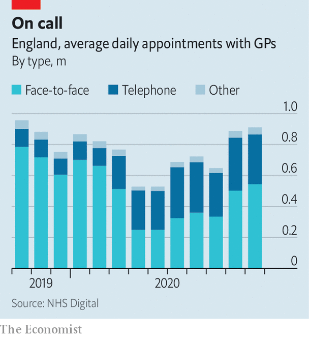
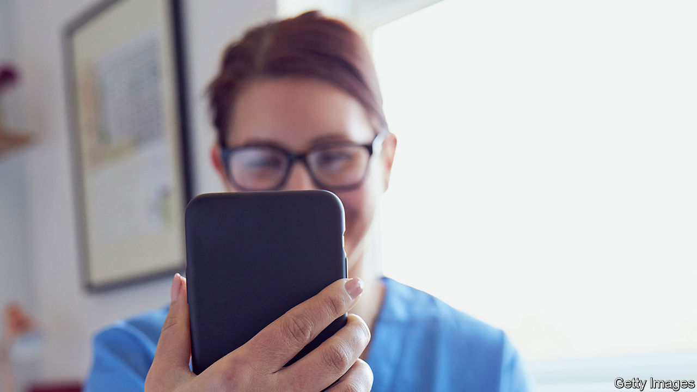

###### Health care

# How covid-19 unleashed the NHS 

##### The pandemic has brought forth a wave of innovation 

 

> Dec 3rd 2020 


ACCORDING TO SHELAGH O’RIORDAN, a consultant in geriatric medicine, patients often experience the National Health Service (NHS) as a conveyor belt. “You feel ill, you call this number. This number calls an ambulance. That ambulance tells you that you should go to hospital. You go to hospital. And then, if you’re frail, you might not come out.” Her job, as she sees it, is to help people off the conveyor belt, and even on a quiet Sunday morning the telephone keeps ringing. Most calls are from nurses, paramedics or care-home workers. After a quick chat, each is given a set of instructions about the care of the patient to whom they are attending.


Dr O’Riordan set up this home-treatment service at the start of the pandemic, spurred by the need to keep patients out of hospital. The service offers acute care at home: diagnosing, assessing and looking after frail locals who wish to avoid hospital. Operating from a nondescript office on the edge of Ashford, a town of 75,000 in Kent, by the start of November it had treated more than 2,000 patients, around a third with covid-19. In the first wave of the pandemic it was unable to replicate the care received in hospitals, with people needing to head into an infirmary for oxygen or dexamethasone (a cheap but effective steroid). Both are now available at home.


The pandemic has put the NHS under unbearable strain, but it has also unleashed a wave of innovation. Freed from bureaucracy, and pressed by the need to keep patients out of hospital, medics and health officials have rethought how care is provided. In areas from remote care, to the use of technology, to breaking down silos across the health and social-care systems, covid-19 has accelerated policies that were making slow progress. As Jennifer Dixon of the Health Foundation, a think-tank, puts it: “The safety blanket was thrown off.”


This presents an opportunity. Matt Hancock, the health secretary, has drawn a comparison to the Great Fire of London in 1666, from which emerged the fire brigade, the first insurance firms, new water regulations and St Paul’s Cathedral: “Devastating shock can force people to find new and better ways of doing things.” Those in charge of the NHS now face two big questions. The first is which of these innovations make sense beyond the pandemic, and should become permanent features of the health service. The second is whether this burst of innovation can be sustained.

 


A senior NHS official calls the widespread adoption of remote care a “move away from the dominant mode of medicine for the last 5,000 years”. Before the pandemic, 80% of appointments in primary care were face-to-face. Now they count for many fewer (see chart), and those who do see a general practitioner (GP) mostly have to go through triaging first. “The change was arguably the most extensive and rapid the NHS has ever gone through,” says Trish Greenhalgh, a professor of primary care at the University of Oxford. Yet, despite the fears of many doctors, “nothing very terrible happened”.


Remote medicine—which is now more commonly used for hospital outpatient appointments, too—offers the hope of more convenient and possibly even cheaper care (see ). Pre-pandemic evaluations found it was as effective as in-person treatment for lots of illnesses. There is, though, a caveat. Before the pandemic, remote consultations tended to be done on patients who were considered “very safe bets”, warns Dr Greenhalgh, who is leading a study to assess the impact of their widespread adoption.


Early in the pandemic, the health service signed contracts to provide Microsoft Teams and Attend Anywhere, a video-conferencing platform, to medics. It also offered reassurance on information-governance rules to those who used FaceTime, Skype or WhatsApp. In October 137,000 GP appointments took place online. Yet the same month 10m happened by telephone. “We went to products that were readily available, not the most earth-shattering, transformative digital solutions,” says Axel Heitmueller of Imperial College Health Partners, a non-profit consultancy that focuses on innovation. For the most part, existing care has been replicated (as far as possible) from a distance. In some places, though, it has been transformed.

A breath of fresh air


In north-west London, doctors had been installing a remote-monitoring system for people with high-risk diabetes. When the pandemic hit, the focus switched to covid-19. Patients in a serious condition, but short of hospital admission, were given a pulse oximeter (to measure blood-oxygen levels) and an app into which they entered its readings. “We know people sat at home through the first wave feeling fine, but with their oxygen levels going down,” says Sarah Elkin, a respiratory consultant. “This is a way of picking up earlier the people who are becoming hypoxic.”


Remote monitoring of patients is one of the frontiers of digital medicine. The pandemic injected a new urgency into its introduction. The approval of the app used in north-west London took three weeks, instead of the six months or so that would be expected in normal times. Instead of weaving through a maze of committees, it went straight to those at the top who make the final decision. Covid-19 virtual wards have since sprung up in places from Manchester to South Tees, and NHSX, the health service’s tech unit, has offered support to others who want to follow their lead. In north-west London, medics now plan to use remote monitoring to keep track of people recovering from heart attacks and with lung disease.


People focus on the whizzy technology required to do this. In fact, says one insider, the bigger challenge in schemes like these is changing work patterns and getting disparate parts of the health system to work together. For covid-19, GPs referred patients to the remote-monitoring system, working alongside hospital consultants to decide when to admit patients. This teamwork was part of a broader shift during the first wave. Across the health service, staff, equipment and ideas were shared. Hospitals shuffled responsibilities, acting as part of wider networks rather than as standalone institutions.


Bob Klaber, a director at the hospital trust in north-west London, asks why it takes a pandemic for this to happen. In the popular imagination, the NHS is a monolithic organisation, powered by goodwill. In reality it is a tangled network of organisations, many of which have competing incentives, leading to behaviour that is, with varying degrees of intensity, territorial. Dr Klaber, who also works as a paediatrician, cites the payment-by-results mechanism as one obstacle: “If I see a new patient 240 quid will come into the hospital. If a local GP who I know phones me up and says, ‘I think we could probably clear this up in a five-minute conversation on the phone’: no payment for that.”

 


The mechanism is part of the “internal market”, which was introduced by Conservative governments in the early 1990s. This separates purchasers of services (mostly GPs) from providers (mostly hospitals), which compete for contracts. Studies looking at its effectiveness have obtained mixed results, with none suggesting great success. In an age when rising numbers of (often elderly) patients have multiple health problems, and when the NHS is trying to focus on prevention rather than merely treatment, the bureaucracy and fragmentation it imposes is a problem.


Mr Hancock has said that health care must be “based on the needs of the population, not the design of the institution”, to ensure the co-operation of the pandemic continues. In recent years the government has tried to circumvent the internal market, bringing together purchasers and providers in local areas to plan services for the whole population—an idea imported from America, Germany and Singapore.


Improvements have so far been modest. A recent paper by academics at the universities of Kent and Manchester looked at “Vanguard sites”, which trialled the new approach from 2015 to 2018. It found that emergency admissions rose more slowly than elsewhere, but still increased, and that there was no significant difference in bed-occupancy rates. The NHS leadership thinks the solution is more integration; it hopes to match the financial and legal plumbing of the health service to this new reality. Accordingly, it has asked the government to introduce legislation to restructure the health service, either creating local health boards or adapting existing bodies to serve that purpose.


Along with the potential for the first major NHS legislation since 2012, next year is likely to be dominated by the need to shrink waiting lists, which ballooned during the pandemic. That places very different pressures on the health service from during the first wave, when non-urgent hospital admissions fell by around 70%. Spending has tightened and bureaucracy has reappeared. Mr Heitmueller, who formerly worked in the Cabinet Office, worries about where the spark for innovation will come from in the post-pandemic health service.


While the pace of change may slow, many of the changes will endure. Even over the summer, when the virus waned, the proportion of face-to-face appointments remained far lower than before the pandemic. Connections have been forged across the health system, and barriers broken. “The NHS surprised itself by how quickly it did some major things,” says Chris Hopson of NHS Providers, a representative group. “One of the things that will stick is that sense of the possibility of much, much more rapid change.” With lengthy queues and tight public finances, ministers must hope he is right. ■

