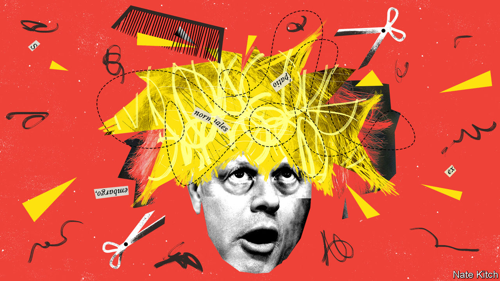

###### Bagehot

# Introducing Dan Rosenfield, Boris Johnson’s organisation man 

##### The prime minister’s new chief of staff is the antithesis of Dominic Cummings 

 

> Dec 5th 2020 


THE FIRST months of Boris Johnson’s tenure as mayor of London, back in 2008, were, by common consent, a mess. Projects fizzled. Senior aides flounced. Chaos reigned. Then “bungling Boris”, as the newspapers dubbed him, appointed a talented chief of staff. The self-effacing but effective Simon Milton brought order to chaos and turned dither into decisiveness. Mr Johnson became Britain’s most popular Tory and was re-elected by a landslide.


His first year in Downing Street recalls those early days in the mayor’s office. A slow response to the outbreak of covid-19 may have doubled the death rate; clumsy handling of the purchase of personal protective equipment left front-line workers vulnerable and led to dodgy deals to get hold of the stuff; faffing about exams generated confusion and anxiety. The angry departure of Dominic Cummings, Mr Johnson’s former chief adviser, and his Brexiteer acolytes left Downing Street shell-shocked. Party discipline has collapsed. On December 1st 53 Tory MPs voted against the government’s tiered-lockdown system and 16 abstained, the biggest revolt since Mr Johnson became prime minister.


But his premiership may be about to undergo a transformation, for he may have found himself a new Simon Milton. Dan Rosenfield is due to take over as his chief of staff on January 1st. In a political world in which almost nobody agrees on anything, almost everybody has a good word for Mr Rosenfield.


The new chief of staff’s most obvious qualification is that he is the antithesis of Mr Cummings. Mr Rosenfield is a peacemaker where Mr Cummings is a warmonger, an organiser where Mr Cummings is an ideas man, a smooth operator where Mr Cummings is spiky. Mr Cummings wanted to blow up the British establishment. Mr Rosenfield personifies it.


He spent more than ten years in the Treasury, the engine room of the British government, eventually serving as principal private secretary to both Labour’s Alistair Darling and the Conservatives’ George Osborne. He also has extensive experience in business. He left the Treasury to work as an investment banker and five years later moved to Hakluyt, a posh corporate-advisory firm with close links to the secret service, whose chairman, Paul Deighton, is also chairman of The Economist Group. Some Tories worry that, unlike two of his recent predecessors, Gavin Barwell and Nick Timothy, he is a neophyte when it comes to the ruling party’s internal machinations. But for a man with sensitive political antennae, which Mr Rosenfield clearly has, a certain distance from the warring Conservative tribes may be an advantage.


Mr Rosenfield has two qualities that his boss conspicuously lacks. As his success at Hakluyt suggests, he is a master of getting things done rather than generating ideas or spinning stories: the company expects its people to complete projects, not just to act as rainmakers. He is also steeped in economics and business. Mr Johnson’s indifference to economics puts him at a disadvantage in arguments with the Treasury, let alone in policymaking. His poor relations with business could also become a problem if Sir Keir Starmer succeeds in mending fences between Labour and the private sector. Mr Rosenfield is business-friendly to a fault.


The appointment of a new chief of staff is the centrepiece of a wide-ranging shake-up of Emperor Boris’s Praetorian Guard. The congenitally narcissistic media has fixated on the appointment of Allegra Stratton, one of its own, as head of press relations, but more interesting changes have taken place behind the scenes. Mr Johnson has appointed Neil O’Brien to run the Policy Review Board, the party’s internal think-tank. A northern MP, Brexiteer and former Treasury adviser, Mr O’Brien is a fount of ideas on what “levelling up” means in practice. Mr Johnson is also working hard to repair the damage Mr Cummings did to his relations with the parliamentary party. There are even rumours of a plan to move the Whips’ Office from Parliament back to Downing Street (Number 12, where it used to be, not Number 10). Most important of all, a big cabinet reshuffle is in the works.


Mr Rosenfield’s first day in the job could be difficult if, as looks quite possible, Britain leaves the European Union without a deal. Even if there is one, he will be wading into quicksand. The prime minister’s biggest problems are political rather than purely organisational. Brexit was always a bundle of contradictions held together by a shared hostility to the EU and a vague optimism about freedom. Mr Johnson’s taste for waffle and fudge made him the perfect leader of the movement as long as it was about protest. With the end of the transition period he will have to focus on what he likes least: making difficult decisions and tough trade-offs.


Party management is also becoming harder, as the dysmorphic Tory party completes its transition from the natural party of government into a British version of the Taliban, dominated by a bunch of right-wing revolutionaries and in a permanent state of fury and factitiousness. It was always going to be tricky for a prime minister who made his career by rebelling against the leadership to impose party discipline. The party’s disintegration into factions that reflect warring ideological and regional priorities has made it almost impossible: the One Nation group of liberal Tories, the 109 Group of new MPs (oddly named, since there are 66 of them), the Northern Research Group, the Covid Recovery Group and the grandmother of them all, the European Research Group of Eurosceptics. Many of the last lot are battle-hardened, addicted to revolt and already convinced that the Downing Street reset is an establishment plot to neuter Brexit and return to business as usual.


For all that, better organisation can improve things. Much of the mess that the government has made of the pandemic has been the result of poor management. And despite that, and despite the infighting, it is still level-pegging with Labour in the opinion polls. Imagine how things might look with a new team in Downing Street, a ruthless reshuffle and mass vaccinations under way. Don’t bet against another Miltonic resurrection. ■

