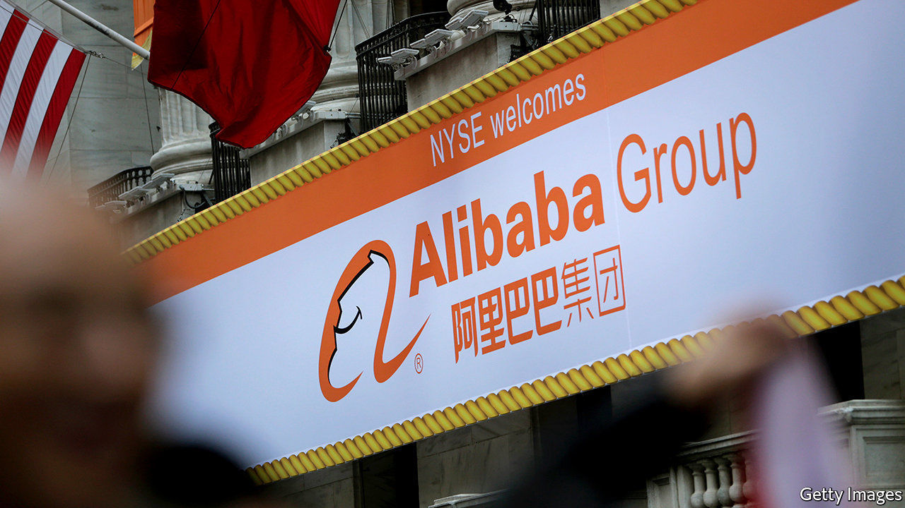
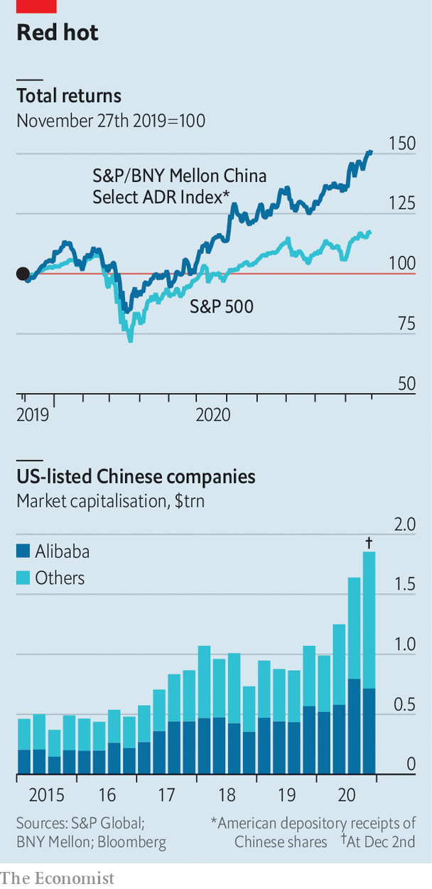

###### Exchange-traded fiends

# Congress wants to boot Chinese firms from American exchanges 

##### A spat over Chinese firms listed in America 

 

> Dec 3rd 2020 


FOR 18 YEARS American regulators have implored Beijing to let them inspect the China-based auditors of Chinese companies listed on America’s stock exchanges. Dream on, China’s Communist regime responded, citing sovereignty and national security. On December 2nd Congress had had enough. The House of Representatives passed a bill that would boot offending firms off American bourses if their auditors fail to comply with regulators’ information requests for three years running. Since it had earlier sailed through the Senate by 100 votes to nil, it can expect a presidential signature.

 


This would put Chinese businesses worth a combined $2trn at eventual risk of expulsion, including Alibaba, a New York-listed internet titan (see chart). It would make it harder for Americans to get exposure to China through American exchanges. Those hungry for juicy Chinese stocks might end up buying them abroad instead, through channels over which Washington exerts no control.

