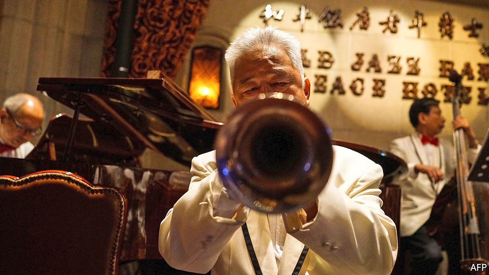

###### Accommodating climate

# How China’s Jin Jiang and Huazhu put Marriott and Hilton to shame 

##### Two Chinese hospitality groups thrive as Western rivals struggle 

 

> Dec 3rd 2020 


COVID-19 HAS, received wisdom has it, been terrible for hotels. The share prices of the eight biggest listed Western groups by room count have slipped by 14%, on average, this year. The glum consensus is, though, being challenged by two big Chinese chains. Both are enjoying resurgent demand for domestic travel as China has tamed its epidemic. And strength at home is fuelling ambitions abroad.


Jin Jiang, the world’s second-biggest hotel firm by capacity, boasted an occupancy rate of 74% in the third quarter, in line with last year and more than double that of its bigger rival, Marriott International. Its market value has soared by three-quarters this year, to $6.4bn, above better-known Asian brands such as Shangri-La and Mandarin Oriental. Huazhu, which like Jin Jiang is based in Shanghai, saw revenue per available room recover by 40% from the second quarter, to 179 yuan ($27). The group is now worth $16bn, behind only Marriott and Hilton Worldwide among the world’s listed hoteliers.


Similarly to their big Western rivals, Jin Jiang and Huazhu each owns a portfolio of brands that cater to different customers. Jin Jiang, which is controlled by Shanghai’s local government, operates everything from budget digs (think Marriott’s Fairfield Inn) to the upper end of the mass market (like Sheraton). Huazhu is a more all-encompassing group, which also competes in the luxury segment. Both companies prefer to offload the costs of hotel construction to franchisees in exchange for lower franchise fees, which enables them to expand much more rapidly. 


The pair indeed look poised to capture a greater market share at home, reckons Yulin Zhong of 86Research. In America chain hotels accounted for 72% of all hotel rooms at the end of 2019. In China the equivalent figure was just 27%. 


As incomes rise and Chinese travellers become more discerning, the standardised, dependable amenities and good service that big chains guarantee begin to look more appealing. Domestic providers of such things enjoy a substantial first-mover advantage. The number of hotel rooms in China held by Wyndham, the biggest foreign operator, is merely a third that of Huazhu and a fifth that of Jin Jiang. And their advantage is growing—the two firms have more than 7,300 hotels under development between them, mostly in China, equivalent to 47% of their existing stock.


In a bid to break into the global market, two years ago Jin Jiang purchased a majority stake in Radisson, the world’s 11th-biggest hotel operator by capacity, for $332m. In January Huazhu paid $868m for Deutsche Hospitality, a posh German group. Such tie-ups allow the new owners to study the nuances of serving a sophisticated foreign clientele without spending millions on marketing their unfamiliar brands in the West (or raising the sort of hackles that Chinese acquisitions often do in more sensitive industries such as technology or finance). As American and European hoteliers continue to reel amid the pandemic’s second wave, more last-minute deals may be on offer for the Shanghai duo. ■

