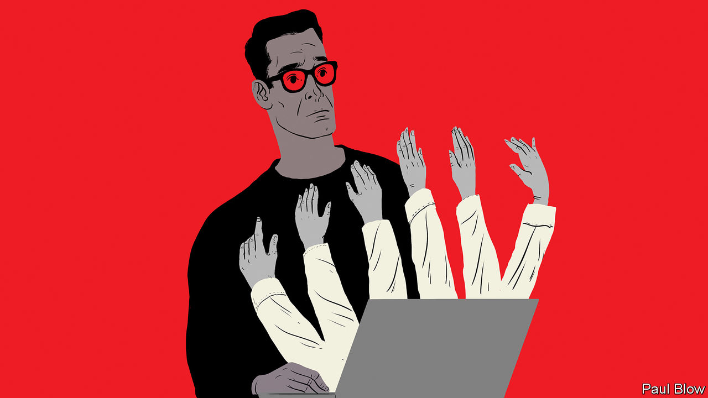

###### Bartleby

# How the pandemic is forcing managers to work harder 

##### Remote work brings benefits to employees and employers alike—but requires more effort on the part of executives 

 

> Dec 3rd 2020 


BUSINESSES ARE still struggling to understand which of the pandemic’s effects will be temporary and which will turn out to be permanent. Three new reports attempt to analyse these longer-term trends. One is from Glassdoor, a website that allows workers to rank their employers. Another is from the Boston Consulting Group (BCG), a management consultancy. The third is from the Chartered Management Institute (CMI), a British professional body. Read together, they imply that firms stand to benefit—but that managers’ lives are about to get more difficult.


One change that is all but certain to last is employees spending more of their time working at home. The Glassdoor report finds that less commuting has improved employee health and morale. Splitting the week between the home and the office is also overwhelmingly popular with workers: 70% of those surveyed wanted such a combination, 26% wanted to stay at home and just 4% desired a full-time return to the office. Perhaps as a consequence, remote work has not dented productivity—and indeed improved it in some areas. Flexible work schedules can be a cheap way to retain employees who have child-care and other home responsibilities.


Telecommuting offers other potential cost savings, and not just the reduced need for office space. Remote workers do not need to live in big cities where property is expensive. If they live in cheaper towns and suburbs, companies need not pay them as much. Glassdoor estimates that software engineers and developers who leave San Francisco could eventually face salary cuts of 21-25%; those quitting New York could expect reductions of 10-12%. As the report points out, remote employees are, in essence, competing with a global workforce and are thus in a much weaker bargaining position.


This point is reinforced by the BCG report, which finds that the pandemic has increased the willingness of companies to work with freelancers. Previously, many managers worried that legal and compliance issues prevented them from using outside staff. The pandemic forced firms to adjust their business models rapidly, and simultaneously led to growth in the pool of talented freelancers, as full-time employees had to be laid off. BCG says that “by embracing flexibility in whom they hire, internally or externally, [companies] can finally speed up operations and deliver faster on strategy.”


Despite its advantages, a remote workforce, or one consisting of more outsiders, brings challenges for managers, as the third report demonstrates. The CMI surveyed 2,300 managers and employees. The results highlight just how important effective communication, and concern for workers’ well-being, is to good management. They also unearthed an interesting difference of perspective: nearly half of senior executives thought they were engaging employees more in decision-making since the pandemic, but only 27% of employees agreed.


The survey also shows that the experience of remote working has not been uniform. Of those working virtually, 69% of women with children want to work at least one day from home when the pandemic ends, compared with 56% of men with kids. These women have had less contact with managers during the lockdown than their male peers have had, suggesting they have been neglected.


Strikingly, 48% of British staff from minority ethnic backgrounds thought that workplace culture had got better during the crisis, against 34% of all employees. This suggests something was wrong with office culture beforehand: the CMI survey found that black employees were more likely than any other ethnic group to feel their manager did not trust them to undertake their role.


So managers have a lot more work to do in responding to the pandemic. Executives need to tailor their behaviour to individual employees’ needs. Ironically, though managers may have feared that remote working would allow employees to slack, it may be that managers have not been up to the challenge. Bosses may have spent too much time videoconferencing and not enough speaking directly with subordinates.


Ask someone what it is like to work at a firm and they may respond by saying what the offices are like—whether they are cramped, in a nice location and so on. In a world of remote working, employees may stress instead how the employer communicates with them. Not so much “management by walking around” as management by phoning—or Zooming—around. Time to get dialling.


Editor’s note: Some of our covid-19 coverage is free for readers of The Economist Today, our daily . For more stories and our pandemic tracker, see our 

