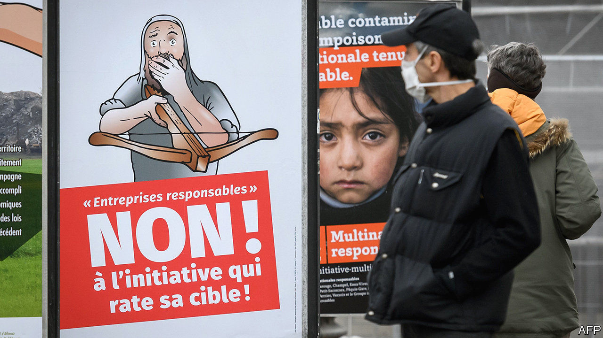

###### Swiss miss

# Swiss multinationals narrowly avoid new ethics standards 

##### A referendum on stakeholderism wins the popular vote but fails to secure enough support from cantons 

 

> Dec 5th 2020 


CORPORATE CHIEFTAINS can barely keep tabs on what their own staff are up to, let alone suppliers and subsidiaries in far-flung places. A referendum in Switzerland on November 29th proposed to change that, making Swiss multinationals liable in domestic courts for lapses in human rights or environmental stewardship along their global supply chains. The proposal failed by the narrowest of margins—a watered-down version will come into force instead.


The changes were championed by the usual foes of big business—NGOs, pressure groups and the like—with their long-standing gripes over cacao that Nestlé uses in KitKats or cobalt traded by Glencore. This political push to make companies more accountable chimes with boardroom proclamations about purpose-driven business, shareholders be damned. Corporate bosses nonetheless fiercely opposed the measures. Vague threats were made about footloose multinationals moving to laxer jurisdictions.


That won’t be necessary. Though the Responsible Business Initiative gained 50.7% of votes, it failed to carry enough cantons under the arcane Swiss system. (Another proposal, to ban the central bank from investing in defence companies, was roundly defeated.) The Swiss government, which opposed the measures, will still bring in some less stringent norms. Reporting standards will be tightened, with fines for erring. But campaigners will not be allowed to bring wayward companies to civil courts, as they had hoped.


No Swiss business is—at least publicly—in favour of child labour, human-rights abuses or environmental vandalism. But low taxes, pleasant living conditions and a historical penchant for business-friendly policies like bank secrecy have helped the Alpine confederation attract more than its fair share of global firms, some with tricky supply chains. All proclaim their attachment to corporate social responsibility, as proven by glossy brochures. But none felt being dragged through Swiss courts for misbehaviour elsewhere would do anything but enrich lawyers. Some argued that the risk of litigation may dissuade them from being open about inevitable shortcomings they are working to fix.


The referendum was seen as a prequel to wider European efforts to hold businesses accountable beyond their immediate operations. Germany has mulled a law on supply-chain standards; next year the EU will push for firms to be held responsible for human-rights abuses and environmental harm. If the Swiss experience is anything to go by, bosses will resist, stakeholder-friendly rhetoric notwithstanding.■

