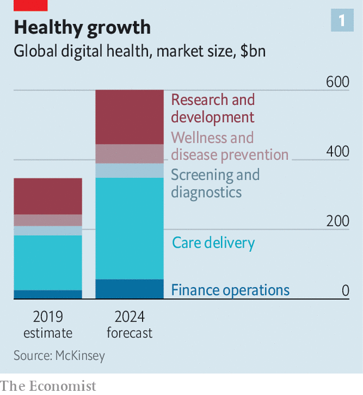
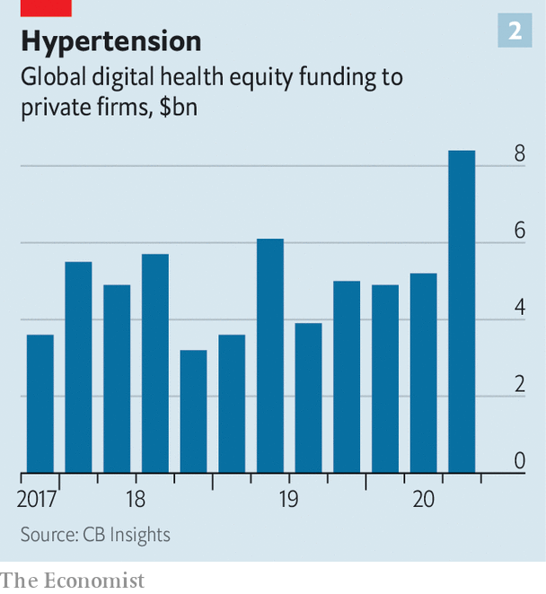
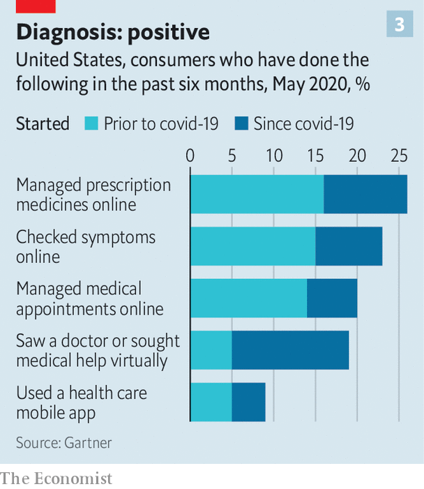

###### Health care and technology

# The dawn of digital medicine 

##### The pandemic is ushering in the next trillion-dollar industry 

 

> Dec 2nd 2020 


LAST JANUARY Stephen Klasko, chief executive of Jefferson Health, which runs hospitals in Philadelphia, chatted to a bank boss. The financier told him that 20 years ago health care and banking were the only industries yet to embrace the consumer and digital revolutions. “Now”, Mr Klasko recalls him adding, “you are alone.”


The banker had a point. The McKinsey Global Institute, the in-house think-tank of the eponymous consultancy, reckons that when it comes to digitisation, health care has indeed lagged behind not just banking but travel, retail, carmaking and even packaged goods. Some 70% of American hospitals still fax and post patient records. The CEO of a big hospital in Madrid reports virtually no electronic record-sharing across Spain’s regions when the first wave of covid-19 washed over the country this spring.


By exposing such digital deficiencies, the pandemic is at last spurring change. Confronted with shutdowns and chaos, doctors have embraced digital communication and analytics that have been common in other industries for years. Patients are growing more comfortable with remote and computer-assisted diagnosis and treatment. And enterprising firms, from health-app startups and hospitals to insurers, pharmacies and tech giants such as Amazon, Apple and Google, are scrambling to provide such services.

 


McKinsey estimates that global digital-health revenues—from telemedicine, online pharmacies, wearable devices and so on—will rise from $350bn last year to $600bn in 2024 (see chart 1). Swathes of America’s $3.6trn health-care market are in for a digital makeover. The same is happening in China, Europe and most other places where doctors ply their trade.


The groundwork for what looks poised to be the next trillion-dollar business has been accelerated by the pandemic. Money is pouring in. According to CB Insights, a research firm, a record $8.4bn of equity funding flowed into privately held digital-health darlings in the third quarter of 2020, more than double the amount a year ago (see chart 2). The industry’s unlisted “unicorns”, worth $1bn or more apiece, have a combined value of over $110bn, according to HolonIQ, a research firm. In September AmWell, a telemedic in which Google has invested $100m, raised $742m in an initial public offering (IPO); its market capitalisation is $6bn. On December 2nd JD Health, a digital pharmacy affiliated with JD.com, a Chinese online emporium, raked in $3.5bn in Hong Kong’s second-biggest IPO this year.

 


No wonder investors are giddy. Demand for digital medicine is surging. Doctolib, a French firm, says its video consultations in Europe have shot up this year from 1,000 to 100,000 a day. Ping An Good Doctor, a Chinese online health portal viewed by some as the choicest part of its insurer parent (see ), is expanding to South-East Asia in a joint venture with Grab, a Singaporean ride-hailing giant.


As with many technology fads, some of this will turn out to be hype. Sober analysts at Gartner, a research firm, pour cold water on exaggerated claims made by proponents of individualised “precision medicine” and medical artificial intelligence (AI). But even they admit there are reasons to think that not all the excitement is overblown.


Technologies such as sensors, cloud-computing and data analytics are becoming medical-grade just as the risk of contracting covid-19 in hospitals and clinics makes their adoption look more enticing than ever. Specialist firms like Livongo and Onduo make devices to monitor diabetes and other ailments continuously. A study by Stanford University found that nearly half of American doctors surveyed used such devices. Of that group, 71% regarded the data as medically useful. In June the Mayo Clinic, a prestigious non-profit hospital group, teamed up with a startup called Medically Home to provide “hospital-level care”, from infusions and imaging to rehabilitation, in patients’ bedrooms. Even the Apple Watch has been shown to predict a medical problem known as atrial fibrillation in a clinical trial.

An Apple a day


Patients are keen. A study of some 16m American ones just reported in JAMA Internal Medicine, a journal, found that their use of telemedicine surged 30-fold between January and June. American consumers surveyed in May by Gartner were increasingly using internet and mobile apps for a variety of medical needs (see chart 3).

 


Critically, regulators around the world are pressing health-care providers to open up their siloed systems—a precondition for digital health to flourish. The EU is promoting an electronic standard for medical records. In August the Indian government unveiled a plan for a digital health identity with interoperability at its core. Kuantai Yeh of Qiming, a VC firm, says that China’s government, too, is trying to overcome resistance to electronic records from hospitals fearful of losing patients to rivals. Yidu Cloud, a big-data platform for hospitals, may already be the world’s largest health data set, thinks Lee Kai-fu of Sinovation Ventures, another VC firm.


Apple, with its reputation for protecting users’ privacy, is also championing a common standard. A combination of such efforts and regulatory pressure heralds “a new era” for digital medicine, thinks Aneesh Chopra, a former White House technology chief. Judy Faulkner, boss of Epic, a leading maker of software to manage electronic health records that Mr Chopra has long urged to be more open, declares she is all for it; 40% of the data managed by her firm are already shared with non-customers, she says. Kris Joshi, who runs Change Heathcare, which handles over $1.5trn in American medical-insurance claims a year, sees more interoperability, at least between businesses.


All this is helping medicine evolve from “a clinical science supported by data to a data science supported by clinicians”, argues Pamela Spence of EY, a consultancy. Does this make health care big tech’s for the taking? Amazon wants Alexa, its digital assistant, to be able (with your permission) to analyse your cough and tell you if it is croupy or covidy. In November the online giant, which already sells just about everything else, launched a digital pharmacy to take on America’s drug-distribution coterie of pharma firms, middlemen and retailers. AliHealth, a division of Alibaba, China’s e-commerce champion, is disrupting its home pharmacy market. Its revenues leapt by 74% in the six months to September, year on year, to $1.1bn. Apple has its watch and nearly 50,000 iPhone health apps. Google’s parent company, Alphabet, has Verily, a life-sciences division.


Tech giants’ earlier forays into health care flopped, argues Shubham Singhal of McKinsey, because they had gone it alone. Medicine is a regulatory minefield with powerful incumbents where big tech’s business models, particularly the ad-supported sort, are not a natural fit. But the pandemic has also highlighted that existing providers’ snazzy hardware and pricey services too seldom genuinely improve health outcomes. If the new generation of digital technologies is to thrive it must “improve health, not increase costs”, thinks Vivian Lee of Verily. Her firm is moving away from fee-for-service to risk-based contracts that pay out when outcomes improve (eg, if diabetics get blood sugar under control or more people get eye exams).


That points to a hybrid future where Silicon Valley works more closely with traditional health-care firms. Epic is using voice-recognition software from Nuance, a startup, to enable doctors to send notes to outside specialists; it has also teamed up with Lyft, a ride-hailing firm, to ferry patients to hospitals. Siemens Healthineers, a big German health-tech firm, is working with Geisinger, an American hospital chain, to expand remote patient monitoring. Patients of India’s Apollo Hospitals can use an app to get drug refills, tele-consultations and remote diagnoses—and even secure a medical loan through Apollo’s partnership with HDFC Bank.


Dr Klasko, keen to prove the banker wrong, is embracing the hybrid approach with gusto. “You must have partnerships with providers, not just hundreds of unconnected apps.” He has brought bright sparks from General Catalyst, a VC firm that made early bets on many digital-health startups including Livongo, to work alongside his innovation team in Philadelphia. “Moving fast and breaking things does not work well in health care,” observes Hemant Taneja of General Catalyst. But nor does standing still. ■


Correction (December 3rd 2020): A previous version of this article referred to Change Healthcare as Change.

