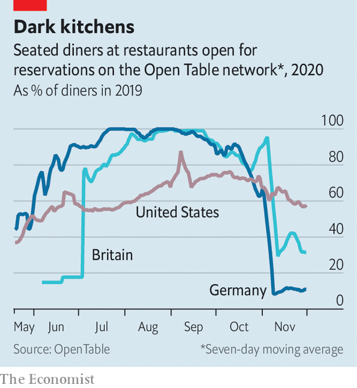

###### Malls’ last stand

# The surprising resilience of American restaurant chains 

##### The secrets behind successful pandemic gastronomy 

 

> Dec 3rd 2020 


COVID-19 HAS been brutal for big tenants of American shopping centres, such as clothing stores and cinemas. Not so for the casual eateries that surround these outlets. Many of America’s sit-down dining chains are on track to emerge stronger after two quarters of pandemic-driven innovation. The final hurdle is the winter.


Independent restaurants were early victims of lockdowns. Chewing, chatter and low air-flow made their busy floors prime candidates for super-spreader events. As early as March, state and local regulations shut down dining halls and began to whittle down the ranks of sit-down eateries. Yelp, a popular review website, reported more than 32,000 restaurant closures between March and September; 61% of these were predicted to be permanent.


Larger chains fared better. With the credit lines and corporate infrastructure to roll out new delivery methods and safety measures, they steadily stemmed losses. Plenty have now recovered or exceeded their pre-pandemic valuations.


New off-premises business has helped. Texas Roadhouse, a steakhouse chain, introduced to-go “family packs” and an online butcher selling meat to grill at home. This tided it over as it installed protective equipment and slowly reopened dining rooms. In October it reported a year-on-year increase in same-store sales.


Other chains dealt with a fall-off in diners by propping up profit margins. Darden Restaurants, the parent company of Olive Garden, slashed promotional spending and simplified menus to reduce waste and costs. Olive Garden’s margins improved even as a lack of clients in flagship locations depressed overall sales. The company felt sufficiently self-assured after the second quarter to reinstate its dividend.

 


America’s restaurant chains are outperforming international rivals, says Dennis Geiger of UBS, a bank. American consumers have steadily returned to fill seats as officials lift restrictions (see chart). In other markets stricter regulations and shyer consumers are holding back recovery. Hong Kong’s dining sector has yet to turn around from its spring collapse; receipts fell to an all-time low in the third quarter and even fast-food purchases fell by 23% relative to last year. The share price of Vapiano, a big German chain, stands at less than a tenth of its pre-pandemic level. Darden’s is back to where it was in January. Texas Roadhouse’s is up by a third.


Winter will test the strength of American chains once more, as lockdowns loom to staunch the flood of new covid cases. At least chains with a national presence think that even as northern locations grow frosty, southern states will be opening patios. And data from Yelp show that interest in outdoor dining is breaking records: it was up tenfold in early October, year on year.■


Editor’s note: Some of our covid-19 coverage is free for readers of The Economist Today, our daily . For more stories and our pandemic tracker, see our 

