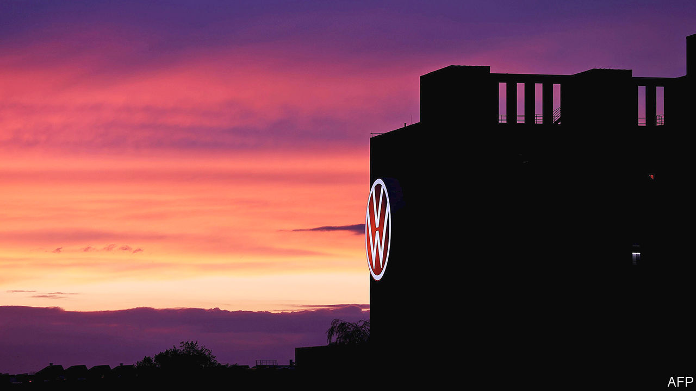

###### In the hot seat

# Volkswagen’s boss takes on the unions 

##### The fight may cost him his job 

 

> Dec 3rd 2020 


FIVE YEARS ago the Porsche and Piëch families, who control just over half of Volkswagen’s voting rights, poached Herbert Diess from BMW, a posh Bavarian carmaker. He was hired to run VW, the biggest by far of the the group’s 12 marques, because of his reputation as a cost-cutter and hard-nosed manager who would not shy away from taking on the unions. Untainted by VW’s “Dieselgate” emissions scandal, he made a good start by improving its poor profit margins. In 2018 he was rewarded with the job of running the entire group.


Only two years later the dynamic Bavarian’s job is on the line after a series of clashes with organised labour. In June Mr Diess almost got the boot because of a dust-up with the supervisory board over a leak of confidential information about the group’s software failings. He alleged it might have come from the board’s union representatives. After that he was relieved of his job as boss of vw (which he had kept).


This time the clash is more serious still. On December 1st the executive committee of the group’s 20-member supervisory board, the non-executive conclave that holds management to account, met to discuss his request for an extension of his contract. The current one runs to 2023, so extending it now would constitute a vote of confidence. No decision has been made public. The whole board will convene on December 10th.


Mr Diess demands unequivocal backing from the board so that he can fulfil his mission to cut vw’s bloated workforce and boost profitability (which is lagging far behind Audi and Porsche, the stars of the group). He wants to fill the soon-to-be-vacant job of chief financial officer with an ally, perhaps Arno Antlitz, Audi’s finance chief. He also intends to make his confidant the group’s head of procurement. The two roles are central to his drive to boost efficiency at VW, which recently approved a €150bn ($181bn) investment plan.


Bernd Osterloh, who heads the works council and also sits on the supervisory board’s executive committee, voted down Mr Antlitz and other candidates for the two jobs suggested by Mr Diess. That provoked Mr Diess to ask the board for support. Stefan Weil is the state premier of Lower Saxony, which, as the owner of 20% of VW shares, is entitled to two seats on the supervisory board. The Volkswagen law from 1960, which limits the voting rights of any shareholder to 20%, gives Lower Saxony a veto on any major decision. To protect investment and jobs in the region, representatives of the Land invariably back the board’s ten labour representatives, which means that organised labour tends to call the shots on VW’s board.


“Osterloh and Weil will try to bring down Diess,” predicts Ferdinand Dudenhöffer of the Centre for Automotive Research, a think-tank. Mr Diess, who can be gruff, clashed with Mr Osterloh soon after he arrived from BMW—and regularly since then. On November 28th he published a manifesto on how to transform VW into a digital company focused on electric vehicles. “When I started in Wolfsburg, I was determined to change the Volkswagen system,” he wrote of his early days at VW’s headquarters. Mr Diess wanted to “break down antiquated structures, and make the company more agile and modern”. He succeeded in some areas, he said, but not everywhere.


“Lower Saxony should give up its voting rights,” thinks Mr Dudenhöffer. Otherwise VW will remain constrained by its “provincial corset”. Mr Dudenhöffer believes that Dieselgate would not have happened without VW’s skewed corporate governance. With unions refusing to allow lay-offs, he explains, cheating may have seemed the only way to increase its profit margins. Toyota sells almost the same number of cars worldwide as VW with roughly two-fifths of the workforce.


Bernstein, a research firm, published an open letter to board members in November urging them either to back Mr Diess or to sack him. Corporate Germany’s traditional model of co-determination has gone too far at vw, the letter says. It is supposed to help bosses and labour to work together rather than fight each other at every turn. Even if the board backs Mr Diess this time, the infighting will soon resume. It may be time to consider repealing the counterproductive Volkswagen law.■

