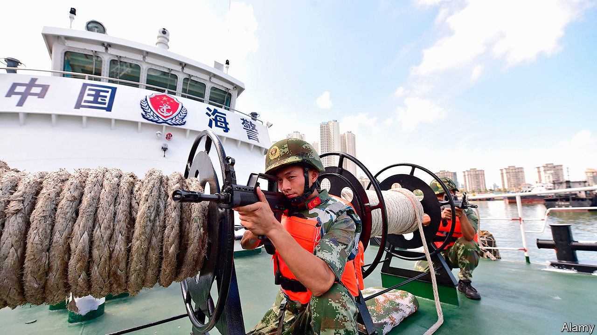
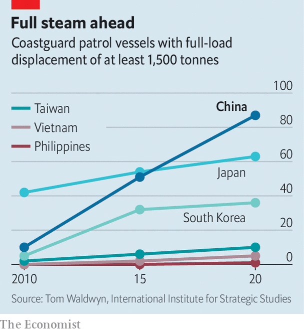

###### Great white hulls

# A new law would unshackle China’s coastguard, far from its coast 

##### It is the world’s biggest, and intends to use its muscle 

 

> Dec 5th 2020 


THE ZHAOTOU-CLASS cutter may be a lowly coastguard ship. But it is no pushover. At 12,000 tonnes, it is the world’s largest vessel built for such use. It looms over most American or Japanese destroyers. Its roomy deck accommodates two helicopters, a 76mm gun and a thicket of other weaponry. China has two of them. One is deployed on its east coast. The newest, CCG 3901 (the letters stand for “China Coast Guard”), set sail in 2017 on its maiden patrol of the South China Sea, its designated sphere of operation. Nowhere around China’s shores are waters more contested. The arrival of the behemoth is intended to make a point: China backs its claims in that area with a panoply of steel.


Soon CCG 3901 will have extra ammunition. In November China published a draft law that would empower the coastguard to demolish other countries’ structures built on Chinese-claimed reefs, and to board and expel foreign vessels. In some circumstances it could even fire on hostile ships. The deadline for public comment expired as The Economist went to press.


Over the past decade, the seas around China have been roiled by rival activity and enmity. In the East China Sea, Chinese vessels have been probing waters around the Japanese-held Senkaku islands—uninhabited outcrops which China also claims (and calls the Diaoyu). In the South China Sea China has turned disputed reefs into island fortresses. America and its allies have in turn sent a growing parade of warships to challenge China’s claims there. China’s navy, the world’s largest, has been ever more active, too. But its coastguard, also the world’s largest, has become increasingly important in this contest.


In 2013 China merged several civilian maritime law-enforcement agencies into a new unified one, called the Chinese Coastguard Bureau. Five years later this was put under the command of the People’s Armed Police, a paramilitary force that reports to the Central Military Commission, the country’s supreme military body. In effect, this turned China’s coastguard into a branch of the armed forces—much like its counterparts in America and India.


It has also benefited from a shipbuilding spree. Today China’s coastguard has more than 500 ships. In the region, Japan is a distant second with 373. Others trail far behind. Taiwan has 161, the Philippines 86 and Indonesia a mere 41. China’s ships have got beefier, too. A decade ago China had just ten vessels with a full-load displacement of at least 1,500 tonnes (about the size of a small warship). By 2015 it had 51 such ships. Today it has 87, says the International Institute for Strategic Studies, a London-based think-tank.


Many of the coastguard’s ships now dwarf the largest warships in the region’s smallest navies. The most capable, says Olli Suorsa of the S. Rajaratnam School of International Studies (RSIS) in Singapore, are “essentially navy ships painted white”, minus the missiles (though that is also true of Japan’s coastguard). The Type 818 patrol ship, for instance, is a modified version of the Chinese navy’s Type 054A frigate. Such large ships are less agile than smaller ones, but they convey suitable menace.

 


That comes in handy, for China uses its coastguard not only for routine maritime law-enforcement—such as catching smugglers—but also to project power. When China dispatched the HD8, a survey vessel, to Vietnam’s exclusive economic zone last year, it sent a flotilla of coastguard ships, including the CCG 3901, as back-up. Some blocked Vietnamese coastguard ships from approaching. When the HD8 was sent to Malaysian economic waters in April, the CCG 3901 tagged along again. A report published last year by the Centre for Strategic and International Studies in Washington, found that 14 Chinese coastguard vessels patrolling disputed features in the South China Sea had broadcast their location on the Automated Identification System, an international ship-tracking network, to demonstrate a “routine, highly visible Chinese presence”. The Chinese coastguard’s near-constant vigil in the South China Sea has been helped by the supplies it receives from China’s newly built outposts there.


In the East China Sea, coastguard ships have spent a record number of days this year near the Senkakus. In October two of its vessels sailed in the islands’ territorial waters (ie, less than 12 nautical miles from shore) and stayed for longer than 39 hours, the previous record.


Sometimes the coastguard is used in support of China’s “maritime militia” of armed fishing vessels, which the country uses to establish a presence in disputed waters. In April Vietnam accused China’s coastguard of ramming and sinking a Vietnamese fishing vessel near the Paracel islands in the South China Sea, to which both countries lay claim. It was the second such incident there in less than a year.


America worries about the Chinese coastguard’s growing role as an enhancer of Chinese maritime power. Last year an American admiral hinted that, in the event of a clash, America’s navy would treat vessels belonging to China’s coastguard and maritime militia no differently from those of its navy. In October America said it would explore the viability of deploying its own coastguard vessels to American Samoa, in the South Pacific, to counter China’s “illegal, unreported and unregulated fishing, and harassment of vessels”.


China has reacted huffily to other countries’ concerns about the draft coastguard law. To some extent, it is right to be miffed. Most of the bill’s provisions match those of laws elsewhere and accord with international norms, says Collin Koh of RSIS.


But there is every reason to worry about the Chinese law’s proposed scope. It covers China’s “jurisdictional waters”, a term that the country applies to most of the South China Sea, says Ryan Martinson of the US Naval War College. Most of those waters are claimed by other countries or regarded as part of the global commons. China’s sweeping assertion of rights there was largely rejected in 2016 by the Permanent Court of Arbitration, an international tribunal in The Hague. Article 22 of the draft bill would allow China’s coastguard to create “temporary exclusion zones”, potentially cordoning off swathes of open ocean.


According to Mr Koh, the Chinese coastguard has been complaining for years that it needs such a law to give it more clout in its dealings with rival forces in the South China Sea. The coastguard is “powerful”, says Hu Bo, director of the Beijing-based South China Sea Strategic Situation Probing Initiative, a think-tank. But, he adds, it has a “heavy task”. In 2016, when Indonesia’s navy fired on a Chinese fishing boat and detained its crew, the coastguard felt powerless to respond—worried, apparently, that using force without explicit legal backing might harm China’s image. “It was a big failure,” says Mr Martinson. “There was likely a lot of soul-searching after that.” The new law will serve notice that the white-hulls may shoot back. ■

