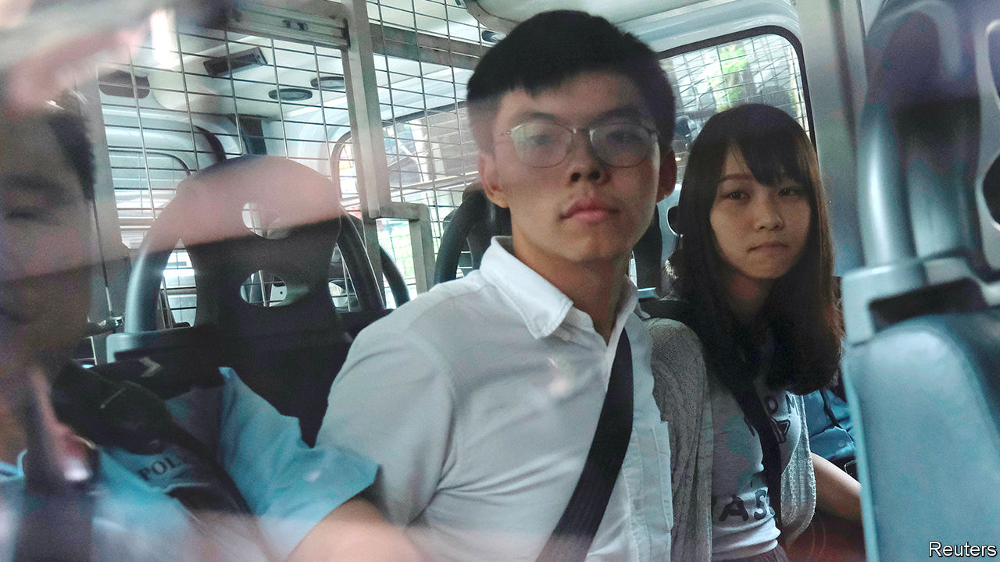

###### Where the party wants him

# Joshua Wong is jailed 

##### A leader of Hong Kong’s pro-democracy movement gets 13 months 

 

> Dec 3rd 2020 


JOSHUA WONG, one of the best-known faces of Hong Kong’s pro-democracy movement, was sentenced on December 2nd to more than 13 months in prison for his role in a protest last year. Mr Wong, pictured, has been riling the Chinese Communist Party for over a decade with his activism. Agnes Chow and Ivan Lam, co-leaders of his now-disbanded group, Demosisto, also received jail sentences of several months each.■

