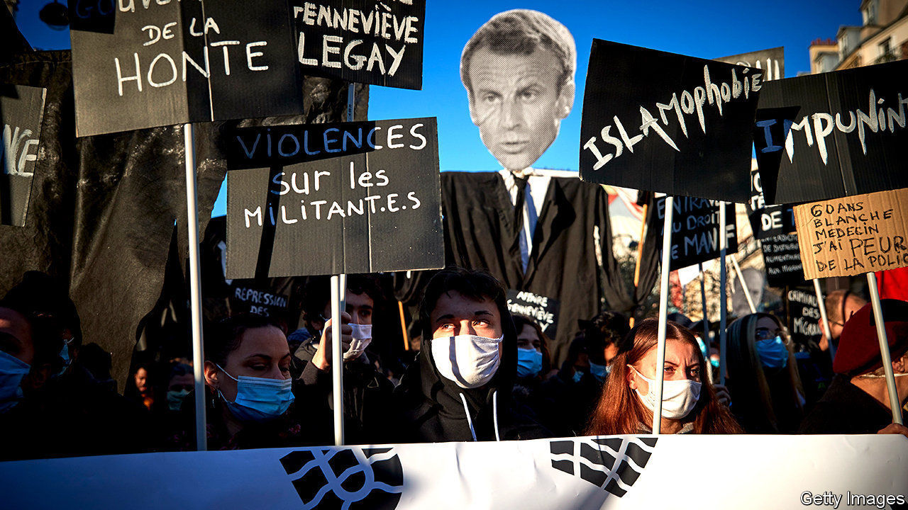

###### Demi-tour

# After police are filmed beating a black man, France does a U-turn 

##### A gagging bill that could shield cops is being revised 

 

> Dec 5th 2020 


AT 6.42PM ON November 21st, three policemen forced their way into a recording studio in a smart area of Paris and savagely beat up Michel Zecler, a black record producer. Pursued for not wearing a face mask, Mr Zecler initially spent 48 hours in detention for violence against the police, and says that during the beating he was called a “sale nègre (dirty negro)”. On November 30th, four days after a surveillance video of his beating was posted on social media, contradicting the officers’ account, preliminary charges were brought against the three, for intentional violence and the falsification of police records. All have been suspended.


The episode not only shocked France; President Emmanuel Macron said on social media that it “put us to shame”. It has also prompted an extraordinary U-turn by the government. For the beating took place as a controversial “general security” bill designed to reinforce police powers was going through parliament. Article 24 of the draft law, which was passed by the lower house on November 24th and will next go to the Senate, would forbid the posting or broadcasting of any image that identifies an individual officer during a police operation “with the manifest aim of physically or psychologically causing them harm”. Had the bill already been on the statute books, it might have made posting the video that exposed Mr Zecler’s ordeal illegal.


The point of Article 24, according to Gérald Darmanin, the hard-line interior minister who drafted it (presumably with Mr Macron’s initial approval), is to protect the police from attempts to identify and target individuals, whether physically or on social media. French policemen regularly get online threats. In 2016 a police officer and a police employee were stabbed to death in front of their three-year-old son in Magnanville, a town north-west of Paris. Investigators found a list of names of police officers, among other figures, on the perpetrator’s computer.


The French media and others worried about press freedom, however, cried foul. An editorial in Le Monde, a newspaper, called Article 24 “pernicious”. Ten deputies from Mr Macron’s party, La République en Marche (LREM), voted against the bill, and 30 more abstained. On November 28th tens of thousands of people took to the streets of cities across France to protest. Even Macronistes are concerned about the president’s drift to the right on security matters.


At first, the government tried to defend Article 24. Faced with a groundswell of hostile opinion, however, Mr Macron on November 30th told parliamentarians at a crisis meeting at the Elysée Palace to rewrite the article completely. “It’s not a very glorious way of getting out of the situation,” says Roland Lescure, an LREM deputy. “But at least it’s clear and quick, and a way of saying ‘sorry, we got it wrong, let’s go back to the drawing board.’”


Mr Macron’s U-turn over Article 24 may now defuse the tension over press freedom. But the events that helped to prompt the reversal, and in particular Mr Zecler’s beating, will require a longer-term policy response. France does not collect data on its citizens’ ethnicity, so it is difficult to know the scale of racial discrimination. But an official study in 2016 found that a young man “perceived as black or Arab” is far more likely to be stopped for an identity-card check than anyone else. Mr Darmanin, who now finds himself under internal pressure, has promised to come up with a proper review of training and diversity, as well as police oversight and discipline. It may have taken a particularly nasty case, but the problem of racism among the French police is at least beginning to be acknowledged. ■

