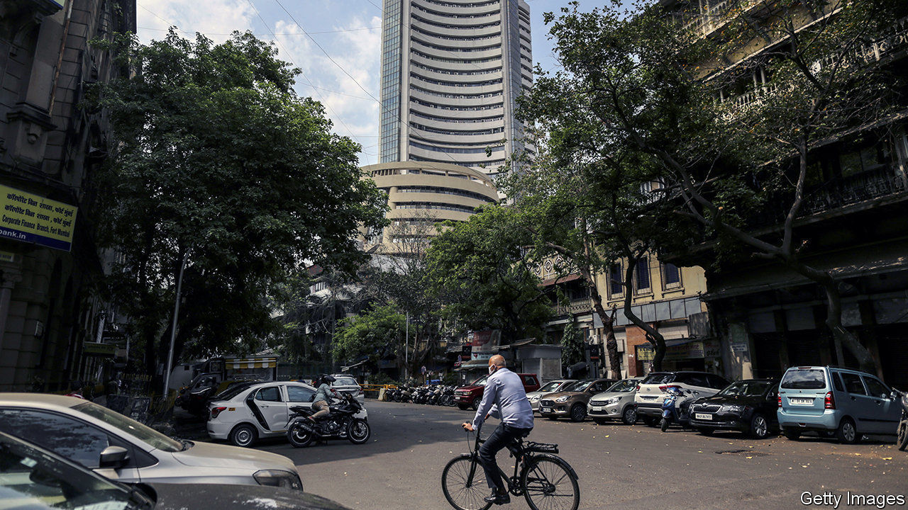
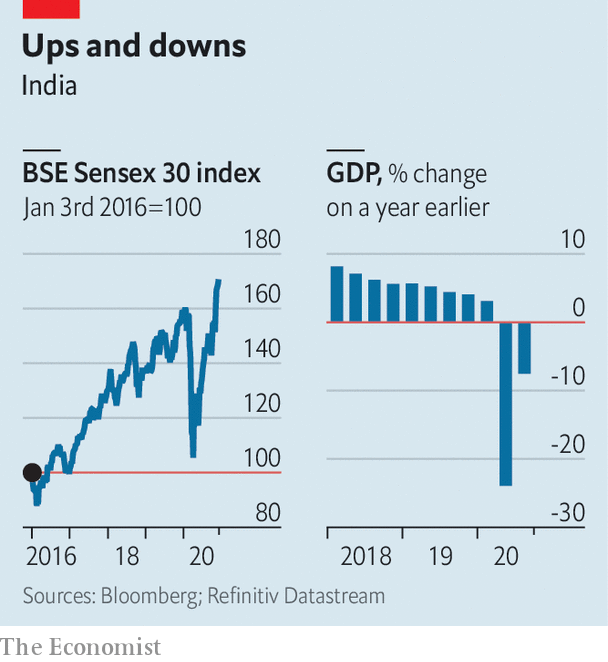

###### Dramatic disconnect

# Despite a weak economy, India’s stockmarket is at record highs 

##### What do investors know that economists don’t? 

 

> Dec 5th 2020 


THE MOOD ON Dalal Street, Mumbai’s version of Wall Street, is jubilant. Record highs are being achieved in one session after another on the Bombay Stock Exchange, most recently on December 2nd. The Sensex, an index of the country’s biggest 30 firms, is up by around 72% since March 23rd, the day before India went into its strict lockdown; so too is the broader-based BSE 500. That is one of the largest rises among the world’s ten biggest economies. Share prices across all of the 79 sectors tracked by Capitaline, a data provider, have risen. Those for makers of cement products have gone up by 139%; those of carmakers by 89%; even those of real-estate investment trusts, hobbled by shutdowns, have risen by 5%.


This picture seems in striking contrast to that of the economy, which sustained the deepest downturn of all large countries. In the second quarter India’s GDP fell by 24% compared with the previous year; in the third, according to figures released on November 27th, it was still 7.5% lower than a year ago. The Centre for Monitoring Indian Economy (CMIE), a research firm, estimates that more than 21m jobs have been lost since the pandemic struck. In November the labour-participation rate dropped below 40% for the first time.


Meanwhile, inflation has been rising, limiting the Reserve Bank of India’s ability to cut interest rates. In October, consumer prices rose by 7.6%, well above the upper bound of the central bank’s target range. Years of deficit spending and a shortfall in tax collection mean there is little latitude for fiscal policy, either. In the third quarter, government spending fell by 22% compared with the same three months in 2019.

 


Yet it is not necessarily a contradiction for the stockmarket and the economy to go in different directions. They measure different things: the present value of future profits in the first case, and current business conditions in the second. Perhaps the stockmarket has been early in understanding India’s resilience, just as it was quick to grasp the severity of the epidemic. Share prices fell by nearly 40% between mid-February and late March, as supply chains fell apart and activity came to a standstill. Now factories are open, airports are crowded, the roads jammed with traffic and the air clogged by pollution. A renewed appetite for global risk, especially after news of effective vaccines broke, has only helped. In recent months India has been the recipient of record portfolio flows from abroad.


Investors may also have become more optimistic on growth prospects. The crisis has allowed the government to push through rule changes, such as agricultural and labour reforms, which could introduce needed efficiency. Its “Make in India” campaign is tariff-heavy, but also offers incentives to lure in foreign producers. Recent policy moves, such as the adoption of a goods-and-services tax, may have also toughened the environment for small, less formal firms, and pushed profits towards larger, listed ones.


Companies’ profits rose in the third quarter, even though revenues fell. The cost-cutting could signal greater efficiency. But it could also be a story that ends unhappily for investors, if it explains low employment and why, in the recent GDP numbers, household spending remained depressed. Growth in power consumption and freight traffic has begun to slow, suggesting the recovery may be sputtering. That would seem to bode ill for both the economy and the stockmarket. For now, though, investors are unfazed. ■


Editor’s note: Some of our covid-19 coverage is free for readers of The Economist Today, our daily . For more stories and our pandemic tracker, see our 

