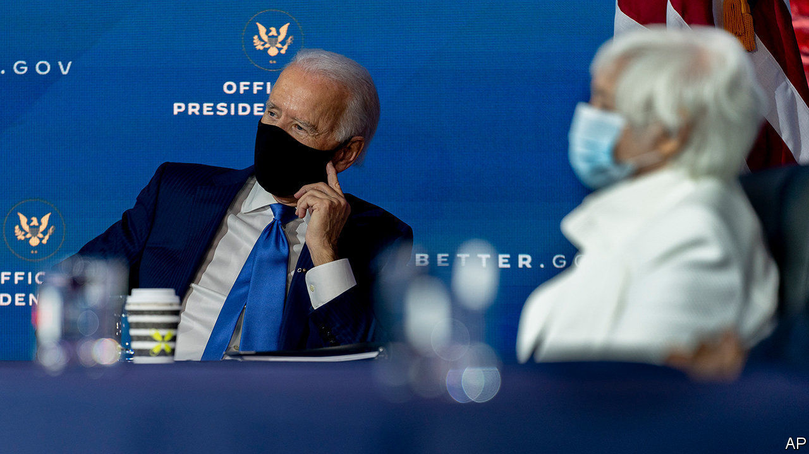

###### Presidential picks

# Joe Biden’s choice of economic advisers signals his priorities 

##### The team stands out for its diversity, and its emphasis on climate change and labour rights 

 

> Dec 5th 2020 


JOE BIDEN’S record as president may well hinge on his response to America’s economic woes. On December 1st the president-elect launched his effort to right the economy, when he formally unveiled his choices for top policy jobs. His economic team stands out for its diversity, its interest in climate change, and its emphasis on the welfare of working people, sending a clear signal of Mr Biden’s priorities. Its overriding challenge, though, will be to repair an economy battered by covid-19.


Many of the names on the slate are familiar. If confirmed by the Senate, Janet Yellen will become America’s first female treasury secretary. She is assembling one of the more impressive public-service careers in the economics profession, having led the Council of Economic Advisers (CEA) during the Clinton administration, and the Federal Reserve from 2014 to 2018.


Experience aside, Ms Yellen’s broad acceptability across Democratic factions no doubt was a point in her favour. By contrast, Mr Biden’s CEA—an advisory body of wonks that aims to ground the president’s policies in sound economics—may be the most progressive in recent memory. It will be led by Cecilia Rouse, an economist at Princeton University, who if confirmed would be the first black woman to chair the council. Ms Rouse is no stranger to Washington, having advised both Bill Clinton and Barack Obama during their terms. She has also done impressive research; her work showing that student debt may deter low-income students from enrolling at university, for instance, may be especially pertinent given a running debate in Washington over the wisdom of cancelling student loans. Jared Bernstein, who advised Mr Biden on economic policy during his vice-presidency and has long been an advocate of pro-labour policies, will join Ms Rouse. So too will Heather Boushey, who runs the Washington Centre for Equitable Growth, a left-leaning think-tank. Ms Boushey has argued forcefully that generous government support for women and families is a key ingredient of broad-based prosperity. (Neither Mr Bernstein nor Ms Boushey require Senate confirmation.)


Other appointments have been greeted less warmly by the left. Brian Deese, who has been chosen to lead the National Economic Council, the president’s top economic-policymaking body, worked at BlackRock, an asset manager, after serving as an adviser to Mr Obama—causing some to worry about a revolving door between government and business. But Mr Deese’s portfolio, which involves directing investment in climate and sustainability initiatives, has muted some of the criticism—and shows the importance that Mr Biden places on tackling climate change.


Neera Tanden, the head of the Centre for American Progress, a left-leaning think-tank, and Mr Biden’s choice to run the Office of Management and Budget, is a more divisive figure, known for picking fights with far-left supporters of Senator Bernie Sanders. Republican senators have expressed discomfort with her nomination too; she may face the fiercest confirmation row of them all. But confirmation will be only the first of the team’s many challenges. Reforming the economy in the face of a slump and Republican opposition will be no easy task. ■


Dig deeper:

Read our , and then sign up for Checks and Balance, our  and  on American politics.

