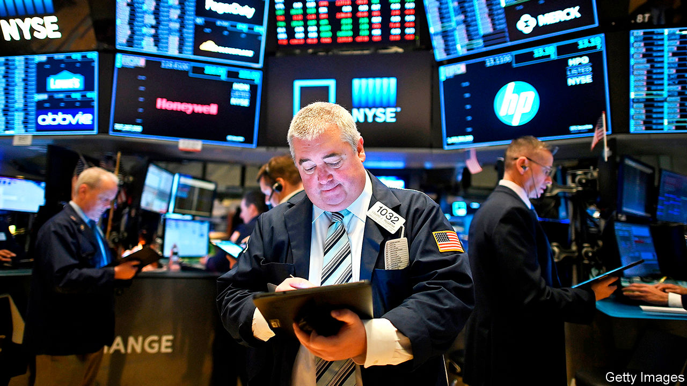

###### Go figure

# Meet the data firms cashing in on the quant-investing boom 

##### S&P’s plan to buy IHS Markit is the latest in a slew of deals in the industry 

 

> Dec 5th 2020 


TRADERS AND their Bloomberg terminals are seldom parted. Some 330,000 people fork out around $25,000 annually to access Bloomberg’s suite of services: financial-market data; graphing and pricing tools; the ability to chat with other market participants. These functions are so vital for bond traders, hedge-fund managers and pension-fund investors that, when the pandemic closed offices worldwide, many lugged their terminals home in taxi cabs.


As quantitative investing swells and algorithms dominate financial markets, though, the demand for data is changing. A human stock-picker might prefer a single slick platform through which they can build charts and chat to their broker, but quantitative firms want to be plugged into vast data sets that they can sift for signals. One of the quickest-growing slices of the market-data industry for the past five years has been direct selling to investment managers, rather than traders. And a motley, fragmented bunch of providers are having enormous success selling proprietary data directly to quantitative managers. A reminder of this came on November 30th when S&amp;P, a rating agency and financial-information firm, said it would buy IHS Markit, a credit-data provider, for $44bn. The tie-up is the second-largest acquisition announced this year, behind only a $56bn Chinese oil-pipeline deal in July.


The providers that are winning from the quant boom are doing so almost by historical accident. Some—such as Nasdaq and Intercontinental Exchange (ICE), which run exchanges—were once merely financial-market plumbers, clearing transactions and matching trades. Other niche players, like IHS Markit, started off by providing pricing for the opaque market in credit-default swaps, hoping to tap investors’ growing appetite for derivatives. The transaction data these firms accumulated used to be a by-product. Now they are “the lifeblood of finance”, says Audrey Blater of Aite Group, a research firm. Market-data revenues have grown by around 5-8% per year for the past five years and margins are fat. S&amp;P has an operating margin of 56%, 16 percentage points more than five years ago.


Now these once entirely disparate firms are teaming up. The S&amp;P and IHS Markit merger follows a slew of similar deals. In 2019 the London Stock Exchange (LSE) agreed to buy Refinitiv, a financial-data service once owned by Thomson Reuters, for $27bn. In September this year ICE bought Ellie Mae, a mortgage-information provider, for $11bn.


Incumbents hope these mega-mergers will allow providers to reap economies of scale and create data bundles that appeal to clients. Like the giants of consumer technology, financial-data firms are seeking to create “ecosystems” that clients never have to leave, says Ms Blater. Such scale economies certainly seem to exist for S&amp;P and IHS Markit. The companies expect around $480m in annual savings, but Hamzah Mazari of Jefferies, an investment bank, thinks they could end up closer to $600m. The transaction should also create revenue-generating synergies, which the pair estimates at an annual $350m. That is because they have complementary businesses and serve the same pool of clients. S&amp;P provides equities indices, for instance, whereas IHS Markit looms large in the pricing of bonds. The combined entity could sell its array of products through enterprise-wide contracts, charging clients a fee for all-you-can-consume data.


All this makes regulators worry about the growing market power of a shrinking group of data providers. European watchdogs are due to make a decision on LSE’S purchase of Refinitiv by mid-January. But they may not do much to block the union between S&amp;P and IHS Markit. Mr Mazari says overlaps between the firms’ businesses do not amount to more than 10-12% of their revenues, so concentration in their various segments will not rise by much. But whether the deals are pulled off or not, their size shows how the industry is being recast. For decades rivals attempted to usurp Bloomberg by offering similar but cheaper platforms. Traders may still clutch at their terminals, but the market for data is being transformed. ■

