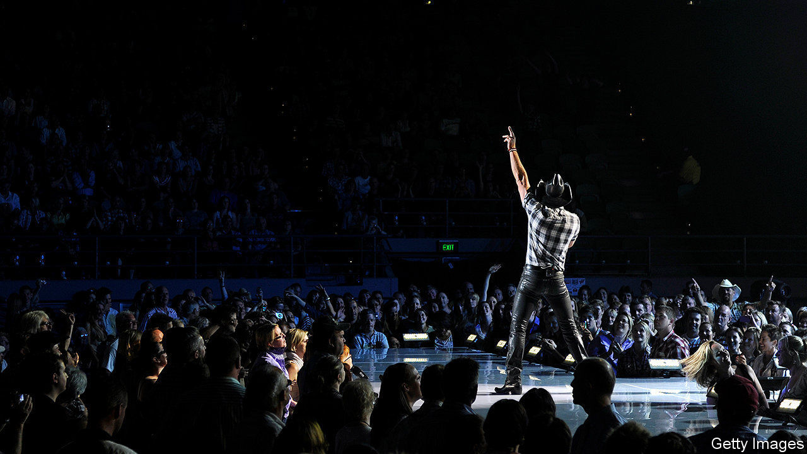

###### Tuning in

# Music royalties are proving a hit for investors 

##### Apart from being fun to own, they offer steady dividends 

 

> Dec 3rd 2020 


BEN STENNIS is a country-music songwriter from Nashville who has written hits for performers such as Tim McGraw and Jason Aldean. Earlier this year, as the music industry was stopped in its tracks by the coronavirus, a company called Royalty Exchange offered him the chance to raise some cash. Since 2016 it has run an online marketplace that brings together musicians who want to sell their work and punters wanting to invest in royalties. Anthony Martini, a partner in Royalty Exchange, says it has 25,000 potential investors on its books, from pension funds to “dentists from Ohio”. The rate of investors signing up has doubled this year, compared with 2019.


Music royalties are a complicated business. When a song is recorded, copyrights are created both for the composition of the song and the recording itself. Each of those rights is then split into mechanical rights (generated when a song is sold in a physical format or streamed), performance rights (when it is played on the radio or live at a concert) and synchronisation rights (when it appears in a film, television programme or a video game).


The idea of investing in royalties is not new. In 1985 Michael Jackson forked out $47.5m for the rights to the recordings of around 250 songs by The Beatles; Taylor Swift is trying to buy the rights to some of her master tapes after her previous record label was sold. But firms like Royalty Exchange are making rights affordable to a wider pool of investors; some auctions start with prices in the four figures. (Mr Stennis sold his rights, and paid off his mortgage with the proceeds.)


There are several reasons why music royalties seem attractive at the moment. Mr Martini believes investors are drawn in by a rate of return that is insulated from macroeconomic trends. Music rights offer a predictable stream of income—people tend to tune in no matter what the economy is doing. Owning a song is more fun than buying a slice of a company. And once they have been bought, songs need not require much attention.


Not everyone agrees that buying royalties should be a passive business, though. In 2018 a former manager of Iron Maiden and Guns N’ Roses, Merck Mercuriadis, founded an investment company called Hipgnosis. More than 90% of the firm’s shares are held by institutional investors, including AXA, an insurer, and the Church of England. The aim is to improve the lot of songwriters, who do not have the same opportunities as performers to make money through tours and merchandise.


Hipgnosis has spent more than £650m ($870m) buying the rights to over 13,000 songs. It now owns a share of eight of the 25 most-played songs of all time on Spotify, a streaming platform, including tunes co-written with Ed Sheeran (“Shape of You”) and Justin Bieber (“Love Yourself”). In addition to the hits, Mr Mercuriadis also wants to boost returns from songs that have “been left to languish” by big labels.


Hipgnosis seeks to promote its catalogue by trying to place them in films, TV programmes and streaming playlists. Since it went public in July 2018, the cumulative return on its net asset value is just shy of 40%. Music to investors’ ears. ■

