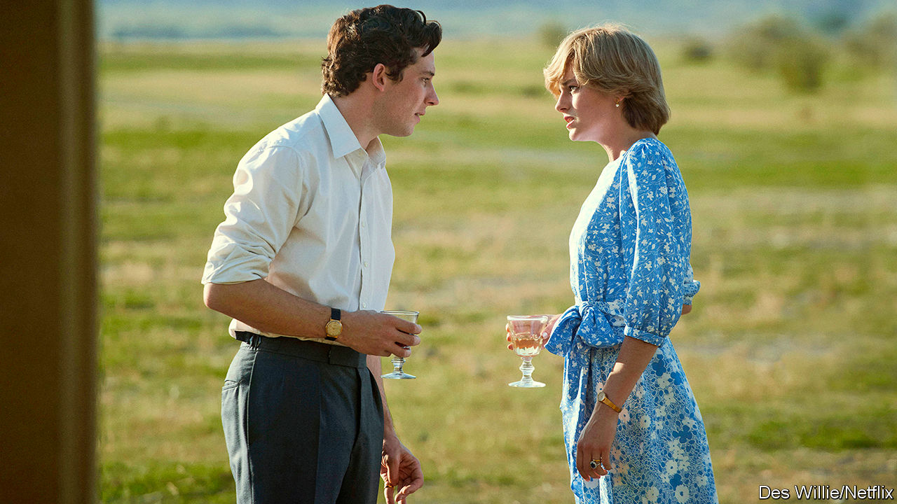

###### Uneasy lies the head of production

# Does it matter if “The Crown” fictionalises reality? 

##### It is more truthful than the story the royals sold 

 

> Dec 5th 2020 


“I’M STRUGGLING TO find any redeeming features in these people at all,” says Margaret Thatcher to her husband Denis in the course of a visit to Balmoral Castle, where the Thatchers are snubbed, humiliated and forced to play an after-dinner game called Ibble Dibble in which players smear their faces with burnt cork while getting drunk. Oliver Dowden, Britain’s culture secretary, takes a similar view of the portrayal of the Royal Family in “The Crown”. He believes that the real royals have been traduced by Netflix, which makes the drama, and has demanded that the company issue a health warning before future episodes, pointing out that the programme is fiction.


It seems odd that a government led by a man who is writing a book on Shakespeare should insist on historical accuracy in drama. Boris Johnson has not been heard complaining that “Richard III” libels a supposedly non-nepoticidal monarch. All drama that involves real people is, to some extent, fiction: when Charles and Diana stared into each other’s eyes and realised it was over, no one else was in the room where it happened. If those being portrayed are dead, decently behaved and unimportant, nobody cares what lines script writers make up for them. But if they are alive, adulterous and the heir to the throne, things are bound to get sticky.


It is not surprising, then, that the release of the latest episodes has been accompanied by the sound of remote controls ricocheting off Home County walls. Conservatives are furious because their pin-up, Margaret Thatcher, appears as a rasping termagant determined to spill the blood of Argentines and rub the noses of the poor in the dirt. The royals’ friends and flunkeys are outraged that the Windsors are portrayed as cold-hearted bullies who drive Diana to bulimia. The series, they claim, is untrue, unfair and will harm the monarchy.


If the monarchy is so vulnerable that a man pretending to be Prince Charles saying mean things to a woman pretending to be his wife damages it gravely, then the institution has probably outlived its usefulness. Famous people are often portrayed in ways they do not like, but that is one of the costs of free speech. If they feel strongly enough about it, they can sue; but Netflix’s lawyers are probably not sitting by the phone.


The most interesting charge is of untruth. Certainly, “The Crown” distorts chronology and invents events. Prince Philip was not estranged from his mother. The queen did not visit Churchill on his deathbed. The row between Lord Mountbatten and Prince Charles before the prince’s mentor is blown up by the IRA is, so far as anybody knows, made up. Yet the monarchy, too, is a purveyor of fiction. “Richard III” was propaganda written by a Tudor toady to justify the overthrow of the previous regime. The Windsors constructed their own happy-family story, which turned out to be less true than the fictionalised tale of dysfunction and despair. And, all in all, they do not come badly out of “The Crown”. Its theme is the conflict between duty and personal fulfilment, which causes pain to cascade down from generation to generation. That is no fiction.


Since a government wedded to free speech is unlikely to haul Netflix’s chief executive to the Tower of London for ignoring Mr Dowden, the intervention should be read as mere virtue-signalling to conservative Britons. Still, the government’s concern for veracity is welcome. Perhaps in future Mr Johnson will pay closer attention to the truth than he did when heading a campaign to leave the European Union which claimed that Brexit would save the country £350m a week, or when he said over a year ago that a trade deal was “oven-ready”. Those lies could lead to a geopolitical divorce far messier than the Windsors’.■

