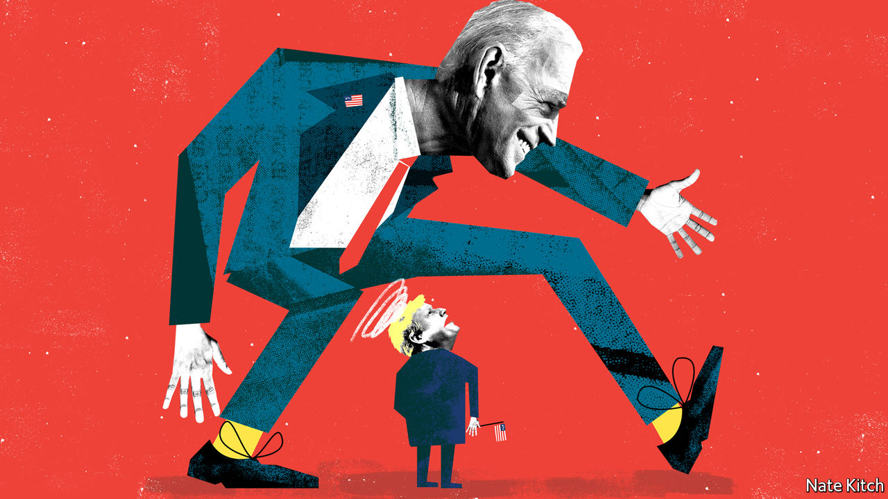
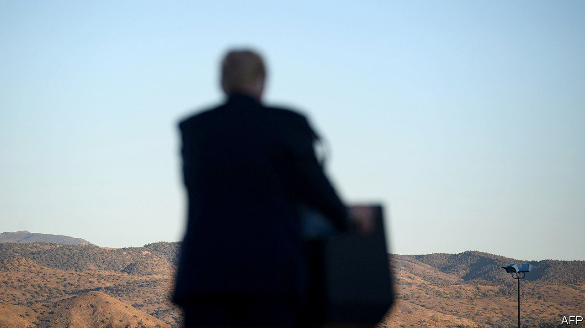

###### On Afghanistan, diplomats, Hong Kong, the Democrats, the colour black, hipsters

# Letters to the editor 

##### A selection of correspondence 

> Dec 5th 2020 


 


Left to stand alone


You warned of the dire implications of America withdrawing from Afghanistan (“”, November 21st). Certainly, the parallels with the Soviet withdrawal in 1989 and the eventual collapse of the Najibullah regime are uncomfortable. However, it was not the withdrawal of Soviet combat troops that brought about the collapse, but the ending of Russia’s subsidies in 1992.


Other pivotal moments in Afghanistan’s history are also linked to the withdrawal of subsidies, from the rivalries between Shah Shujah and Dost Mohammad in the early 19th century, culminating in the first Anglo-Afghan war, to arguments over military pay in 1879, which led to the murder of the British envoy, and through to post-1918, when Britain cut its subsidy. There is a pattern here. Intimately linked to the historic, systemic weakness of the Afghan state and its inability to raise taxes, the government is beholden to those who subsidise it. When the money runs out, it fails.


The key to securing Afghanistan’s future is to keep the government financially afloat. NATO has promised that funds will be provided until 2024. That is a start, but 2024 too closely matches the post-Soviet trajectory to be comfortable. Instead, our commitment should be as open as our military one has been. That may give a chance for the post-Taliban generation to take power and for the country’s economy to flower.


The Taliban always taunt us, “You may have the watches but we have the time.” We should now respond, “Yes, but we have the money.”


SIMON DIGGINS

Defence attaché, Kabul 2008-10

Rickmansworth, Hertfordshire


Had the Americans followed your line of thought, they would still be involved in Vietnam.


ALEXANDER CASELLA

Former UNHCR director for Asia

Geneva

 


An honourable man


was in error in stating that Kim Darroch was “sacked” as Britain’s ambassador to Washington after a confidential memo critical of the Trump administration was leaked (October 24th). In fact, he resigned after the president tweeted that his administration would no longer deal with the envoy, and Boris Johnson failed to support him. Mr Darroch acted with honour and a sense of the national interest.


PAUL TAYLOR

Saint-Remy-de-Provence, France

Hong Kong’s legislature


You reported that four legislators in Hong Kong were disqualified from office (“”, November 14th). What you did not say is that each of the four had earlier been barred from running for re-election by the returning officers. It was found they had not genuinely upheld the Basic Law and honoured their pledge of allegiance to the Special Administrative Region, which is required under Article 104.


As the elections to the Legislative Council were postponed in September for a year because of the pandemic, a decision was made by the National People’s Congress Standing Committee, the highest organ of state power. The logic is simple. People not qualified to contest the election should not be allowed to continue to serve as legislators in the current extended Legco.


The Special Administrative Region government is not targeting any member of the Legco. Nor are we suppressing political parties or silencing dissenting views. There is no question of the Legco becoming a “rubber stamp” body.


Our rules relating to the behaviour of public officers follow international norms. In Britain, members of Parliament must take an oath of allegiance to the crown before assuming office. In America members of Congress must swear to support and defend the constitution.


It is regrettable that 15 lawmakers subsequently chose to resign from the Legco. For them to abandon their monitoring role in providing checks and balances for the government is an irresponsible act that serves the interests of no one.


MATTHEW CHEUNG KIN-CHUNG

Chief secretary for administration

Hong Kong Special Administrative Region Government

 


Political diversity


It is correct and reasonable to suggest that the structure of America’s electoral college is disadvantageous to the Democrats because of the current geographical distribution of the party’s supporters (“”, November 14th). But there are pros and cons in all democratic systems, and there are arguments for the characteristics that yield this particular outcome as well as arguments against. You recognise that Democrats tend to live in more “diverse” cities, but you also note that they tend to “cluster” to a greater extent. Crucially, it is the latter point that works against Democrats.


Diversity is a word we hear a lot of these days, often in support of laudable policies. But it involves including all parts of our society in the political conversation. If the Democrats cannot win rural votes, maybe they have a problem with diversity, which the electoral-college voting system is merely helping point out.


STEPHEN NASH

Chiddingfold, Surrey

 


The dark art


J.M.W. Turner was another artist drawn to the evocative possibilities of the colour black, especially in his watercolours and paintings depicting the utilitarian grime of the Industrial Revolution (“”, November 7th). Black is an essential element in his numerous images of steamboats, which marked early 19th-century technological progress. In “Peace: Burial at Sea”, a hulking black steamship dominates the canvas, extruding heavy dark smoke; its blackened sails a sombre reference to the death of his colleague Sir David Wilkie (“I wish I had a colour to make them blacker,” Turner said). The painting is on display as part of the Turner’s Modern World exhibition at Tate Britain.


WILLIAM RODNER

Norfolk, Virginia


Pierre Soulages, who will be 101 this month, has devoted the second part of his very long life exclusively to the colour black, or rather non-colour, as he calls it. It is not so much black that interests him as the emotions elicited by the reflection of light off black paint and the intense sensorial and introspective experience this brings the viewer. 


Unlike Anish Kapoor, who featured in your article, Mr Soulages does not resort to a new material but works on the texture of paint and pigment, matte or gloss, breaking up the surface with lines, contours, crevasses and forms that either absorb or reflect the light, thereby leading the viewer into another world, beyond black: outre-noir. 


He has exhibited extensively outre-Atlantique, but perhaps not outre-Manche?


ELIZABETH CARROLL SIMON

Paris

 


Trend setters


The spread of a global hipsterism (“”, November 7th) is simply another case of the rest of the world taking to American popular culture, whether for good or ill. This has a long history. Romans once thought it was hip to act like Greeks. Even Virgil got into the act, and he was no hipster.


PHIL HOLT

Ann Arbor, Michigan

