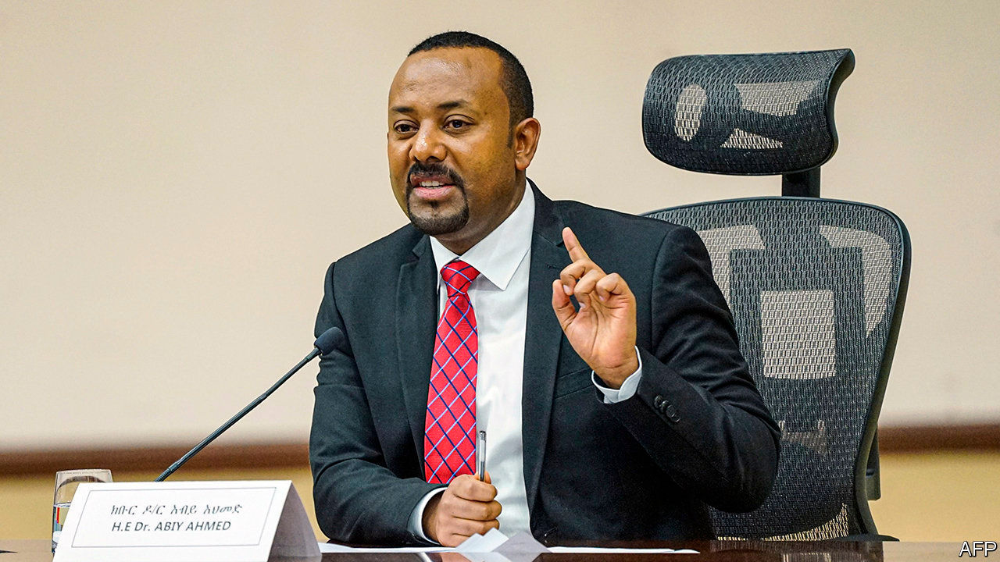
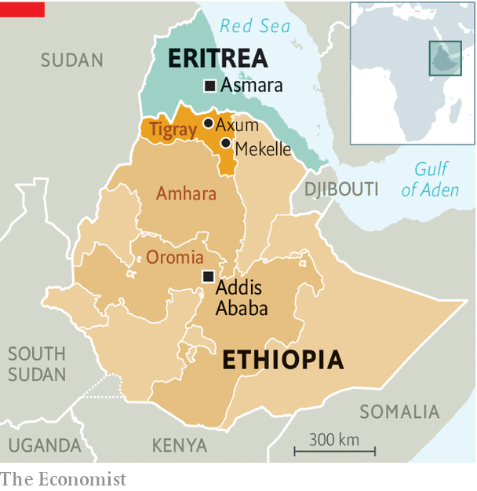

###### Victory, defeat and confusion

# In Ethiopia, Abiy Ahmed has won the battle but not the war 

##### Tigray’s ousted rulers have fled, but they plan to fight on 

 

> Dec 1st 2020 


THE BATTLE, in the end, was mercifully short. The 500,000 inhabitants of Mekelle, the capital of Ethiopia’s northern region of Tigray, were spared a large-scale bloodbath. On November 28th Abiy Ahmed, Ethiopia’s prime minister, declared victory over Tigray’s ruling party, the Tigrayan People’s Liberation Front (TPLF). A military operation that had started a few weeks earlier was complete, he said. Shelling of the city began at about ten that morning. By the evening Tigray’s president, Debretsion Gebremichael, and other leaders had vanished into the mountains. Crowds in the national capital, Addis Ababa, broke into celebration.


But the fighting has not stopped. “Almost all the Tigrayan forces are outside the big towns and cities,” says a TPLF intelligence officer, explaining that they had withdrawn when Ethiopian forces started shelling towns. Only hours after Abiy’s announcement of victory, rockets were fired for the third time from Tigray into Eritrea, a country to its north that has been helping Ethiopian forces. There have since been reports of sporadic clashes and air raids, as well as looting in towns, including Mekelle. “We have a plan to retake our towns from the invaders,” Debretsion told The Economist by text message.


The fog of Ethiopia’s month-long civil war has thickened since it was declared over. Speaking to parliament on November 30th, Abiy claimed that not a single civilian life had been lost during the march into Tigray. The UN and the more than 40,000 refugees who have fled to Sudan reckon otherwise. Hospitals in the regional capital are flooded with injured people. Medical supplies for the wounded and body bags for the dead are running low. But a communications blackout imposed on the region since the start of the conflict means it is impossible to know the true figure. Counter-claims that TPLF forces downed a jet and recaptured the town of Axum are also unverified.

 


Harder to dispute is the federal government’s claim that it has the upper hand in the conflict. In the weeks before it fired the first shots on November 4th, the TPLF believed it would easily win a conventional war against the Ethiopian army. The retreat from Mekelle has put paid to that hubris. The TPLF does not seem to have counted on the government’s use of drones, for instance, which are thought to have been devastatingly effective. And it seems to have misjudged its ability to fight on several fronts, including one against even the small number of Eritreans thought to have attacked it along the northern frontier. “The TPLF totally overestimated at least their conventional force,” reckons René Lefort, a researcher who has known some of its leaders for decades.


The question now is whether it can sustain a prolonged guerrilla war. Its leaders certainly have a wealth of experience: in 1991 they overthrew a dictatorship in Addis Ababa after 17 gruelling years in the bush. For almost three decades after that they called the shots in the federal government, which means they know its vulnerabilities. Keeping the army tied up in Tigray may be enough to weaken Abiy’s control elsewhere. His home region of Oromia, for instance, is racked by an armed insurgency.


But many of the veterans of the TPLF’s bush war are now in their 60s and 70s. They also have few allies left in the region. The once porous border with Sudan, a lifeline in the 1970s and 1980s, has largely been sealed. On November 29th Sudanese security forces seized a large cache of weapons and ammunition en route to Tigray. “What happens when they run out of bullets?” asks a UN diplomat. “How do they expect to bring fuel trucks up long, winding roads without any air cover?”


Much will depend on whether Abiy can win over ordinary Tigrayans. His government promises to rebuild towns and villages battered by war. It also says it is welcoming back refugees. But many of those who fled, the vast majority of whom are Tigrayan, say they fear reprisals if they come back. Most are from western Tigray, which is now run by police and bureaucrats from the neighbouring Amhara region. Amhara claims this territory as its own. Its militiamen fought alongside the federal army in battles that reportedly saw some of the war’s worst atrocities. Militias on both sides appear to have targeted civilians, including at least 600 allegedly massacred by a youth group of the TPLF. Abiy may have won. But he still has a bitterly divided country to heal. ■

