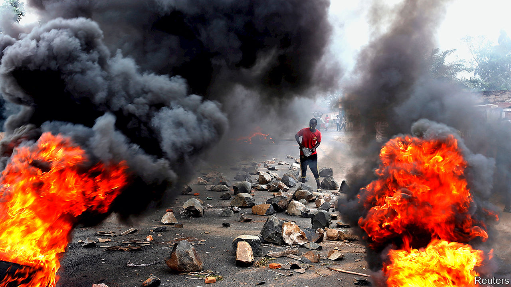

###### No haven

# Tanzania’s police are torturing refugees from Burundi 

##### People fleeing repression at home also face it in refugee camps 

 

> Dec 3rd 2020 


EVEN AFTER Tanzanian policemen had hung him from the ceiling and beaten him with sticks, Crispin (not his real name) would not confess to being a rebel leader with plans to overthrow the government of neighbouring Burundi. It was only when they injected a liquid into his testicles that he caved in and said he was plotting a coup.


He was not. Some years ago Crispin was photographed at an anti-government protest in Burundi. Thugs from the ruling party’s youth wing, the Imbonerakure (“those who see far”), painted a red cross on his door and turned up one night to threaten him. So in 2016 he fled to a refugee camp in western Tanzania. But men from the Imbonerakure also stalk the camps with lists of dissidents provided by Burundian intelligence. They target them, allegedly with help from Tanzanian police. Desperate families often pay the Imbonerakure to have their relatives freed. The spoils are shared with local cops. Most of those picked up are accused of hoarding weapons or plotting against Burundi’s government.


In December last year men from the Imbonerakure turned up at Crispin’s shelter flanked by Tanzanian policemen. They bundled him into a police car and took him to a cell where he spent three months. He was released only because his wife paid 1m Tanzanian shillings ($430) to the Imbonerakure. “They said if she paid I would not be killed or returned to Burundi” to face imprisonment, he says.


Others were not able to buy their way out. Human Rights Watch (HRW), a New York-based watchdog, interviewed 18 refugees who had been arrested in camps by Tanzanian policemen in the past year. Several had been tortured. Eight of them were forcibly returned to Burundi, where they have been locked up without charge. Another rights group, CBDH/VICAR, based in Rwanda, says that about 170 Burundian refugees have disappeared from Tanzania since 2015. “There seems to be collusion between the Tanzanian and Burundian authorities,” says Mausi Segun of HRW. “Several of those tortured were told that Tanzanian officials had information on them from Burundi.”


About 300,000 Burundians have fled their country since 2015 after violence broke out when the then president, Pierre Nkurunziza, said he would stand for an unconstitutional third term. Hundreds were killed. Activists, journalists and anyone who might have been spotted at a protest rushed to neighbouring countries. Around half of them went to Tanzania.


A new president, Evariste Ndayishimiye, was elected in June in a rigged poll. His government is just as scary. Gervais Ndirakobuca, the new security minister, is nicknamed “Ndakugarika”, meaning “I will kill you” in Kirundi, the local language. He earned his reputation as a rebel commander during the civil war and has worked hard to maintain it since. As police commissioner under the former president, who has since died, he was responsible for some of the bloodiest crackdowns on protesters. Because of this the EU and America have imposed sanctions on him.


With such people in the government, few refugees seem likely to believe its assurance that the country is safe and that they should return. Officials in Tanzania and Burundi drew up a secret agreement that was leaked last year. It said all refugees should “return to their country of origin whether voluntarily or not”. Some 50,000 have gone back in the past two years. Many cite insecurity in the camps, in particular arbitrary arrests, as their reason for returning. Moreover, camp authorities have threatened Burundians, saying that if they do not sign up to go home they will lose their refugee status and risk arrest. Some of those returning say that they were threatened or detained when they crossed the border. Many have fled again, but this time into safer Uganda.


Crispin has no choice but to stay in Tanzania. He has been warned by the Imbonerakure that if he tries to leave for another neighbouring country, he will be stopped at the border and sent back to Burundi. “It is terrifying to live in a country where you can be arrested at any time. I am constantly frightened,” he said. “But there is nowhere for me to go.” ■

