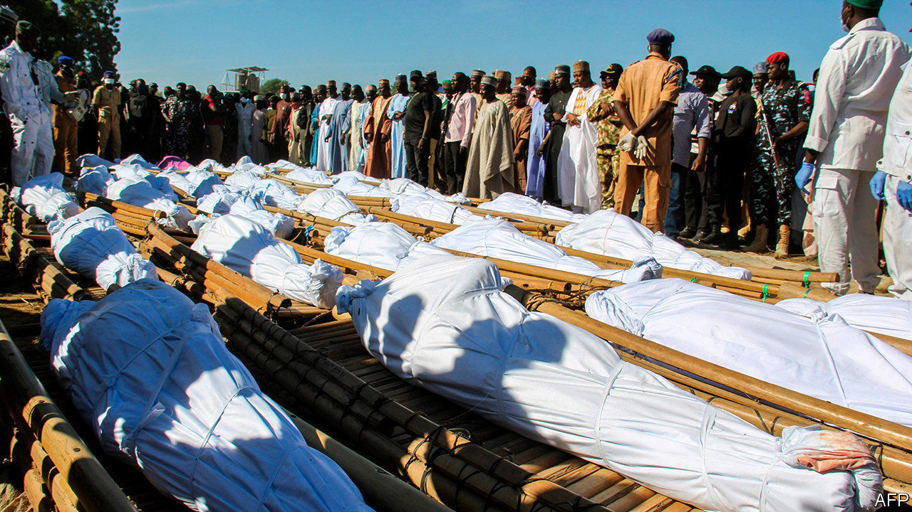

###### Death in a rice field

# Why 78 Nigerian farmers were murdered 

##### Slaughtered by Boko Haram, and blamed by the state for their own deaths 

 

> Dec 3rd 2020 


THE FARMERS—43 of them—were found in the rice fields where they had gone to work. Some had their throats slit. Others were beheaded. In the days that followed locals found evidence of yet more butchery, taking the toll to 78. Boko Haram, a jihadist group that has been fighting since 2009 to carve out a caliphate in north-east Nigeria, was quick to claim credit for the murders. It said they were revenge for the capture of a militant by locals.


The people of north-east Nigeria have grown wearily accustomed to the horrors of Boko Haram, whose name is loosely translated as “Western education is forbidden”. The group has been known to strap ticking bombs to children before sending them into markets and mosques. Its abduction of more than 200 girls from a school in Chibok in 2014 became emblematic of the many failures of President Goodluck Jonathan’s administration. He was defeated in an election the following year by Muhammadu Buhari, a former general who promised to restore security.


Yet the latest killings—and the government’s ham-fisted response to them—have rekindled outrage among Nigerians. Garba Shehu, Mr Buhari’s spokesman, initially blamed the victims, saying they had not been given permission from the army to go to the farm. An army spokesman accused them of collaborating with the insurgents and not tipping off the security forces.


But one survivor said they had told soldiers that jihadists were in the area. After the farmers nabbed one and handed him over, many feared Boko Haram would retaliate. When it did, the army was nowhere to be seen.


The government is unable to provide security in large swathes of the countryside. Jihadists are not the only scourge. Bandits loot villages in northern and central Nigeria, and kidnap for ransom. Many farmers have abandoned their homes and crops. “We will not have food sufficiency because people are afraid of going to their farms,” says the head of a farmers’ association.


Mr Buhari won a second term last year, largely thanks to the votes of rural northerners. Their support now seems to be dwindling. That may not matter much to a term-limited 77-year-old. But it matters to his party. Allies are pleading with him to fire his army chief. Mr Buhari remains remote and passive, however, even as his country burns. ■

