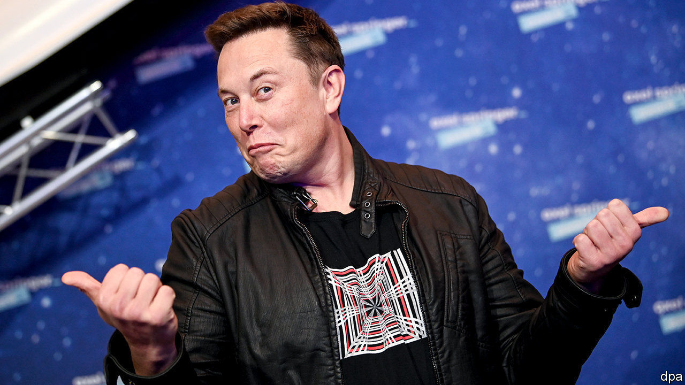

###### The Starship SN8

# Elon Musk’s latest adventure 

##### He hopes it will be a stepping stone to the Moon and Mars 

 

> Dec 5th 2020 


IF ALL GOES well, Elon Musk’s plan to conquer the universe will soon take another step forward, with the flight of Starship SN8, a rocket built by his company, SpaceX. SN8 is expected to rise from its launch pad at Boca Chica, in Texas, sometime between December 4th and 6th. (SpaceX have not confirmed this, but a local flight restriction has been imposed on the area for that period.) The idea is that it will fly to an altitude of 15km, cut its engines, tip slowly forward until it is parallel with Earth’s surface, and let gravity take its course. Then, shortly before it hits the ground, it will fire its thrusters again to realign itself vertically and will thus come gently to rest on a landing pad a few hundred metres away from where it took off.


SN8 is, as its name suggests, the eighth in the current series of prototypes for SpaceX’s proposed Starship (SN stands for “serial number”). It is, though, the first to have a nose cone, and thus to assume the distinctive atmosphere-penetrating shape normally sported by space rockets. It also has more oomph than its predecessors. Previous SNs have used just one of SpaceX’s Raptor engines, and have, if launched (some were used for ground tests), reached a height of no more than 150 metres. SN8 includes three Raptors—half the number expected for the finished design.


Strictly, SN8 is a prototype of only the second stage of the Starship that SpaceX proposes eventually to build. Its successors are intended to sit on an as-yet-to-be-constructed “Super Heavy” rocket that will deliver the bulk of the firepower. This first-stage vehicle is expected to house up to 37 Raptors. These will give it double the thrust developed by the first stage of a Saturn V, the launch vehicle America used for its crewed Moon missions. And the Moon is, indeed, an intended destination, though the craft will earn most of its bread and butter ferrying goods and people into orbits close to Earth—a task for which it has a capacity of 100 tonnes.

Here I am, sitting in my tin can


Crucially, unlike a Saturn V, every part of which except the capsule containing the crew was thrown away during the course of a mission, a Starship will be fully recyclable, with both stages returning to Earth in a manner similar to SN8. Moreover, unlike Saturn’s partially recyclable successor, the Space Shuttle, refurbishing a Starship for relaunch will not cost $1bn a pop. Instead, Mr Musk estimates, the turnaround will require only a few million dollars.


Starships should also be cheap to build. Instead of a fancy carbon-fibre composite they are made of stainless steel, which is a seventieth as expensive, but is, in many ways, better. Not only is it resistant to the fracturing to which a composite might be prone in the low temperatures of outer space, but its melting-point is also high enough to prevent damage in the fiery conditions of re-entry. This is an important part of a Starship’s easy recyclability.


When an entire Starship will fly is still anyone’s guess. Mr Musk has a good record of doing what he says, but his timings have a tendency to slip. For a man who famously once said his ambition was to die on Mars, but not on impact, the Starship project is an important step on the road to his intended retirement home. Bases on the Moon or Mars would need frequent resupply from Earth. That would be made easier by high-powered reusable rockets.


Mr Musk has, himself, put the odds of SN8’s flight being successful at three to one against. If it does succeed, however, the odds against his wider vision of the future coming true will shorten.■

