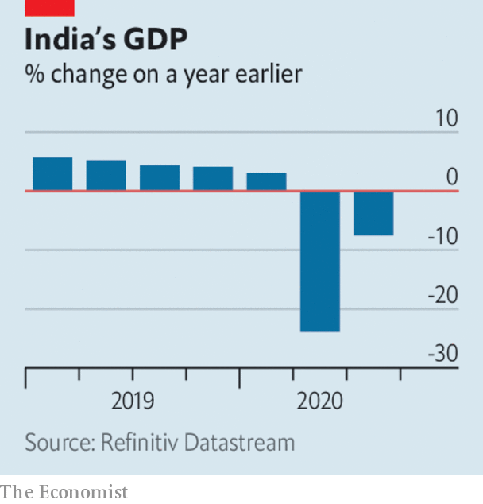

###### 

# Business this week 

#####  

 

> Dec 3rd 2020 


Salesforce agreed to buy Slack for $27.7bn, combining its range of business software with a chat platform tailored to companies. United they will increase competition for Microsoft, which has pulled ahead of many rivals in this year of working from home, when firms have relied on cloud services more than ever. Microsoft’s Teams platform has also been a formidable challenger to Slack. Shares in Slack have performed poorly compared with other providers of remote tech. See .

What looms for Zoom?


Zoom, one of the chief beneficiaries from the turn to remote working, reported that revenue soared by 367% in its latest quarter, year on year, to $777m. But its share price took another knock, as the news on vaccines and the prospect of a return to office normality raised more questions about its future.


There was more consolidation in the data-provision industry, as S&amp;P Global , best known for compiling credit ratings, struck a deal to acquire IHS Markit, an American-British information provider. At $44bn, it is the largest takeover in America this year. See .


Airbnb said it would price its forthcoming IPO at between $44 and $50 a share, which would value it at up to $35bn. That is double a private estimate from earlier this year, when the home-rental firm was hit by lockdowns. It has since bounced back, as people seek remote dwellings either to work in or to get away from it all. The pandemic “has accelerated the ability to live anywhere” Airbnb recently said.


China followed through with its threat to impose tariffs of between 107% and 212% on Australian wine imports. China is the biggest market for Aussie wineries. Beijing says the tariffs are an anti-dumping measure to stop Australian imports damaging the domestic wine industry, but it has slapped tariffs on other Australian goods this year, as the countries’ diplomatic relations have worsened.


The government might be about to change in Washington, DC, but a new law that may in effect ban trading in shares of Chinese companies on American stock exchanges over concerns about their accounting practices is very close to becoming reality. The House of Representatives unanimously passed the bill this week. It has already cleared the Senate. Chinese companies would have three years to comply with the law. See . 


The organisation that runs Libra, a cryptocurrency that has been proposed and backed by Facebook, renamed the project “Diem”. Following criticism from regulators around the world the payments system has much less scope than its creators had hoped, but according to reports the first Diem dollar, backed by the American dollar, could be launched next month.


ExxonMobil wrote down $20bn-worth of assets in natural gas. The energy company was the world’s biggest by market capitalisation seven years ago. It has yet to report a profit this year and was removed from the Dow Jones Industrial Average in August.


Turkey’s economy grew by 15.6% in the third quarter over the previous three months, and by 6.7% compared with the same quarter last year. The spurt in growth was fuelled by government-backed credit. However, with exports falling, a widening current-account deficit could spell more trouble for the lira.

 


India’s economy is still struggling, contractingby 7.5% in the three months ending September, year on year. Still, that was an improvement on the previous quarter, when GDP shrank by 24%. See .


The OECD’s latest outlook forecast that global GDP will return to pre-pandemic levels by the end of next year, if outbreaks of covid-19 are under control and vaccines are widely available. It forecasts the world economy will grow by around 4% in both 2021 and 2022. The recovery will be uneven, however. China and other non-OECD countries will chalk up faster growth rates than developed ones.


In Britain, the pandemic pushed more long-struggling retailers to the wall. Arcadia, which owns a string of high-street clothing brands, such as Topshop and Burton, fell into administration. That led the firm behind a potential rescue of Debenhams to pull out of its deal; the department-store chain now faces liquidation. The collapse of both retailers puts 25,000 jobs at risk. See . 

Golden State loses its lustre


Hewlett Packard Enterprise, which provides computer servers and IT services, decided to move its headquarters from Silicon Valley to Houston. In 2015 HPE split from the PC-and-printer business that was Hewlett Packard, a computing pioneer born in Silicon Valley and often synonymous with the famous tech cluster. HP computers is still based there, though the region’s high living costs and terrible traffic have made Texas a tempting location for many tech companies.

