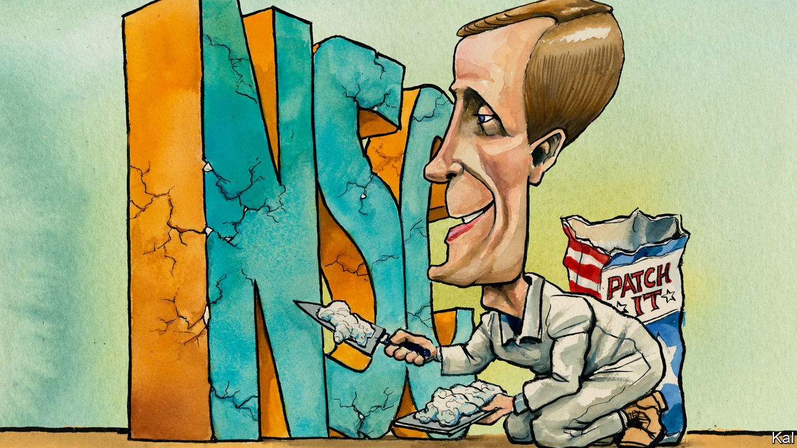

###### Lexington

# Jake Sullivan to the rescue 

##### The Democrats’ Golden Boy augurs a return to competent foreign policymaking 

 

> Dec 5th 2020 


AT THE HOARY age of 36, Jake Sullivan delivered this life lesson to graduating students of the University of Minnesota. “Reject certitude. And don’t be a jerk. Be a good guy.” He cannot be accused of ignoring his advice. The Democratic wunderkind, who eight years later will become the youngest national security adviser since McGeorge Bundy in 1961, has a reputation for high-grade amiability that is even rarer in Washington, DC, than his big brain.


“He’s the smartest guy in the room, but he’s not cocky about it,” says Senator Amy Klobuchar, a fellow Minnesotan, who hired Mr Sullivan from the Minneapolis law firm where he had taken a brief break from elite institutions (Oxford, Yale Law, a clerkship at the Supreme Court). When he left her office to work on Hillary Clinton’s 2008 presidential campaign, he promised to return. He proceeded instead to make himself indispensable, in the State Department, White House and on the trail, to Mrs Clinton, Barack Obama and Joe Biden in turn, including as the then vice-president’s NSA. (“He did the trifecta,” quips Ms Klobuchar, a trifle ruefully.)


Even Iran’s mullahs were said to appreciate his lack of condescension, after he was charged by Mrs Clinton with a series of top-secret missions to the Gulf that opened a path to the Iran nuclear deal. More remarkably still, the mullahs of the Democratic left like him, too. This is on account of his intraparty peacemaking for Mr Biden; and also a soul-searching essay on the limits to neoliberalism that he penned in the wake of Mrs Clinton’s loss to Donald Trump—for which, as her policy chief, he held himself partly to blame. The bipartisan foreign-policy world has welcomed his latest elevation with a gusto that goes beyond the usual post-Trump relief. “He’s a terrific choice,” says Stephen Hadley, former national security adviser to George W. Bush. “He’s a good person, very smart and very balanced.”


Such plaudits may prove hard to live up to. Especially as Mr Sullivan will be judged by harsher standards than his recent predecessors. Mr Trump’s half-dozen national security advisers have been weighed by the media and Democratic opposition chiefly on their reported willingness to restrain the president’s excesses. Thus the extraordinary turnabout in John Bolton’s reputation on the left. Only Michael Flynn, who this week called for a military coup and the imposition of martial law to overturn the election, has been skewered for the failure of Mr Trump’s foreign policy. Mr Sullivan can expect much stiffer criticism for much smaller setbacks. Barbed comments from Republican hawks such as Tom Cotton and Marco Rubio, for whom any association with the Obama administration is unforgivable, suggest it has already begun.


On his core responsibilities—which will include restoring sanity to the inter-agency process and managing the rivalries it breeds—he will nonetheless start with big advantages. He knows Mr Biden’s mind and has his confidence; the president-elect calls him a “once in a generation intellect”. He has comradely relationships with Tony Blinken and other senior Biden nominees—and a habit of continually questioning his own assumptions which creates an impression of open debate. Often noted by those who have worked with him, this quality is also indicated by Mr Sullivan’s self-critical recent writing, including that essay on economic policy, another in defence of American exceptionalism (“Despite its flaws, America possesses distinctive attributes…”) and a synthesising third essay, in Foreign Policy, on his ambition to bring foreign and domestic policy into alignment.


His willingness to adapt suggests the fear that Mr Biden’s security agenda will be too backward-looking may be overblown. When Mr Biden said this week that he would not hurry to scrap the tariffs on China, and that he would try to expand as well as to reconstitute the Iran deal, he echoed positions that Mr Sullivan had previously laid out. The Biden administration will focus on rehabilitating the traditional means of statecraft—including diplomacy and basic competency—that the Trump administration disdains. But it will husband whatever useful leverage its predecessor has accrued, while pursuing some of the same hawkish objectives.


Mr Sullivan will find his grander scheme to integrate foreign and domestic policy tougher going. He makes a strong case—in his Foreign Policy piece and elsewhere—that globalisation has made this essential (as the pandemic underlined). Also that the cosy foreign-policy world needs better answers (as Mr Trump’s success showed) for its populist critics. Mr Biden’s promise of a “foreign policy for the middle class” speaks to the same concern. And Mr Sullivan can be expected to make at least modest efforts to address it. As NSA, he might be expected to play an unusually big role in trade and immigration discussions. By the same token, expect domestically orientated agencies—such as Health and Human Services—to play a bigger part in the inter-agency security debate.

Everything’s Jake


Yoking together foreign and domestic objectives could also be offered as a political rationale for the more ambiguous relationship with China that Mr Biden wants. Where any engagement with the Party is currently considered a show of weakness, Mr Biden might argue that closer ties in areas such as public health and climate change are urgently required by the needs of ordinary Americans. But these would be marginal developments, far short of the transformation Mr Sullivan advocates, and for a familiar reason. Presidents pay such heed to foreign policy in part because their prospects of passing much on the home front are so limited. Linking foreign and domestic objectives will not fix the partisan dysfunction underlying that failure, as Mr Sullivan must realise.


His return to government is therefore liable to be much less ambitious than his writings might suggest. Meeting his admirers’ expectations will be hard. But in picking Mr Sullivan, Mr Biden has given himself a better chance of bringing a period of disarray in American foreign policymaking to a close.■


Dig deeper:

Read our , and then sign up for Checks and Balance, our  and  on American politics.

