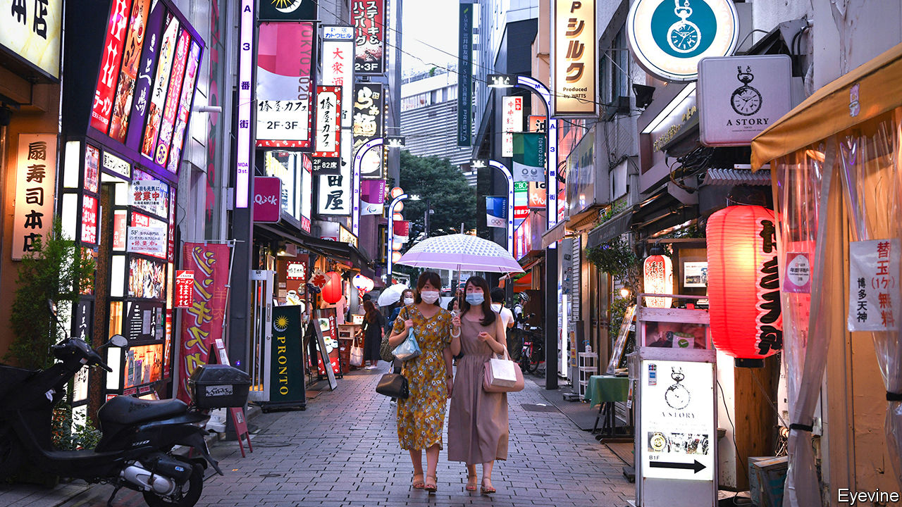
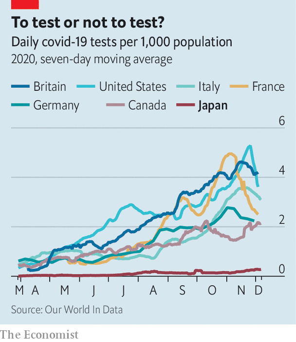

###### 3C epiphany

# The Japanese authorities understood covid-19 better than most 

##### That has helped keep Japan’s outbreak relatively small 

 

> Dec 12th 2020 


WHEN THE Diamond Princess, a cruise ship suffering from an outbreak of covid-19, arrived in Japan in February, it seemed like a stroke of bad luck. A small floating petri dish threatened to turn the Japanese archipelago into a big one. In retrospect, however, the early exposure taught the authorities lessons that have helped make Japan’s epidemic the mildest among the world’s big economies, despite a recent surge in infections. In total 2,487 people have died of the coronavirus in Japan, just over half the number in China and fewer people than on a single day in America several times over the past week. Japan has suffered just 18 deaths per million people, a higher rate than in China, but by far the lowest in the G7, a club of big, industrialised democracies. (Germany comes in second, at 239.) Most strikingly, Japan has achieved this success without strict lockdowns or mass testing—the main weapons in the battle against covid-19 elsewhere.


“From the beginning we did not aim at containment,” says Oshitani Hitoshi, a virologist who sits on an expert panel advising the government. That would require identifying all possible cases, which is not feasible in a country of Japan’s size when the majority of infections produce mild or no symptoms, argues Mr Oshitani: “Even if you test everyone once per week, you’ll still miss some.” Japan performs the fewest tests in the G7: an average of 270 a day for every million people, compared with 4,000 or so in America and Britain (see chart).


Instead, the government tried to apply the lessons of the Diamond Princess. After trained quarantine officers and nurses were infected aboard the ship, despite following protocols for viruses that spread through droplets, Mr Oshitani’s team concluded that the virus spread through the air. As early as March, Japanese officials began warning citizens to avoid the san-mitsu or “3Cs”: closed spaces, crowded places and close-contact settings. The phrase was blasted across traditional and social media. Surveys conducted in the spring found that a big majority were avoiding 3C settings. The publishing house Jiyukokuminsha recently declared it “buzzword of the year” for 2020.

 


The Diamond Princess also inspired an early focus on clusters. The government set up a cluster-busting taskforce in March.


These insights allowed the authorities to make granular distinctions about risks, opting for targeted restrictions rather than swinging between the extremes of strict lockdowns and free-for-all openings. Nishimura Yasutoshi, the minister overseeing the government’s response to covid-19, carries a device that monitors carbon dioxide to measure the quality of ventilation during his meetings. (The room where he and your correspondent meet registers 506 parts per million, safely below the threshold of 1000 ppm that indicates poor air flow. The interview takes place across a large table, behind plastic shields and with face masks on.)


Researchers deployed Fugaku, the world’s fastest supercomputer, to model different situations. Crowded subways pose little risk, if windows are open and passengers wear masks, Mr Nishimura insists. Sitting diagonally, rather than directly across from each other can reduce the risk of infection by 75%. Movie theatres are safe, “even if viewers are eating popcorn and hot dogs”, Mr Nishimura says. While most cinemas in the West are closed, “Demon Slayer”, a new animeflick, has been playing to full houses in Japan, becoming the country’s second-highest grossing film ever. In addition to the 3Cs, the Japanese government warns of five more specific dangers: dinner parties with booze; drinking and eating in groups of more than four; talking without masks at close quarters; living in dormitories and other small shared spaces; and using changing or break rooms.


Of course, these insights would have been for naught if ordinary people had ignored them. But Japanese heeded the government’s advice to stay home and to quarantine if showing any symptoms of the coronavirus, even though these admonitions carried no legal force. “Sometimes we are criticised for being an overly homogeneous society, but I think it played a positive role this time,” Mr Nishimura says. And already spick-and-span Japan became even more punctilious about hygiene. While Americans argued over whether face coverings were an assault on personal freedom, Japanese lined up outside Uniqlo for the release of its new line of masks. During the first ten weeks of flu season this autumn, Japan saw just 148 cases of common influenza, or less than 1% of the five-year average for the same period (17,000).


Better yet, although the population of Japan is disproportionally elderly, and therefore potentially more vulnerable to covid-19, it is also very healthy. Only 4.2% of Japanese adults are obese, a condition known to make the disease more lethal. That is the lowest rate in the OECD and a tenth of America’s. Japan also has a good health-care system, with universal coverage and lots of well-equipped hospitals. It even had lots of already trained contact-tracers, part of an established public-health network dating back to the 1930s.


These advantages clearly have their limits. The virus has spread rapidly in recent weeks, reaching record highs in terms both of daily cases and daily deaths. The government has had to dispatch medical personnel from the Self-Defence Forces to shore up hospitals in the worst-hit spots. But at the same time it has discouraged caution with a scheme that subsidises domestic tourism and meals out, in an effort to help the economy. Although this seems to have contributed to covid-19’s recent spread, the government has only curbed it rather than scrapping it. And cold weather is now pushing people into 3C spaces, as it has been across the northern hemisphere. But in Japan, at least, the recent growth in the number of cases has started from a dramatically lower base. ■


Editor’s note: Some of our covid-19 coverage is free for readers of The Economist Today, our daily . For more stories and our pandemic tracker, see our 

