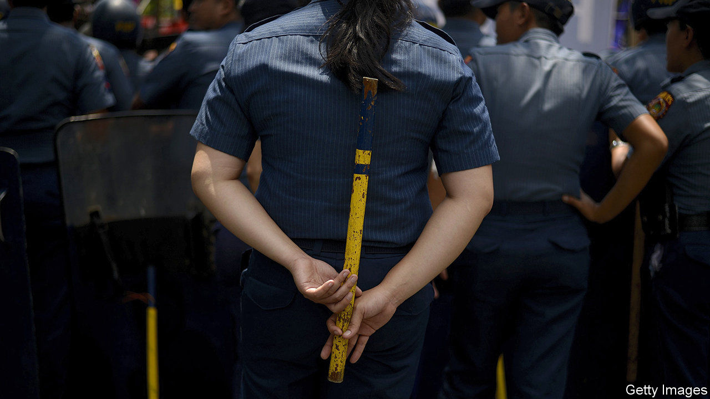

###### Bludgeon first, open fire later

# The Philippines’ president advocates beatings over shootings 

##### Rodrigo Duterte shows a softer side 

 

> Dec 12th 2020 


THE RATTAN sticks being issued to the Philippine National Police to keep people apart during the covid-19 epidemic are versatile, Lieutenant-General Cesar Binag explained: “They will be one metre long, and will be used for enforcement, for measuring, or for hitting those that are hard-headed.” To critics of President Rodrigo Duterte, the announcement, on December 4th, was yet another sign of the brutality of his regime. The Commission on Human Rights, a state body, remarked drily: “Violence, even in its slightest suggestion, is not the best way to address the pandemic.” Even Mr Duterte’s own spokesman, Harry Roque, had to acknowledge that it would be against the law for a police officer to whack anybody with a stick without proper cause.


The police have demonstrated a great proclivity for violence during Mr Duterte’s four-year-old war on illegal drugs. His campaign against both dealers and users has killed thousands of people. At least 5,903 of them, by the official count, have perished at the hands of the security services, guided by his exhortation to kill anybody who violently resists arrest. (Thousands more have been killed by unknown assailants.) Yet in the most recent of his frequent addresses to the nation Mr Duterte surprised his critics. Instead of ordering the police to crack heads if people failed to stay a metre apart, he gave a well-reasoned argument for the advantages of equipping the police with rattan sticks or, better still, proper batons, as a means to reduce their use of guns and thus stem bloodshed.


“When a person resists arrest and he becomes violent, the first impulse of a police without a baton is to hold his gun,” he said. “He might not draw it, but he holds his gun, ready for action. If he has a baton you just hit the hand, hit the body. It would be painful. Maybe you can subdue the person resisting arrest.” The president promised the police that he would issue them with proper batons, and told them: “Use the baton, not the gun.”


Mr Duterte often goes on television to deliver rambling monologues about what his government is doing or what he wants it to do. These talks are replete with vituperation, threats and unfunny jokes. Ministers, members of Congress, civil servants and military or police officers appear alongside him, to voice their agreement with whatever he says. It is a ritual that many ordinary Filipinos find endearing, if a little too long-winded to be entertaining. But it is not just theatre: this seems to be how policy is made in Mr Duterte’s Philippines—openly, on screen, evolving haphazardly from off-the-cuff remarks made by the president, which his subordinates must interpret as best they can.


Mr Roque is the chief interpreter of such remarks. The spokesman’s mantra is that Mr Duterte’s statements should be taken seriously, but not literally. Taking the president literally can have deadly consequences. In a televised speech on April 1st Mr Duterte urged the police and armed forces to shoot dead anyone in Manila breaking lockdown rules. Twenty days later a police officer enforcing the lockdown killed an ex-soldier who was being argumentative. The victim’s behaviour may have been due to mental illness stemming from his military service. The police officer who fired the fatal shots was later charged with murder.


This episode may help to explain Mr Duterte’s new enthusiasm for batons. And for once he put his ideas in plain words, which the police can take both seriously and literally, without fatal consequences. ■

