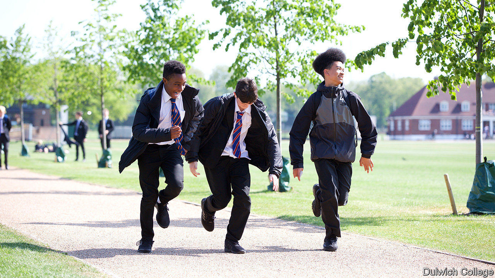

###### New school rules

# Black Lives Matter in Britain’s top public schools 

##### Pupils and teachers drive changes, though some parents need convincing 

 

> Dec 12th 2020 


JOSEPH SPENCE is everything one might expect from the master of Dulwich College. His doctoral thesis delved into 19th-century Irish Toryism, and his CV is a tour of Britain’s most illustrious schools. But he is no traditionalist. Under his leadership, Dulwich offers pupils unconscious bias training and a history curriculum which aims “to amplify the voices of the colonised as much as the coloniser”. The hope, says Dr Spence, is to look beyond the conventional canon, although that “doesn’t mean it has to disappear”, he reassures.


Britain’s public schools were once proud bastions of tradition—now they are trying to move with the times. Marlborough focuses on black history, filling its curriculum with “as many diverse texts, guests and experiences as possible”. Harrow’s summer reading list includes voguish titles like “White Fragility” by Robin DiAngelo. Eton faces criticism for sacking a teacher who made a video arguing against “radical feminism” (the school insists the problem was the refusal to take it off YouTube).


Some of this reflects the schools’ intakes. More than a third of pupils at independent schools now come from ethnic minorities, up from a quarter a decade ago. Many are aware that they could be more welcoming. A survey by the African Caribbean Education Network, a group of black parents whose children attend private and grammar schools, found that 76% of their children have experienced racial bias.


Change is pushed by pupils. Following George Floyd’s death in May, many petitioned for diverse curriculums. At Charterhouse, pupils formed the Unity Society, a safe space where they could discuss current affairs. Most teachers are happy to support these efforts, says Will Orr-Ewing of Keystone Tutors: “These schools are run by liberals, for liberals.”


Opponents think schools are frightened of censure. A recently departed Eton teacher says the Charities Commission, which requires schools to prove they provide a public good to enjoy tax advantages, has had a significant impact on their behaviour, as has growing political opposition to their charitable status. According to the teacher: “Suddenly every leading private school had an outreach officer whose job it was to say, ‘Look how much we care, look how liberal and inclusive we are! Please like us! Please don’t beat us up!’”


Parents are not entirely on board. When pupils at Benenden complained in October that their headmistress used a racial slur in a speech about diversity, parents backed the head. Yet even some sceptics may recognise the appeal. Top public schools offer good grades, and the opportunity to pick up knowledge that helps you get ahead in the world. Is knowing the lingo of much of society’s elite part of that nowadays? “You bet,” affirms one head teacher.

