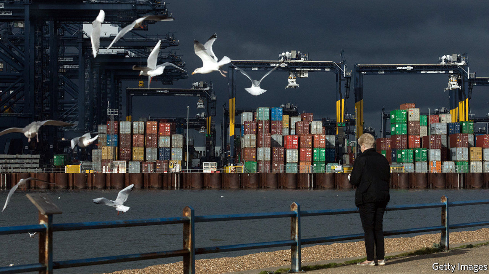
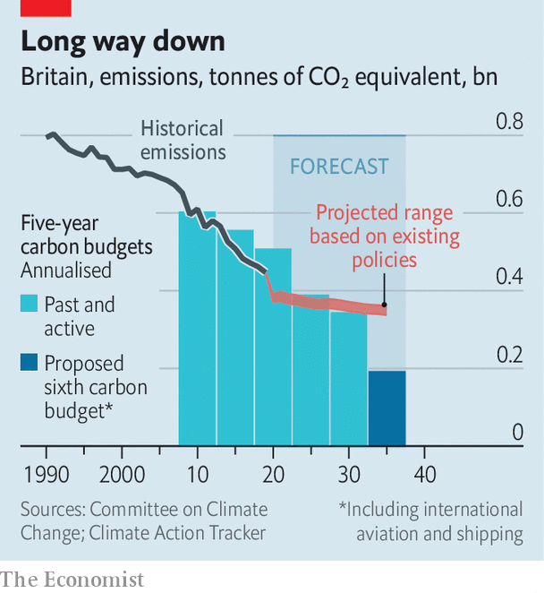

###### Chasing rainbows?

# Britain excels at announcing climate targets 

##### But it must do more to meet them 

 

> Dec 10th 2020 


BRITAIN IS IN danger of securing a reputation for too much style and too little substance when it comes to climate change. The government has spent the past few months issuing target after goal after grandiose statement, all intended to portray the birthplace of the Industrial Revolution as a leader on the path to global decarbonisation. But policies and funding to make the targets reality are lacking.


On December 3rd Boris Johnson announced that the country’s greenhouse-gas emissions would, in the coming decade, drop to 68% below where they stood in 1990—a considerable decrease on the previous goal of a 57% drop by 2030. The pledge will form part of Britain’s formal amped-up contribution to the UN Paris agreement. Under the terms of the agreement, all countries are due to submit fresh commitments by the end of 2020. Scores of new pledges are thus expected at a virtual summit on December 12th, held to mark five years since the agreement was made on the outskirts of France’s capital.


On December 9th the Committee on Climate Change (CCC), which advises the government, presented a breakdown of how the economy, landscape and society must change over the coming decades to meet Britain’s long-term goal of cutting emissions to net zero by 2050. It says emissions should decline rapidly between 2025 and 2035, by which date they should be 78% below levels in 1990.

 


Some of the biggest gains are forecast to come from ditching the combustion engine in favour of electric vehicles, as well as a vast but currently non-existent programme to replace gas boilers in homes with heat pumps. By 2035 every electron coursing through the nation’s power grid would come from a renewable or zero-carbon source. In accordance with the government’s recently announced plan for decarbonisation, a push for wind power would form the bulk of this, growing from 40GW in 2030 to at least 100GW in 2050. The committee also sees a role for hydrogen in heating some buildings as well as in powering ships and industry. Schemes to more than double the area that is planted with trees each year, and to slash cropland and grasslands, would transform large swathes of the landscape. All this would cost £50bn ($70bn) a year by 2030, five times the amount spent now.


Based on the CCC’s recommendations, Britain will now adopt its sixth carbon budget, which will have to be met between 2033 and 2037. By law, it must adopt a new budget every five years, to set the pace for the economy’s decarbonisation. The first two, running from 2008 to 2017, were met. Figures published in October show that British emissions are expected to squeak in just under budget for the third round. But the country is not on track to meet its fourth carbon budget and will miss the fifth by an even greater margin.


According to the CCC, the first and second budgets were probably met thanks to the global financial crisis. “Policy has fallen short of bringing about the measures required to put the UK on course to meet its original long-term ambition of an 80% reduction, let alone the recently agreed net zero ambition,” it noted last year. The covid-19 downturn will aid efforts to meet the third budget. But to be a true leader, Britain must stop relying on mishaps and put money and policy towards real change. ■

