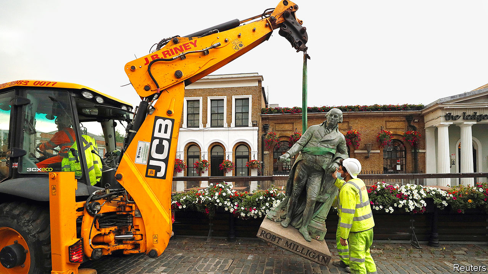

###### Roads must fall

# Britain’s bureaucrats prepare to tear down statues 

##### A series of reports will have far more impact than last summer’s protests 

 

> Dec 10th 2020 


ON DECEMBER 5TH a small group of people carefully removed a sign marking Cassland Road Gardens in London and laid it on the ground. Thus was one corner of the capital purged of its association with an offensive historical figure—John Cass, an early-18th-century slave trader. It was a modest event, noticed by few, which suited the organisers. “It makes more sense to do it this way,” says Toyin Agbetu, a researcher and activist.


The other way is more spectacular. Last June a Bristol crowd inspired by the Black Lives Matter movement pulled down a statue of Edward Colston, another slave trader, and rolled it into the harbour. In the same week activists in Glasgow erected alternative street signs, replacing tobacco barons with black heroes. Elsewhere, statues were daubed with paint. Vigilante groups—some polite and peaceful, others not—mobilised to defend cherished figures.


To cool things down, many local authorities promised to investigate monuments and street names. In theory, all 130 Labour-led councils are doing so, as are some controlled by the Scottish National Party. Hackney, which contains the currently nameless gardens formerly known as Cassland Road, has a rolling process: offensive things are removed when a group of councillors, historians and community leaders reach a consensus. But most councils commissioned reports, which are beginning to come in. This quieter process is likely to topple more statues and names than the crowds did.


Researchers at Lambeth Archives have found that in that London borough four street names, one ward and one tomb commemorate slave owners. Another seven things have some link to slavery or black oppression—for example, a memorial and a block of flats are named after a 17th-century director of the East India Company, which traded slaves at the time. Lambeth Archives uses a traffic-light system: red for definite links, orange for more tenuous ones, green for the blameless.


Some investigations have come up empty-handed. An independent review of statues in Bradford found none that is offensive. In Leeds, investigators found only one “particularly negative” image: an architectural frieze showing an African man in a loincloth. Both cities are far from the coast, and the investigators looked only at statues. Even so, the reports may affect the streetscape. They conclude that the cities should do a better job of reflecting their black, Asian and Jewish populations.


By far the most comprehensive report is the one commissioned by the Welsh government. It finds 68 monuments, places or streets with a definite connection to slavery or racism, and another 213 with a looser connection. One man, Thomas Picton, who governed Trinidad with a brutality that shocked his contemporaries and was later killed at the battle of Waterloo, has 19 roads definitely and 13 possibly named after him. He is also commemorated by a 25-metre obelisk and in the names of a sports centre, a community centre and two pubs.


The local councils that will decide the fate of most street names and monuments must mull tricky questions. If slave traders are anathema, what about people who opposed abolition? And how finicky do they want to be? For example, Swansea has a Grenfell Park Road. That seems to be named after Pascoe St Leger Grenfell, who was part-owner of a copper company that ran Cuban mines with slave labour. But a Grenfell Avenue on the other side of Swansea might have been named after David Grenfell, a Labour MP. It is not clear that many people appreciate the distinction.


The Conservative government is against removing statues, and hints that iconoclasm may lead to funding cuts. But big cities are not Tory territory; statues might become even more tempting targets if they are associated with the government. And the reports will create momentum. Gaynor Legall, who chaired the Welsh investigation, says she used to assume, naively, that slavery was mostly an English phenomenon. She hopes that her review will lead to a national reckoning. “We can’t just drop it now,” she says. ■

