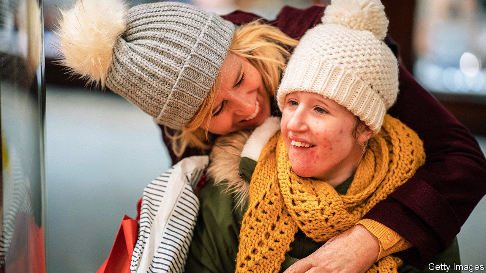
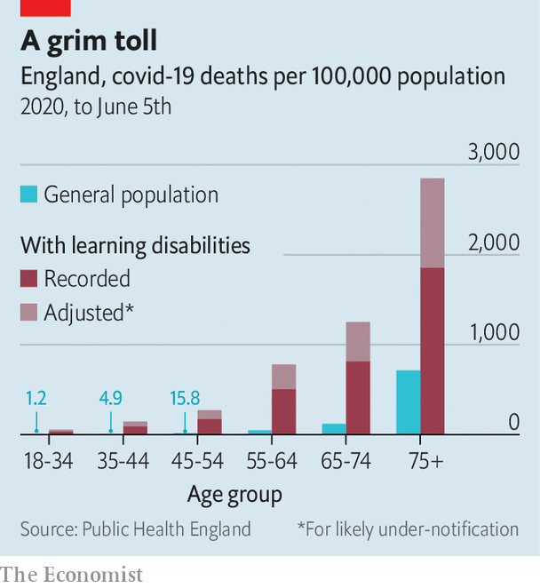

###### Out of sight

# Learning-disabled Britons are the pandemic’s forgotten victims 

##### A lowly position in the vaccine queue is their latest trial 

 

> Dec 10th 2020 


IN A SUPPORTED-LIVING home for people with learning disabilities in Luton, there is no lack of Christmas cheer. One recent evening, staff helped the six women who live there decorate a gingerbread house; another day, they fashioned a collage of hand prints to resemble the outline of a Christmas tree. “We’re trying to make it as fun as we can,” says Carly Somers, one of the workers. Still, it is an uphill battle. Normally, all but one of the women would go to relatives at least for the day itself; this year, they might well all have to stay put. “That’s going to be a big change for them.”


The past year has been trying for everyone. As Edel Harris, boss of Mencap, a charity that supports the six women and 5,000 or so others, puts it: “For those of us without a learning disability, we’re struggling at times to understand what’s happening and to hang on to that hope”. For those who have one it has been even harder, as they struggle to understand change and often require help with everyday life. The latest hurdle is vaccination: most learning-disabled Britons are not in the priority queue for the jabs, the first of which began to be dished out on December 8th.


An official review last month suggested that covid-19 has killed people with learning disabilities at twice the rate of the general population and perhaps six times the rate once sex, age and probable underreporting are accounted for (see chart). That is partly because they are more likely than average to suffer underlying conditions, like diabetes and obesity, that increase risk. But it can also be difficult for them to grasp infection-prevention advice and the need to get tested if symptoms occur.

 


The virus has had a disproportionate impact on their mental health and well-being. Like many of the 1.5m learning-disabled Britons (of whom perhaps 350,000 have a severe disability), Ciara Lawrence has found the government’s official updates on the pandemic hard to follow. “[They] use jargon words like social distancing, shielding and quarantine,” she says. “When they show those graphs on the screen, it is so hard to understand. They show them really quickly.”


It can also be difficult to grasp that social clubs have been suspended rather than canned or understand why relatives have suddenly stopped visiting. Some learning-disabled people have been encouraged by carers to use video calls for the first time to keep in touch with their families. That is a welcome innovation, but no substitute for touch. A group of academics who spoke to learning-disabled Britons, their carers and advocacy groups about the impact of covid-19 reported increased social isolation and loneliness.


Those who look after their learning-disabled relatives themselves have felt the strain as well. Lots of day-care activities and home visits were halted, leaving them without respite. The government has encouraged local authorities to continue such services, while accepting this won’t always be possible. A survey shows a majority of families say the support they receive has fallen by more than half.


The government is belatedly paying more attention to care homes, which bore the brunt of the pandemic’s first wave and whose residents are desperate to be reunited with their families. But whereas care-home residents and staff were prioritised for covid tests, learning-disabled people living in their own homes or with family were not. Official advice on how the rules should apply to them has often been published weeks after similar information for providers of care to elderly adults. And a search of one newspaper database suggests that care-home residents have received about 36 times more coverage in the past year than those with learning disabilities. “A lot of my friends feel they’ve been forgotten,” says Ms Lawrence.


Only those with severe learning disabilities are currently in the priority queue for vaccination; those with moderate or mild ones will receive theirs at the same time as the general population. Jeremy Hunt, the former health secretary, is lobbying public-health officials to change their minds in recognition of the group’s reliance on the support and affection of others as well as its clinical vulnerability. That would be a good start. Ms Lawrence, for one, can’t wait. “I’m not the biggest fan of needles,” she says. Still, she will have the jab as soon as she can, “if it means I can see my family and hug my mum.” ■


Editor’s note: Some of our covid-19 coverage is free for readers of The Economist Today, our daily . For more stories and our pandemic tracker, see our 

