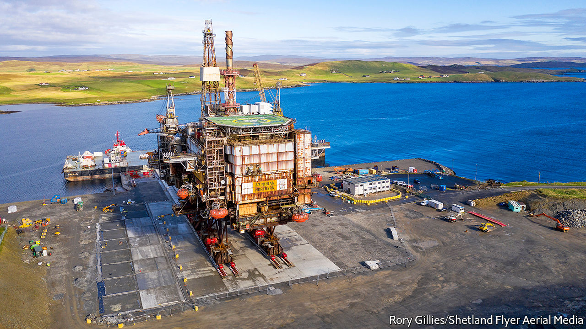

###### Carrion call

# The booming business of tearing apart oil rigs 

##### As North Sea oil dries up, the Shetlands turn to new work 

 

> Dec 12th 2020 


ROUNDING THE corner of Dales Voe, a sea loch in the Shetland Islands, Ninian North looms into view like a vast metallic mantis. Out of the water, the oil rig looks long and squat. Streaked with rust, it weighs 14,200 tonnes. For more than three decades the rig sucked oil from under the North Sea, producing 90,000 barrels a day at its peak in the early 1980s, and boosting the local economy in the process.


Now it awaits breakage, propped up against the Shetland sky by eight thick steel legs, lifeboats still dangling from its flanks (people often repurpose them as garden furniture, explains a worker). Men in hard hats and hi-vis vests take a cage lift up to the platform armed with angle grinders, blow torches and Geiger counters. They are stripping harmful substances out of Ninian, from asbestos to radioactive gunk dredged up from the sea floor.


In the late 1990s the North Sea delivered 4.5m barrels of oil a day. Now, it delivers just 1m. As production has tailed off, the Shetland Islands—home to 20,000 or so people, 110 miles north of Scotland—have sought new work. Tearing down the structures that fed the islands’ economy for decades doesn’t take up all the slack, but it helps. Britain is spending about £1.5bn ($2bn) a year on decommissioning, according to Oil and Gas UK, an industry body.


Ninian’s new home at Dales Voe was built for this kind of work. Thanks to the depth of the loch for which the facility is named, it can handle structures that extend hundreds of metres underwater. The facility came into operation in 2017, and has so far decommissioned two rigs. Ninian North is its largest job yet. Veolia, a French waste- and energy-management firm, runs the project, and has said that it expects the North Sea decommissioning market to grow in coming years.


The Shetland Islands are not the only place competing for the these contracts. There are deepwater facilities in Newcastle and Norway, and Aberdeen is said to be mulling one of its own. Although the Shetland facility is a relative newbie, it has the advantage of being closer to the oilfields. Alexander Kemp of the National Decommissioning Centre at the University of Aberdeen reckons oil-rig operators will spend £50bn taking old platforms out of the sea by 2050.


A large chunk of that is due to be spent in the next 15 years, when a number of the biggest, oldest fields are due for decommissioning—and the covid-19 pandemic has further accelerated things. The price of a barrel of crude slumped from $50 in February to $40 today, and was briefly as low as $16 in April, meaning oil-producing assets it might have made sense to keep in operation are no longer viable, and need to be taken out of the water.


Even so, those rig operators who are not making money are having a hard time paying for expensive decommissioning. It helps that they can offset their expenses against taxes that have already been paid. Yet this has caused rows with environmental groups, as the Treasury ends up owing oil companies—like Canadian Natural Resources, which owns Ninian—a refund.


The Shetland Islands will hope the subsidies continue. Sometime in May next year, at midnight, a demolition crew will blow out Ninian’s enormous steel legs, and its body will slump to the ground like a dying beast. Men will swarm the carcass, and begin tearing it apart in Lerwick’s midsummer gloam. Out in the North Sea, another 1.8m tons of oil and gas rig await the same treatment. ■

