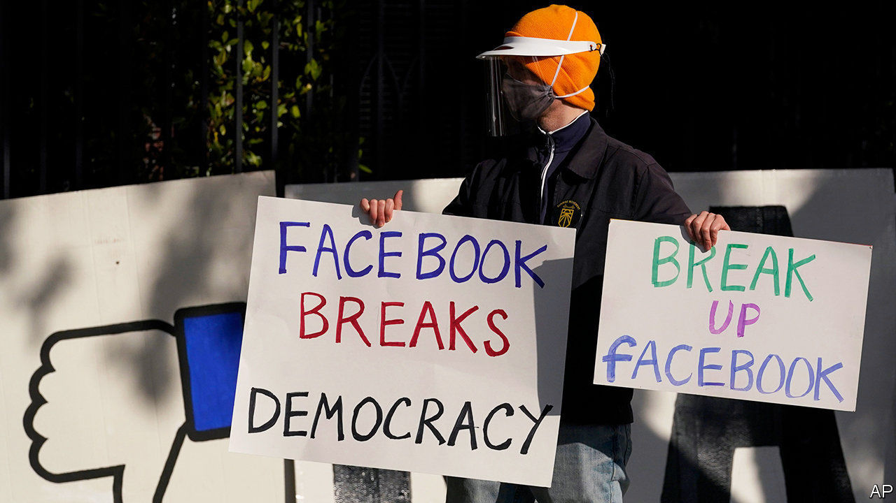

###### Battle commences

# A formidable alliance takes on Facebook 

##### Investors don’t seem to care 

 

> Dec 12th 2020 


LETITIA JAMES, New York’s attorney-general, couldn’t be blunter in describing the antitrust case lodged on December 9th against the world’s biggest social network. “By using its vast troves of data and money Facebook has squashed or hindered what the company perceived as potential threats. They’ve reduced choices for consumers, they stifled innovation and they degraded privacy protections for millions of Americans,” she declared, summarising the accusations. Forty-five states joined her bipartisan coalition against the giant. Separately, the Federal Trade Commission (FTC) sued Facebook for monopolistic practices in social-networking and demanded remedies including the firm’s break-up.


A few years ago co-ordinated action by 46 states and the FTC that could split Facebook apart was unthinkable, says Lina Khan, an antitrust scholar at Columbia Law School. But the case is about more than narrow competition law. The controversies around Facebook’s privacy practices, the spread of fake news and conspiracy theories on the platform, and its exploitation by authoritarian regimes mean regulators and politicians are set on forcing change.


Will they succeed? The cases look strong. Experts judge Facebook to be the lowest-hanging antitrust fruit, alongside Google (which America’s Justice Department sued over alleged monopoly abuses in October). Amazon and Apple are in the crosshairs, but those cases will take longer, if they come at all, says an antitrust expert.


Listen on:  |  |  |  | 


The Facebook lawsuits centre on its acquisitions. The firm maintained its monopoly in personal social-networking by systematically buying up potential competitors, both contend—notably Instagram in 2012 and WhatsApp in 2014. A smoking gun could be Onavo, an Israeli firm Facebook bought in 2013—to protect user data, the firm said. The suits claim it in fact used Onavo to track rival apps’ popularity and select acquisition targets. Another alleged anti-competitive practice was blocking rival app developers from its platform. As consumer harm is hard to prove against big tech’s mostly free products, the suits try a novel argument: that damage is done to users’ privacy and advertisers’ choice.


Facebook will argue that its market is social media, which is broader and more competitive than social-networking. TikTok, a Chinese-owned short-video app, is now more popular than Instagram among American teenagers. The internal Facebook emails on which the lawsuits hinge hardly paint a picture of a lazy monopolist; Mr Zuckerberg and his lieutenants see competitive threats everywhere. Facebook can also argue that breaking it up is well-nigh impossible. Last year it started integrating Instagram, WhatsApp and Messenger more deeply. And the FTC’s complaint fails to mention it cleared the Instagram and WhatsApp deals. The government “now wants a do-over”, sending a chilling warning to American business that “no sale will ever be final”, Facebook said.


Markets shrugged off the news. Facebook’s shares dipped by 2%, in line with the rest of big tech. Investors either see forced divestitures as unlikely, says Brent Thill of Jefferies, an investment bank—or spy even more money to be made from spin-offs. ■

