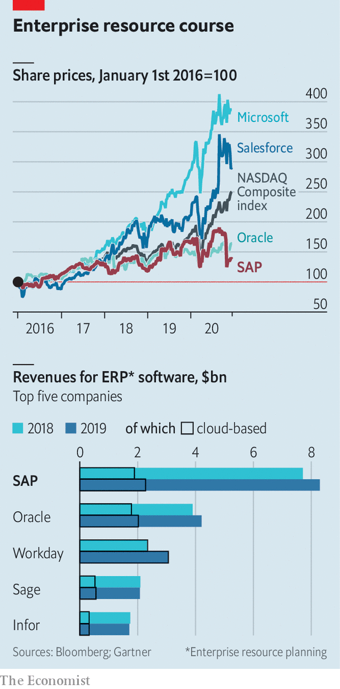

###### Europe’s biggest tech firm

# Can SAP’s new boss reset its business model? 

##### Christian Klein has the right ideas. Implementing them will not be easy 

 

> Dec 12th 2020 


“COUNT ON US, hold us accountable and together we will reinvent the way businesses run.” Thus ends a recent letter of support from 337 senior managers at SAP, a maker of business software, to Christian Klein, their chief executive. In April Mr Klein, then a stripling 39 years old, took over as sole boss of Europe’s biggest technology firm, after running it for a few months in tandem with Jennifer Morgan, an American who used to helm SAP’s business across the Atlantic. He needs all the love he can get, for SAP faces a challenge.


Mr Klein became CEO at the peak of covid-19’s first wave. It had hurt SAP more than other tech firms: many of its biggest clients, such as carmakers and energy companies, were temporarily hit by the pandemic. And it struck as more rivals were vying for swathes of the business-software market that the German giant used to rule.


Then, in October, Mr Klein was humbled when he presented changes to SAP’s business model that would depress margins in the short run and delay earlier revenue and profit targets by two years. Combined with lacklustre results for the third quarter, the news shaved 22% off the firm’s share price, wiping out €35bn ($41bn) in market value, the sharpest drop in 21 years and almost unheard of for a firm of SAP’s size (see top chart). The purchase of almost €250m in SAP shares the following day by Hasso Plattner, chairman of the supervisory board, who co-founded the company 48 years ago, did not reassure investors.

 


To regain their confidence Mr Klein must improve SAP’s offering in the cloud, and persuade more of its clients to move there. And he needs to do this while fending off competition from firms such as Oracle, Salesforce and Workday in America, SAP’s biggest market.


The pandemic has softened demand for “enterprise resource planning” (ERP) software, which firms use to manage their everyday operations—and which has long been SAP’s forte. It has also prompted SAP’s existing clients, typically large or medium-sized manufacturers, to rethink their ERP processes. “I never had so many calls from CEOs who wanted to talk about supply chains,” says Mr Klein. Retailers and manufacturers asked SAP for tools to get more visibility of their suppliers. Critically, many of them demanded that ERP, which has traditionally resided on firms’ own servers, be moved to the cloud instead.


SAP is very late to the cloud, where companies have been progressively moving for the past 20 years, says Liz Herbert of Forrester Research, a consulting firm. Oracle, which also embarked on the transition belatedly, has done so swiftly. So has Microsoft, the world’s biggest software-maker, with ambitions to expand its enterprise offerings. By contrast, SAP remains more of a hybrid. It has moved a chunk of its business to the cloud but many big customers still use its software on their premises.


Why the dithering? Shifting complex, customised end-to-end ERP processes to the cloud is much harder than uploading human resources, sales or customer-relationship management, Mr Klein explains. And ERP remains SAP’s bread and butter: it controls 21% of the market, according to Gartner, a research firm, compared with 11% for Oracle, its closest competitor (see bottom chart). A whopping 92% of Fortune 500 companies—from carmakers, like BMW, to defence firms, such as Lockheed Martin—use SAP software. It therefore cannot get the transition wrong. SAP listened to its customers and took a methodical approach, says an executive at a rival software firm, whereas the market wants it to move fast and break things. 


Even so, says Mr Klein, “covid was clearly an inflection point.” Bosses of big firms who may have waited another five years before switching to the cloud now want to speed up. They are also demanding a closer integration of SAP affiliates acquired by Mr Klein’s predecessor, Bill McDermott. These include Concur, a travel-expenses firm; Ariba, a procurement platform; and SuccessFactors, which makes HR software. This will require additional investments by SAP. So will Mr Klein’s plan to increase spending on research and development.


SAP must now persuade its 35,000-odd ERP clients of the benefits of the cloud. It must convince investors of the same thing. Licences for on-site software bring a big chunk of revenue upfront, whereas customers initially pay much less for rolling cloud subscriptions. But recurring revenues are increasingly coveted by all manner of technology firms, from Amazon and Apple to Netflix, because they are more predictable and build a closer relationship with customers. The shift to the subscription model will eventually mean a big revenue lift for SAP, predicts Mark Moerdler at Bernstein, a broker.


As for the transition to the cloud, it need not be onerous technically. That is a bit of red herring, thinks Paul Sanderson of Gartner. The bigger challenge is changing the culture of SAP, which has become too removed from its clients.


Rivals will try to exploit the transition period to win over some of those customers. Larry Ellison, the colourful co-founder and now chief technology officer of Oracle, declared last year that “SAP’s customer base is up for grabs.” His subsequent claim that a huge client of SAP was about to defect to Oracle proved unfounded. Another such boast might not be. ■

