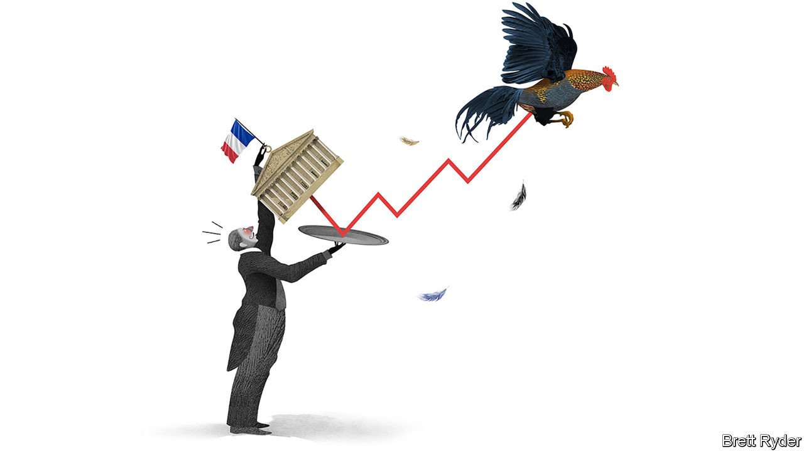

###### Schumpeter

# Unshackling France SA 

##### The best French firms have shaken off the attention of politicians—and thrived 

 

> Dec 12th 2020 


IF DINNER PARTIES were permitted in locked-down France, it is not hard to guess what would set le tout Paris aflutter. For months bankers, politicians and other pre-covid canapé-scoffers have taken sides in a corporate battle royale pitting two century-old firms against each other. Veolia, a water- and waste-management utility, has been struggling to gobble up Suez, a rival which is resisting fiercely. The proposed deal is mired in legal disputes, boardroom recriminations and ministerial intrigue. All grist to the mill for those who see French business as the product of its politicians’ dirigiste tendency to shape the private sector in the mould of the public one. But look at the wider French business landscape and the stereotype is out of date. Away from the clutches of politicians, many French firms have become world-beaters. Is this thanks to the attention of elected officials—or in spite of it?


The ugly spat between Veolia and Suez shows politics still matters in Parisian business circles. Given the two firms offer the same outsourced environmental services to customers dotted across the globe, a tie-up has long been mooted. Veolia having already seized nearly a third of its target’s shares, each side has lined up members of l’establishment to make its case. Their brief is not so much to convince shareholders of the merits of a deal, as might be the case in Britain or America. Rather, politicians whose assent is considered critical are an important audience. Suez and Veolia are each said to have a former speechwriter to President Emmanuel Macron lobbying for them (not the same one). Given that a slew of legal challenges and regulatory clearances is required, the outcome will not be known for months. Few think it will hinge on the transaction’s commercial merits.


Such intrigue used to delight the French business elite. Now it feels old hat. Look at the top of the CAC 40 index of France’s leading companies today, and a new generation of firms has emerged. Two decades ago the corporate league table was dominated by firms in sectors in which relations with government matter, such as telecoms, utilities or banking. The bosses of France Télécom or BNP Paribas, a bank, were inevitably former ministerial advisers. More often than not they had graduated from the École Nationale d’Administration (ENA), a finishing school for public officials.


Fast forward to today and the CAC 40 is led by companies with less use for political connections. The index’s brightest stars today are luxury giants such as LVMH (of Louis Vuitton fame), Kering (Gucci) and Hermès; L’Oréal, a beauty-products firm; Sanofi, a drugmaker; and a host of industrial giants. Selling handbags or skincare products to Chinese yuppies is a global contest in which French firms excel, thanks to competent management. Lesser-known but equally astute companies such as Schneider Electric, a specialist in energy-management kit, have outperformed American rivals such as 3M and General Electric, and European ones like Siemens and ABB. Investors in Air Liquide, a chemicals firm, have enjoyed juicier returns than those of Germany’s BASF or America’s DuPont. Publicis, an advertising group, is worth nearly three times as much as in 2000, while rivals like WPP in Britain and Omnicom in America have lost market value. EssilorLuxottica, a French-Italian firm, is the world’s biggest purveyor of spectacles.


Even more telling, some big firms began to prosper only once unshackled from the government yoke. Total, an oil-and-gas major, used to be worth a fraction of BP or Royal Dutch Shell. As it has gained distance from the corridors of power since privatisation in 1992, it has caught up with its European rivals’ valuations. Safran, an aerospace firm, has seen its market value go up 14-fold in two decades as the state has sold down its stake. Airbus has outpaced its American jetmaking nemesis, Boeing, as political meddling (by the many European governments that founded it) has ebbed.


And today political allies carry less heft than they once did. According to Morgan Stanley, a bank, over 70% of big French firms’ revenues nowadays come from overseas, where French politicians hold little sway. Most regulation critical to French firms used to be done at national level, where regulators were drawn from the same ENA lecture halls as corporate bosses. Now a lot is carried out by European or global watchdogs.


That is not to say that big firms and politicians steer clear of each other. France’s foreign minister recently waded into LVMH’s takeover of Tiffany, an American jeweller, in ways that were eyebrow-raisingly useful for the French luxury champion. But direct patronage is becoming a burden. The French authorities remain a shareholder in Renault and in 2019 clumsily handled a proposed merger with Fiat Chrysler Automobiles, an Italian-American rival (whose big shareholder, Exor, owns a stake in The Economist’s parent company). Peugeot, a nimble competitor with no direct state shareholding, is now in the midst of the merger Renault fluffed.

French whines


Corporate France has plenty of shortcomings. It has no tech giants to match Google or Amazon. Many large companies with few state ties, such as Accor, a hotel chain, and Carrefour, a retailer, are decidedly ordinary. The CAC 40 was lagging behind its European and American equivalents even before covid-19 hit the French economy particularly hard. Its smaller firms pale in comparison to Germany’s Mittelstand. And French politicians, though no longer the dirigiste master-planners of yore, still pine for national (or European) champions to take on Chinese rivals. They frown on hostile takeovers—the mere prospect of which serves to sharpen managers’ minds—which is one reason the Veolia-Suez deal may fail.


That is a shame. Just ask Danone’s shareholders. In 2005 an unsolicited approach by PepsiCo for Danone was foiled by the French authorities on the grounds yogurt-making was a strategic industry. The American firm went on its way and has since delivered fizzy profits for its shareholders. Those at Danone, meanwhile, have had to stomach far blander returns.■

