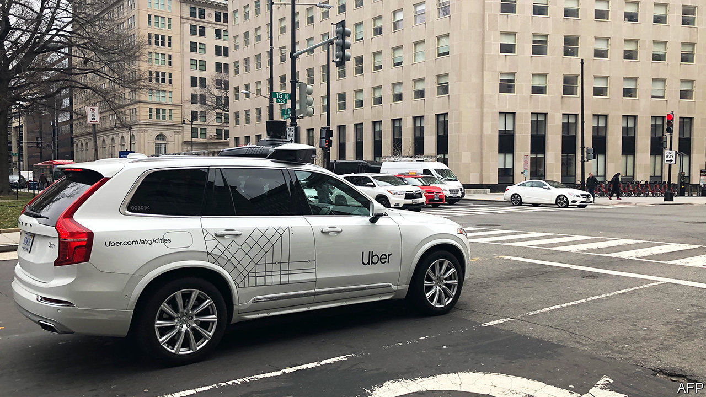

###### Spinning off

# Why is Uber selling its autonomous-vehicle division? 

##### Self-driving cars were meant to be its future 

 

> Dec 12th 2020 


IN 2016 TRAVIS KALANICK, then Uber’s chief executive, described self-driving cars as mission-critical. If somebody managed to beat Uber to making them work, he said, then the rival’s ability to offer taxi trips without paying for human drivers would mean that “Uber is no longer a thing.”


Times change. On December 7th Uber announced the sale of its self-driving arm to a firm called Aurora. No price was given. But Uber said it would put another $400m into the unit; that Dara Khosrowshahi, its current boss, would join Aurora’s board; and that the deal would leave it with a 26% stake in Aurora.


One reason for the spin-off is Uber’s belated effort to return to profit. It lost $8.5bn in 2019, as it fought for market share with rivals such as Lyft. Besides offloading the self-driving unit, the firm has sacked workers and sold its Jump electric-bicycle division to Lime, a scooter firm. On December 8th Uber said it would flog its Elevate flying-car project to a startup called Joby Aviation.


Another explanation is that the reality of self-driving has lagged far behind the excitement, as it had done in the idea’s earlier heydays in the 1960s and the 1990s. The machine-learning software on which the cars rely often struggles to cope with “edge cases”, which are absent from software’s training data but pop up regularly on real roads.


Uber’s self-driving progress has, according to industry rumours, been slow. In 2018 one of its cars ran over and killed a pedestrian in Arizona. It is not alone; Tesla’s “Autopilot” feature has been linked to at least four deaths since it was launched in 2015. But Uber’s Kalanick-era reputation for rule-breaking has made the PR burden heavier.


The bearish interpretation of the sale is that, having given up on self-driving, Uber will remain a fancy taxi-and-delivery firm. But if Aurora can buck expectations and make self-driving work, Uber could license the technology back. And high-tech distractions like self-driving cars—or flying ones—may be the last thing the firm needs. It is under pressure not just from rivals and investors but also from regulatory probes into its other big cost-saving innovation—the assertion that its drivers are not employees, but independent contractors. Joe Biden, America’s president-elect, has called that a “misclassification”. Tighter European rules will come into force by 2022. Those edge cases look urgent.

