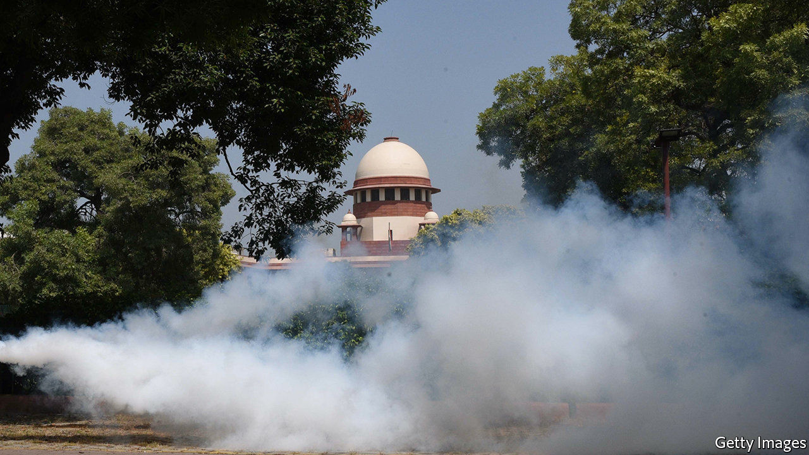
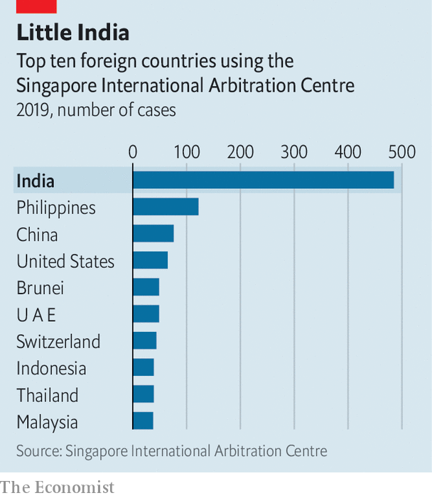

###### The case of the disappearing cases

# Why more Indian business disputes are settled elsewhere 

##### Companies prefer the speed and impartiality of foreign arbitrators 

 

> Dec 12th 2020 


AMAZON, VODAFONE and Cairn Energy operate in different industries: e-commerce, telecoms and oil-and-gas exploration, respectively. But they share a common predicament. All are waging legal battles over their Indian operations—and doing so outside India.


The trio are part of a larger wave. Last year nearly 500 cases filed in the Singapore International Arbitration Centre came from India. No other country came close (see chart). The number of Indian parties involved in arbitration through the Paris-based International Chamber of Commerce tripled last year, to 147. More quietly, London remains a crucial centre for India-related commercial spats, as to a lesser extent does The Hague. Two newish arbitration centres in the United Arab Emirates, in Dubai and Abu Dhabi, want in on the game.


Narendra Modi, the prime minister, is believed to dislike this trend. His administration sees it, with reason, as an infringement of India’s sovereignty—but also as impugning its laws and judicial process. The resistance to outside meddling in the country’s legal affairs is echoed by its bar association, which blocks foreign lawyers and law firms from practising locally.

 


Crucial components of the legal system are nevertheless being outsourced. Companies feel that it is the best way to get a fair shot in India. And for all its grumbling, India’s government understands that attracting investment requires the availability of a judicial recourse that is considered efficient and fair—which Indian courts can at times seem not to be.


The emigrant cases can be divided into two categories. The first kind involve the Indian government. Vyapak Desai of Nishith Desai Associates, an Indian law firm with expertise in the area, has compiled a list of more than a dozen big cases pending. Some were brought by Indian firms. In 2017 Reliance Industries, a conglomerate famous for ably navigating India’s courts and bureaucracy, chose Singapore as the venue to fight a $1.6bn claim by the Indian government, which accused it of improperly extracting gas from fields owned by state-controlled firms. Reliance won and was awarded $8m in compensation.


Foreign arbitration is all the more attractive for firms lacking Reliance’s local nous. Cairn, which is British, filed its case in The Hague, arguing that it should be paid back $1.4bn in taxes involuntarily extracted on the basis of a retroactive law passed in 2012, which was applied to an asset sale six years earlier. Cairn says this violated a bilateral investment treaty between Britain and India; a decision is expected any day now. Vodafone’s case stems from the same law and relies on a similar treaty which India signed with the Netherlands. The firm, which had purchased mobile-telephony assets in 2007, won a bitterly fought case before India’s Supreme Court in 2012 exempting it from a capital-gains tax on the transaction, only to have the levy reimposed by India’s parliament. In September it won a unanimous decision fro


m a three-person arbitration panel in The Hague.


The prime minister’s office is said to be torn over offshore arbitration. On the one hand, it believes that foreigners have no right to contest Indian taxes; partly in response to such cases it has withdrawn from 73 bilateral investment treaties, including the British and Dutch ones, and imposed more onerous terms for challenging tax assessments in new ones it has signed.


On the other hand, it fears that rejecting arbitration would reinforce the sense that India is a toxic place for foreign firms to invest. Appealing against a decision—let alone ignoring it—brings costs, not least by putting off investors at a time when Mr Modi is keen to lure them away from China.


The second category of disputes settled abroad involves only private parties. These often move offshore simply because business moves fast whereas Indian courts do not. It takes more than three years on average to resolve a case before the High Court in Mumbai and nearly three years in Delhi, according to a study by Daksh, a research group. Seven years is not uncommon, Daksh says. Lawyers in Mumbai’s High Court report that is not hard to find cases still pending from the 1960s.


Most of the offshore private cases are resolved quickly and quietly. Some, though, make headlines. The one involving Amazon is an example. In October the e-commerce giant won a favourable decision in Singapore to suspend the acquisition of a tottering retailer, Future Group, by Reliance. Amazon had earlier negotiated with Future a right of first refusal on any sale. Given Future’s troubles, Amazon might reasonably have felt it had no time to wait for a sluggish Indian court to intervene. In appealing against the Singaporean arbitrator’s decision to the Delhi High Court, Future accused Amazon of acting “like the East India Company of the 21st century”. The comments chimed with Mr Modi’s instructions to all Indians to “be vocal for local”. They rhyme less well with his appeals to foreign investors.■

