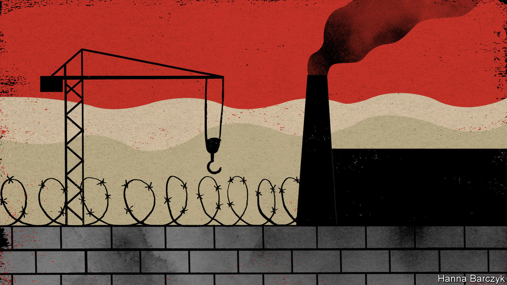

###### Chaguan

# China is doubling down in Xinjiang 

##### Our columnist visits factories accused of using forced labour 

 

> Dec 10th 2020 


A VAST EXPANSE of sand dunes, studded with the wind-eroded ruins of lost Silk Road cities, the Taklamakan Desert is a fine place to hide a guilty secret. At first glance, shame is a plausible explanation for a mini construction-boom under way in this remote corner of Xinjiang. For outsiders are increasingly shocked by China’s rule over this north-western region, where millions of Uyghurs, an ethnic minority, endure oppressive, high-tech surveillance and the constant fear of detention for alleged Islamic extremism.


For the past few years overseas human-rights groups and scholars have used satellite images and Chinese government documents to track dozens of factories rising on the Taklamakan’s southern edge in Lop County, a poor and almost entirely Uyghur area. The factories line the newly laid streets of an industrial park sponsored by the city of Beijing, 4,000km to the east. More alarmingly, satellite images and the Xinjiang government’s own propaganda suggest that as the park rose from the desert sands, at least one political re-education camp lurked amid the factories.


Across Xinjiang over a million Uyghurs have passed through such camps in recent years. Officials eventually admitted to the camps’ existence in 2018. Pointing to terrorist attacks by Muslims from Xinjiang, they said China had set up vocational training centres to cure minds infected with religious extremism. In October 2018 China Central Television toured a camp in Hotan, an ancient oasis city. Detainees were shown in Mandarin-language classes, studying Chinese laws and learning such skills as sewing, before thanking authorities for saving them. In contrast, critics call the campaign both brutal in its methods and horrifyingly arbitrary in its application. Leaked government files record Uyghurs interned for such “suspicious” acts as growing long beards, applying for a passport or using foreign messaging services like Skype. Ex-detainees have accused camp staff of beatings and rapes.


Now this giant social-engineering project is evolving. In late 2019 officials said that all detainees have graduated from compulsory studies. On a recent weekend Chaguan visited the Hotan city camp toured by state television and found it apparently abandoned, observed only by a clutch of camels and locals digging for white jade in a dried-up riverbed. Closing highly visible sites signals shifting tactics, not a change of heart. China is merging counter-terrorism work in Xinjiang with nationwide campaigns to assimilate ethnic minorities and push the rural poor into formal employment, in the name of development and social stability. A State Council white paper from September, detailing training and job placement campaigns in Xinjiang, found 2.6m “rural surplus workers” in the region, notably Uyghurs with “outdated ideas”.


Hints of trouble abound. The white paper blames “terrorists, separatists and religious extremists” for inciting locals to “refuse to improve their vocational skills”. Global firms that audit multinational supply chains for labour abuses increasingly decline to operate in Xinjiang, blaming authorities for obstructing their work. Earlier this year the American government said that it suspects several businesses in Lop County of using forced labour, specifically firms trading in human hair. American customs officers seized tonnes of wigs and hairpieces in June, then afterwards banned all hair imports from the Lop County Hair Products Industrial Park, a zone within the Beijing Industrial Park. Chinese government spokesmen and state media dismiss talk of forced labour as a smear by Westerners bent on keeping China down.


To an optimist, such shrill denials might suggest that sanctions are biting. Xinjiang has a lot to lose: it supplies almost a fifth of the world’s cotton, among other commodities. Your columnist, who is not generally an optimist, headed to Lop County to take a look in person. Chaguan travelled with a reporter from another Western newspaper. As happens in Xinjiang, police were already waiting for the foreign journalists at Hotan, the nearest airport to Lop County. An hour later, goons blocked an access road to the industrial park, turning Chaguan’s taxi away. He and his colleague finally arrived on foot after a long desert walk around the park boundary, a metal fence topped with four strands of electrified wire.

Defiance in the desert


American sanctions have yet to paralyse Lop County’s factories, it can be reported. On a freezing but sunny weekend morning, the entrance to the hair-products park was busy with traffic. Nearby, construction workers toiled on new buildings. The arrival of foreign reporters triggered bouts of pushing and arm-grabbing by unidentified men bent on stopping the Westerners from proceeding further, one of whom called himself “the person responsible for the park”. Trying to grab reporters’ smartphones, they demanded the deletion of pictures of their industrial zone and of what appears to be a training facility at the park’s southern end, resembling a secure boarding school, down to young adults lined up in rows on a playing field. Questions were greeted with evasions. “We don’t really have dealings with the outside world,” replied one of the men when asked about American sanctions. Initially asserting that his company only sells to domestic markets, he then claimed that it makes nothing at all and “is still being put together”.


The men staged one more physical confrontation when a hulking, prison-like complex with tall grey walls and guard towers came into view. Failing to stop the foreigners from seeing the prison, they focused on preventing photography.


Still, evidence-destruction is not a sign of a sore conscience. Bits of the park designed to be seen from the ground by locals are unapologetic. Giant rooftop characters in the training facility spell out such slogans as: “Labour is glorious” and “Serve the economy”. A poster by the main gate shows President Xi Jinping surrounded by smiling Uyghur children. China’s regime is secretive because it has no patience for debating its policies with foreigners. It is proud of its iron-fisted rule in Xinjiang, and is not about to change.■

