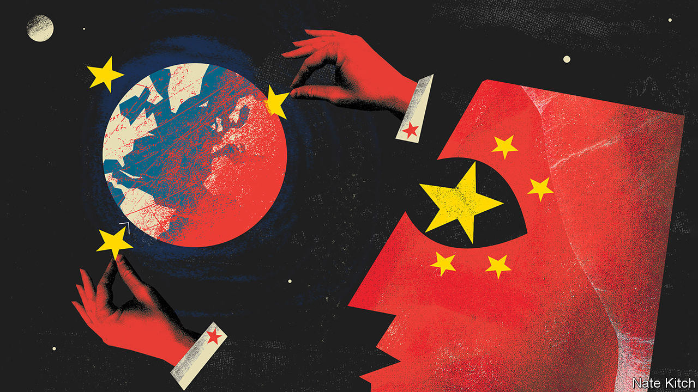

###### Exporting Xi Jinping thought

# How China’s Communist Party trains foreign politicians 

##### Across the world it is seeking to sway tomorrow’s leaders 

 

> Dec 10th 2020 


IN EARLY DECEMBER Xi Jinping, China’s leader, declared that the Communist Party had met a self-imposed deadline. Extreme poverty (defined as earning a bit more than $1 a day) has been eradicated from China. Naturally, the party is keen to tell others about its success in fighting penury. In October it hosted a mostly-virtual two-day seminar on the subject for nearly 400 people from more than 100 countries. Participants quoted by official media gushed praise for China’s progress. But the gathering was not just about uplifting the needy. It was also aimed at showing off China’s political model.


In the West, recent coverage of China’s diplomacy has been dominated by talk of how aggressive it has become. Some of its diplomats have been dubbed “wolf warriors” because of their habit of snarling at foreign critics (the label refers to the title of a jingoistic Chinese film). To non-Western audiences, by contrast, Chinese officials are speaking more softly. They preach the virtues of a form of governance that they believe is making China rich and can help other countries, too. Some welcome this message, even in multiparty democracies. At the poverty-alleviation forum, the secretary-general of Kenya’s ruling Jubilee Party, Raphael Tuju, was quoted as saying that China’s Communist Party should be an example for his own.


In 2017 Mr Xi caused a stir in the West by suggesting that China’s development model offered “a new option” for other countries, and that a “Chinese approach” could help solve humanity’s problems. Though he later insisted that his country did not plan to export a “China model”, the country’s officials have been, in effect, doing just that. Some of those engaged in this effort belong to the foreign ministry. But many, such as those who organised the recent seminar on poverty, work for a branch of the Communist Party called the International Department. Its job is to win support for China among foreign political parties.


The department is well suited to the task. Because it does not directly represent the Chinese state it has no role to play in verbal sparring. But as a party outfit it has considerable authority. It works closely with the foreign ministry and swaps personnel with it.


Late in 2017 it held a convention in Beijing joined by leaders and other members of political parties from 120 countries. Some delegates were from rich democracies such as Japan, New Zealand and America. (Both Republicans and Democrats attended.) Mr Xi gave the keynote address. Many participants signed a statement, the “Beijing Initiative”, praising the Communist Party and Mr Xi. The department has few qualms about the kind of political parties with which it interacts. “They’ll deal with right-wing parties and they’ll deal with left-wing parties and everybody in between,” says David Shambaugh of George Washington University.


Under Mr Xi one of the department’s main activities has been organising training sessions for foreign political parties, especially those from developing countries. It does not say outright that authoritarianism is good. But its mission is clearly to promote the virtues of strong centralised leadership. In November Song Tao, the department’s boss, claimed in an online briefing of party leaders from 36 sub-Saharan African countries that the party’s achievements in development proved the wisdom of five-year plans. “The Chinese system,” he said, could “serve as a reference” for his audience. He said that “only by upholding the leadership of the party” could such plans “stay on the right track”.


During the pandemic much of the department’s instruction has been conducted online, often focusing on China’s achievements in crushing covid-19 (one lesson: tough measures work). Expositions on Mr Xi’s three-part tome, “The Governance of China” have also been a common feature. In recent months such classes have been attended by officials from ruling parties in Angola, Congo-Brazzaville, Ghana, Mozambique, Panama and Venezuela.


Official websites in China often advertise these efforts. One describes a ground-breaking ceremony in 2018 for a China-funded ideological school in Tanzania. It was attended by Mr Song, the department’s boss, and by ruling-party officials from Tanzania, South Africa, Angola, Mozambique, Namibia and Zimbabwe.


In democracies such as Ghana, Kenya and South Africa the department sponsors trips to China by ruling-party members for the study of party-building and governance. In 2018 Ghana’s ruling centre-right New Patriotic Party (NPP) asked for such training in part to “deepen its ideological skills”, found Joshua Eisenman of the University of Notre Dame, an expert on the department’s activities in Africa. The former ruling party of Ghana, the National Democratic Congress (NDC), has sent dozens of its staff to China for such training. The NDC has also opened a leadership school in Ghana. It uses teaching materials devised by the Chinese Communist Party.


It is unclear what foreign party members gain from China’s training sessions. They may be no more than a means of career advancement, or of paying ritual homage to Mr Xi’s wisdom in order to curry favour—China being a valuable source of loans and investment in many developing countries. The seminars can be boozy junkets, dreary snoozefests, or both. An Egyptian veteran of them says they are hardly rigorous; she likened the experience to a “paid vacation”.


The department says it has contact with more than 600 political organisations in over 160 countries. Under Mr Xi such engagements have grown. Christine Hackenesch and Julia Bader, writing for International Studies Quarterly, found that the number of high-level party-to-party meetings increased by more than 50% between 2012 and 2017, to more than 230 annually. Martin Hala of Sinopsis, which monitors China’s activities in Central Europe, has called this akin to forming a “new Comintern”—a reference to the old Soviet-led international communist movement.


There is a critical difference, however. China is not preaching communism. Its aim, rather, is to show that a country can become richer without being democratic. That message finds attentive ears among politicians who find the checks and balances of democracy irksome. In June Kenya’s Mr Tuju (the cheerleader for China at the anti-poverty seminar in October) was challenged about his party’s affection for the Chinese Communist Party by a reader of a Nairobi newspaper. He replied that he did not see what was wrong with “learning from the most successful and the best run” party in the world. ■

