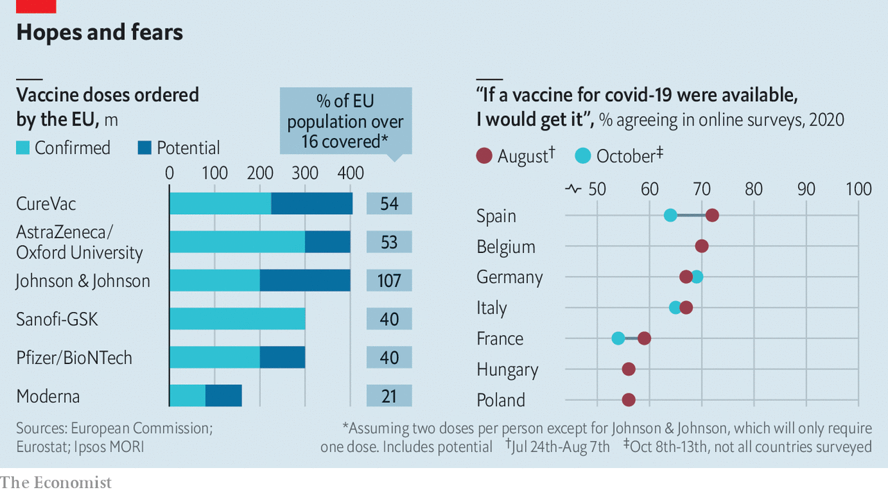

###### Coming soon

# Europe prepares for its first batches of covid-19 vaccines 

##### But supplies and uptake are both uncertain 

 

> Dec 12th 2020 


IN A TYPICAL year the Velodrom, an indoor arena in Berlin that can hold 12,000 people, hosts sports events, trade shows and concerts. This year, the biggest gig it is preparing for is a mass vaccination drive. If all goes to plan, in early January people will start streaming through its 75 booths that are being set up for dishing out doses of Germany’s first supplies of covid-19 vaccines. Two of Berlin’s disused airports and other venues are also being turned into vaccination centres. The plan is to be ready to vaccinate 20,000 Berliners a day over six weeks. This would account for 10% of the city’s residents, mainly the very old.


Germany is rushing to set up more than 430 mass vaccination sites like these. It is also organising roaming vaccination teams for care homes. In spring, vaccines will become available at doctors’ offices. Mobile teams will visit the infirm at home.


Other European countries are preparing too, though most are far behind Germany. Italy plans to set up 300 covid-19 vaccination sites, starting in hospitals, along with mobile units. The laggards are in eastern Europe, where some countries have done little more than set up task forces.


The starting shot for vaccination in the European Union will be fired on December 29th, when the European Medicines Agency (EMA), the EU’s drug regulator, is expected to decide on a covid-19 vaccine created by Pfizer and BioNTech, which has already been approved in Britain. On January 12th the EMA will make the call on a second vaccine, by the American firm Moderna. Other covid-19 vaccines that are still in clinical trials will follow. By the look of things, at some point in 2021 most European countries may be using three or more covid-19 vaccines simultaneously.


A mix of vaccines will be needed. Global supplies of any one of them will be crimped for months. Sharp elbowing for vaccines during the 2009 H1N1 (swine flu) pandemic left some European countries unable to procure any. Wary of that, the European Commission, the EU’s executive branch, earlier this year organised joint pre-purchase agreements on behalf of all 27 member states with the developers of several prospective covid-19 vaccines (see chart). These firms received hundreds of millions of euros to set up production facilities, even before their vaccines are approved. In return, they are reserving large amounts of their first vials for the EU at a set price. Approved vaccines will be distributed by the manufacturers to every EU country in proportion to its population, as batches become available.

 


At the moment, the EU has been promised up to 300m doses of Pfizer’s vaccine and 160m doses of Moderna’s. Both require two shots per course, so this should be enough to cover 60% of all the EU’s adults. The snag is that not much of it will be ready before spring, even if there are no production hitches, which is hardly guaranteed given that the vaccines are new and production chains span several countries. In early 2021 Italy, a country of 60m, expects to get enough of the two vaccines for only 4.7m people. By some estimates, if Germany relies on its allotment of Pfizer’s vaccine alone, it will take two years to get enough for 60% of its population, the estimated threshold for “herd immunity”, the level that stops the disease from spreading.


Hence the impatience of some countries, which are looking to top up their EU allotments. Hungary is importing a Russian vaccine not vetted by the EMA. Germany is cutting its own deals with Pfizer and other vaccine-makers, joining a queue that already includes America, Britain, Japan and a global consortium buying covid-19 vaccines for poorer countries. All of this leaves European governments pinning hopes on the success of some of the other vaccines in the pipeline, and soon.


Since demand will exceed supply for some time, governments are stepping in to decide who will get priority. The answer varies by country. Bulgaria, for example, plans to start with medical workers because its hospitals are bursting with covid-19 patients, and infections among doctors and nurses are rampant.


Germany, Sweden and the Netherlands, by contrast, have weighed up the benefits of vaccinating various groups and decided to start with the elderly. German experts considered three scenarios: vaccinating those with pre-existing health conditions, the over-60s and people over 80. Their statistical models suggest that if only 500,000 people a week can be vaccinated, over a 12-week period the greatest reduction in deaths and hospitalisations will occur if all of them are over 80. The total years of life gained by vaccinating this group was also estimated to be the largest.


By April or May, Europe’s vaccination woes may swing the other way: vials of vaccine may be more plentiful but takers may be too few. Surveys asking Europeans whether they would be willing to get a covid-19 jab are returning dispiriting results (see chart 2 and ). Ipsos MORI, a pollster, found that in some countries the share of people who say yes actually fell between August and October.


An early sign to watch will be the uptake rate among health workers, whom most European countries plan to jab early on. As things stand, many of them avoid seasonal flu shots and have doubts about the safety of the first covid-19 vaccines. Medics are as prone to believing misinformation about vaccines as anyone else. But Jacques de Haller, a former president of the Standing Committee of European Doctors, a professional association, says that some doctors avoid flu shots out of sheer arrogance, believing they are impervious to the disease.


Based on all this, some experts fear that, without strong public-messaging campaigns, the uptake of vaccines in Europe, even in countries that do well, could be as little as 40%. Mass public-communication campaigns are already being planned. One idea floated in Germany is the slogan “Sleeves up”, with photos of people cheerfully getting the jab, possibly with a single central phone number that people can call for an appointment.


But a lot more than posters and slogans will be needed. In France, where people are among the most suspicious in Europe about any vaccine, millions have watched “Hold-Up”, a slick two-hour online documentary packed with conspiracy fiction about covid-19 vaccines. It is just accurate enough to confuse viewers. As pallets of vaccine begin to arrive in European cities, a big question remains unanswered. Will people correctly see it as the best way to protect grandma, curb the pandemic and bring life back to normal? Or will they see it as a risky drug peddled by untrustworthy governments and corporations, and decide not to roll up their sleeves? If too many make the wrong or selfish choice, 2021 will be another annus horribilis. ■


Editor’s note: Some of our covid-19 coverage is free for readers of The Economist Today, our daily . For more stories and our pandemic tracker, see our 

