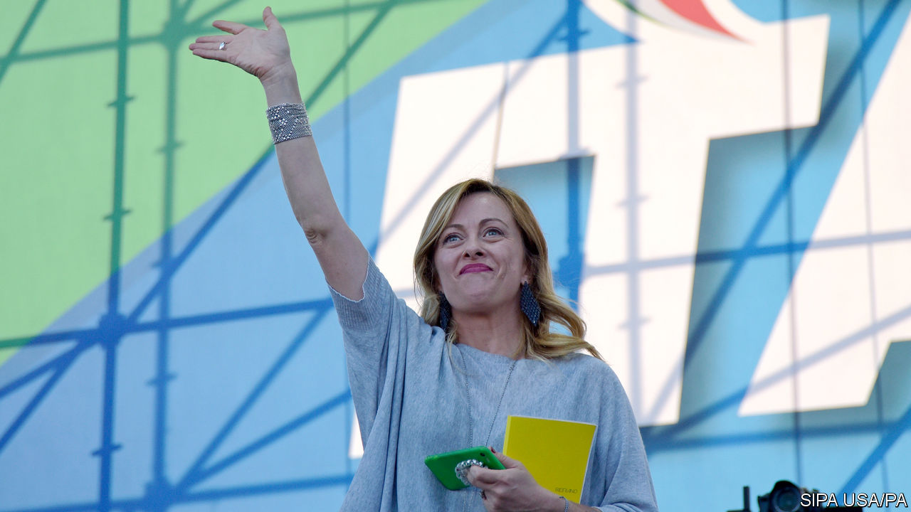

###### Unchained Meloni

# The Brothers of Italy are on a roll 

##### Might they team up with the Northern League to form a government of the hard right? 

 

> Dec 12th 2020 


THE SCANDALS that demolished Italy’s post-war political order in the early 1990s brought a new generation into public life. Among them was Giorgia Meloni, who at the age of 15 chose to join the youth branch of the Italian Social Movement (MSI), the direct heirs of the Fascist Party and its leader, Benito Mussolini, who ruled Italy as a dictator until 1943.


Today Ms Meloni is riding high as a leader herself. Her party, the Brothers of Italy (FdI), has been the outstanding beneficiary of the covid-19 pandemic. Since late February, when it was already on a roll, the party has climbed steadily in the opinion polls from around 12% to more than 16%. It has overtaken the anti-establishment Five Star Movement, notionally the senior partner in Giuseppe Conte’s governing coalition. The FdI is “becoming firmly established as Italy’s third party”, says Antonio Noto of Noto Sondaggi, a polling firm. Nor is it unthinkable that it may soon become the second. Some recent soundings have put Ms Meloni’s party just four points behind the centre-left Democratic Party, also in the government. Mr Conte’s coalition looks increasingly fragile. It is split by a row over divvying out money from the EU’s covid-19 recovery fund. Were it to fall, an election might produce a hard-right coalition government consisting of the FdI and Matteo Salvini’s Northern League, which still leads in the opinion polls, with around 24%.


The rise in the Brothers’ popularity has almost exactly matched the fall in support for the League. Mr Salvini’s raucous showmanship has jarred with an electorate gripped by fear of the virus and its economic consequences. At the same time even diehard nativists must question the League’s leader’s continuing emphasis on unauthorised immigration. So far this year 33,000 migrants have reached Italy, almost three times as many as in 2019 but a far cry from the 181,000 who arrived in 2017.


Ms Meloni has conveyed a more nuanced and sober message, typical of her canny stewardship of a movement that two years ago won less than 5% of the vote at the last general election. Brothers of Italy may be a slightly odd name for a party led by a woman, but it echoes the first line of the national anthem. Under Ms Meloni the FdI has remained passionately nationalistic and wedded to identity politics. Its motto is “God, family and fatherland”. Top of its 15-point programme is greatly increased support for families, to boost the birth rate so Italy no longer needs immigrant workers. It is fiercely against giving automatic citizenship to children born in Italy of immigrant parents, and would impose a naval blockade to stop further arrivals.


The FdI originated in 2012 as a splinter group, made up of lawmakers from the right of Silvio Berlusconi’s catch-all conservative alliance, the People of Freedom. It particularly objected to the TV mogul’s high-handed leadership and his tolerance of EU-imposed austerity. The Brothers’ programme calls for a “rediscussion” of all the EU’s treaties, including those underpinning the euro.


But since taking over the leadership in 2014, Ms Meloni, unlike Mr Salvini, has played down her party’s Euroscepticism. In other areas, too, she has striven to give her party a more moderate image. That got a boost in September when she was elected head of the pan-continental European Conservatives and Reformists Party. Though it includes the likes of Vox in Spain and Poland’s Law and Justice party, it also includes Britain’s Conservatives, allowing the FdI to project itself as no longer belonging to the extreme right.


Perhaps the most telling similarity between Italy’s two hard-right parties is that each is geographically challenged. The FdI’s support comes mostly from the south and centre, just as the League’s base is largely confined to the north. Together they could make a formidable combination. ■

