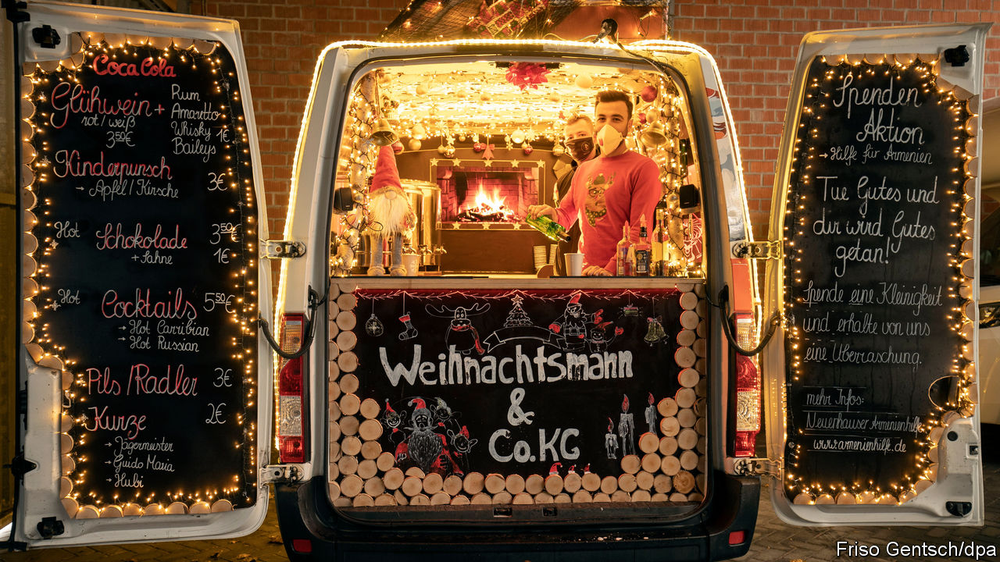

###### In vino, virus

# The joys and perils of Glühwein gatherings in Germany 

##### Covid-19 cases are rising fast 

 

> Dec 12th 2020 


IT IS A chilly winter evening in a courtyard in Prenzlauer Berg, a chic district in Berlin. The company is convivial, a fire pit is blazing and two cheerful barmen are serving up endless glasses of steaming Glühwein, a Christmassy concoction of spices, citrus, sugar and (usually bad) red wine. Under coronavirus restrictions the drinks are supposed to be consumed elsewhere. But here, and across Germany’s cities, that rule is honoured mainly in the breach. Warmly wrapped (but often unmasked) customers clutching their grog gather in small groups around tables or the fire. And the most magical property of Glühwein—it becomes undrinkable once it cools—ensures a steady stream of refills.


German bars and restaurants have been closed to seated custom since November 2nd. Setting up impromptu Glühwein stands is one way for their owners to replace a bit of lost income, especially as Germany’s beloved Christmas markets, where visitors usually quaff gallons of the stuff, have also been cancelled this year. There are drive-in Glühwein stands in Bavaria and Glühwein taxis in Lower Saxony. Some outlets have organised “Glühwein happenings” (although police had to break up one in Heidelberg that attracted 200 people). Andwith most other forms of public drinking off-limits, this most traditional of libations has even acquired a mild hipster edge.


Unsurprisingly, all this jollity has caught the attention of the authorities. Several cities and states have already banned open-air alcohol sales, and more seem certain to follow. “I know how much love has gone into setting up the Glühwein stands,” said Angela Merkel, the chancellor, in an emotional speech to the Bundestag on December 9th. “But this is not compatible with the agreement we have made to take food away to eat at home.”


In Germany, unlike in all other large European countries, the covid-19 caseload is growing. Every day a fresh record number of deaths is recorded. Mrs Merkel has endorsed an expert panel’s recommendation for a tougher lockdown, including extended school holidays and business and shop closures. The experts offered no specific views on Glühwein stands. But politicians are surely mulling it over.


Editor’s note: Some of our covid-19 coverage is free for readers of The Economist Today, our daily . For more stories and our pandemic tracker, see our 

