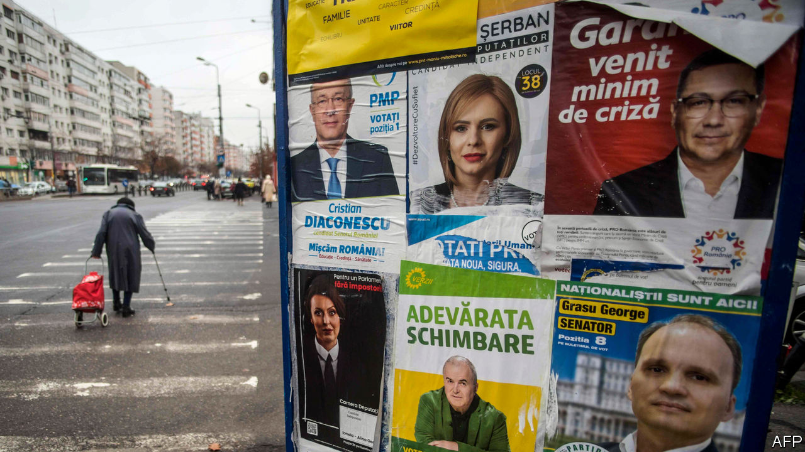

###### Diluting the cleanser

# The next Romanian government’s weak mandate for fighting corruption 

##### The election result is unlikely to make the country any cleaner 

 

> Dec 12th 2020 


CORRUPTION IS THE biggest political issue across most of eastern Europe, and Romania is no exception. In recent years the streets of Bucharest, its capital, have filled with huge demonstrations against crooked officials and their attempts to weaken the rule of law. Yet on December 6th, when it was time to vote, the city was eerily quiet. Just 32% of eligible voters cast a ballot in the general election, the lowest turnout since the fall of the communist regime in 1989. Some blamed covid-19, others lacklustre politicians and their almost non-existent campaign. It was a sadly missed chance to elect a government with a strong mandate to tackle graft.


Many had expected the election to bring stability, after years of brief, scandal-plagued governments. Instead it offered more uncertainty. The opposition Social Democratic Party (PSD), a centre-left outfit that promises to raise welfare benefits, got an unexpectedly high 29% of the vote. The ruling centre-right National Liberal Party (PNL) got only 25% and USR-PLUS, an alliance of anti-corruption parties, won 15%—both scoring well below what pollsters had bet on. “There is no clear winner,” said Klaus Iohannis, Romania’s president. 


To be sure, there was a clear loser. The National Liberals’ Ludovic Orban, the prime minister, quickly resigned. But his party looks set to stay in power. Though the PSD won, it remains discredited by a recent stint in government and lacks allies, so PNL is likely to form a coalition with USR-PLUS and one other party. Negotiations will probably be quick, says Radu Magdin, a political consultant. But any talk of a strong mandate is gone. Whoever takes over as the PNL’s new leader will, astonishingly, be the country’s seventh prime minister since 2015.


The previous election four years ago brought in a PSD-led government that spent much of its time trying to weaken various laws in order to keep its then leader, Liviu Dragnea, out of prison: he was on trial for abuse of power. Hundreds of thousands of Romanians took to the streets, worried lest the country follow the anti-democratic path blazed by Hungary and Poland. Ultimately Mr Dragnea was jailed, and his PSD was ousted in a no-confidence vote in October last year.


Many then expected the National Liberals to enjoy a period of strength. But the pandemic cost them support. The government imposed a strict lockdown that nonetheless failed to contain the virus. Romania’s health system, crippled by the emigration of staff to higher-paying jobs in western Europe, has struggled to cope. On November 14th a fire at a hospital in the city of Piatra Neamt killed 15 covid-19 patients.


The anti-corruption activists of USR-PLUS had high hopes after recent local successes. In September the candidate they backed defeated a PSD mayor of Bucharest who was often accused of cronyism. But they ran a poor campaign for parliament, and hopes that their voters would be unusually dedicated were dashed. The PSD has an advantage when turnout is low, says Veronica Anghel, a political scientist: its party machine of local officials can still get out the vote.


The biggest surprise was the Alliance for Romanian Unity (AUR), a new ultra-nationalist party. No one expected it to clear the 5% threshold to get into parliament. It took 9%. Its platform mixes religious patriotism with a call to annex neighbouring Moldova and “a hodgepodge of conspiracy theories”, says Cristian Norocel of Lund University, an expert on Europe’s far right. Many in the party were involved in a failed referendum in 2018 to outlaw gay marriage. For those hoping Romania would focus on fighting corruption and embedding European values, the election result was not auspicious. ■

