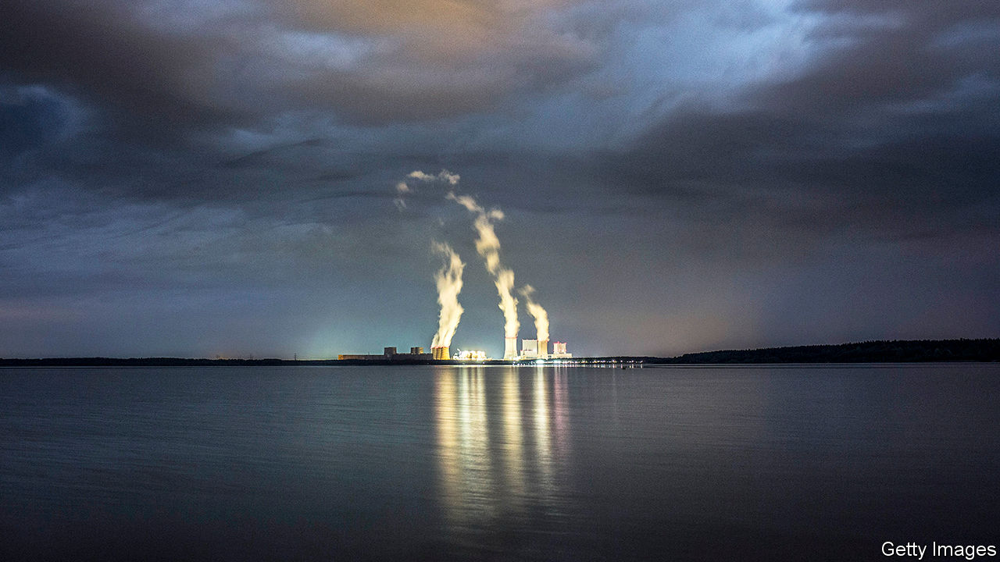

###### Counting the carbs

# Making sense of banks’ climate targets 

##### A lack of data and differing methodologies will make measuring performance fiendishly tricky 

 

> Dec 12th 2020 


FINANCIAL FIRMS produce very few greenhouse-gas emissions directly, aside from those associated with keeping the lights on and the computers whirring. But the picture changes dramatically when you add “financed emissions”, those associated with a firm’s lending and investing activities. Figures from the few banks and asset managers that disclose them suggest that financed emissions are 100 to 1,000 times bigger than operational ones.


Financed emissions are now coming under more scrutiny from climate-conscious clients and campaigners, and lenders are hoping to manage the associated reputational and regulatory risks. Green regulation, for instance, could damage the viability of an investment. On November 30th Barclays, a British bank, published plans for its net-zero target. Its goal will be to cut emissions from deals it arranges in the capital markets as well as on its loans.


In September Morgan Stanley announced it would reach net-zero financed emissions by 2050. In October similar pledges were made by HSBC and JPMorgan Chase, banks from Britain and America respectively. The Net-Zero Asset Owner Alliance, a group of 30 investors with $5trn of assets under management, recently set targets for its members. Advocates hope the targets will be met either by divesting dirty assets or pressing polluters to clean up their act. But matters will not be so simple.


For a start, assessing the emissions associated with a portfolio is fiendishly complex. Many methodologies have emerged, each with their own drawbacks. One approach tries to capture a portfolio’s carbon footprint. Here, the Partnership for Carbon Accounting Financials (PCAF) is the front-runner. But the lack of data is a problem; small firms rarely disclose emissions. HSBC says climate-related data are provided by only 12% of its loan portfolio.


As a result, PCAF users rely on sector averages to fill in the gaps. Double-counting is endemic. Take the emissions from an office block that has a mortgage and is let out. They could be counted by the mortgage lender, any firm financing the companies using the office or even a firm financing the city where the office is located.


Another complication is divvying up emissions between various investors. PCAF’s approach is to use enterprise value (equity plus debt) as a base. A bank lending $10m to a firm with an enterprise value of $100m would be responsible for a tenth of the firm’s emissions. But the value of an asset changes over time. If a company’s market value increases or if it takes on more debt, a lender’s share of the enterprise value would shrink. The lenders’ carbon footprint would fall through no action of its own. (PCAF says it is working on a fix.)


A second approach to gauging greenness is to see whether the portfolio is aligned with the Paris agreement, which aims to keep warming at less than 2°C above pre-industrial levels. The 2 Degrees Investing Initiative (2DII), a think-tank, looks at the assets and production of portfolio companies to work out if, say, a carmaker is building enough electric vehicles to meet the Paris goals. But many asset classes are not included.


A third approach assigns a temperature score to portfolios. This represents how much the Earth would heat up by 2100, if the carbon intensity of the global economy were the same as a given portfolio. Scientists think the Earth is on course for 3 to 4°C of warming above pre-industrial levels. Financial firms that have totted up their portfolio found a similar result.


The score depends heavily on the approach used, though. A study led by Julie Raynaud of McGill University in Canada looked at 12 different methods. Some of those included the emissions from a firm’s supply chain in their calculations, for instance, but others did not. Another difference was whether companies were assumed to hit their net-zero targets. These kinds of variations led to different results. When the same index of low-carbon companies was analysed by the 12 methods, they produced scores ranging from 1.5°C to 4°C—a huge difference, in climate terms.


One hope is that regulators will force more rigour. They are worried that climate change poses a systemic risk to the financial sector and are demanding more information on financed emissions. Calculating the carbon in a portfolio is part of climate stress-tests, which will soon be conducted in Britain, France and Australia. On November 27th the European Central Bank said it will follow suit. A push towards more climate-risk disclosure could eventually require financed emissions data to be published, too.


Even then, the climate impact of banks hitting their targets will be unclear. A study by 2DII found that the holdings of coal plants by Swiss financial institutions, as measured by generating capacity, fell by 20% between 2017 and 2020. Yet the coal firms found funding elsewhere. By 2020, the original cohort of firms in the 2017 portfolio had increased capacity by 50%. Banks with zero-carbon loan books will attract clients, but may not help the planet. ■


For more coverage of climate change, register for The Climate Issue, our fortnightly , or visit our 

