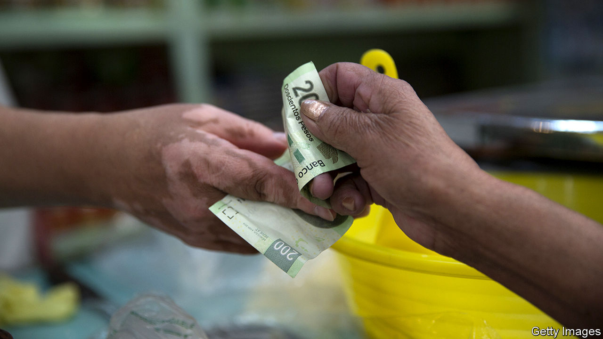

###### Mexico’s unbanked

# Mexicans lack access to credit 

##### Why the country lags other nations 

 

> Dec 12th 2020 


FOR MOST Mexicans online shopping goes like this: people order their goods on Amazon or Mercado Libre, an Argentine ecommerce site that is Latin America’s biggest, but pay in cash at a convenience store. That is no surprise given only 37% of Mexicans over 15 years old have a bank account, according to the World Bank. Some 86% of all payments in Mexico are in cash.


Mexico is an anomaly both in Latin America and among emerging-economy peers such as Kenya and India. In those places 54%, 82% and 80% of people are banked respectively, despite Mexico being richer. Its GDP per person is close to $20,400, around three to four times higher than in Kenya and India.


This shortfall is not just inconvenient. Counting cash adds to business costs, and those without accounts have little access to credit, slowing consumption and investment. The good news is that the country is improving financial inclusion, says Pablo Saavedra, who heads the World Bank’s Mexico programme. Only 27% of Mexicans had an account in 2011, but the pandemic has made the issue “even more urgent”, he says.


There are several reasons why so few Mexicans have access to financial services. Banks are generally conservative. Condusef, the financial watchdog, says bank fees in Mexico are high, with 30% of banks’ income coming from commissions. In rural areas, branches can be hard to reach. Furthermore, banks tend not to be interested in the less well-off: only a fifth of the poorest 20% of Mexicans have accounts. Surveys show many Mexicans do not trust banks. Meanwhile, almost 60% work in the informal sector, where they may receive an inconsistent income, in cash. The lack of access affects some more than others—the poor, rural, women and indigenous people.


Successive Mexican governments have tried to improve access to financial institutions. In 2018, a law was introduced to regulate the fintech industry, which is now booming. Under Andrés Manuel López Obrador (known as AMLO) CoDi, a digital payment system using QR codes and contactless payments was introduced in 2019 while financial literacy was included in the school curriculum in September 2020 (currently schooling is via television during the pandemic). Much still needs to be done to hit the government’s goal of 65% of Mexicans having an account by 2024.


Mexico has also missed a chance provided by the pandemic that other countries have seized. Euromoney, a financial publication, points out that by the end of June 2m people in Colombia had opened bank accounts, compared with 1.4m in all of 2019. Contrast that with Mexico, where the amount of cash in circulation was up by almost 24% in November compared with the year previously, which the Bank of Mexico attributes primarily to the pandemic. One reason for the difference is that Colombia has given handouts to the population, which must be deposited into a bank account, whereas AMLO has been far stingier with support during the crisis.


Newer firms in the private sector are now driving growth, with online-only and challenger banks seeing a rise in demand for their services. Norman Müller, the co-founder of Fondeadora, a challenger bank that received $14m from Alphabet’s venture arm, says of the 250,000 accounts that have been opened since it launched in June 2019, 40% were with people who were previously unbanked (the other 60% were “unhappily banked”, he says). He puts Fondeadora’s success down to an understanding that “our competitor is cash, not other banks” and making the platform as simple and transparent as possible. Since almost everyone owns a mobile phone, mobile money should grow, too.


The current low level of financial inclusion is likely to hamper Mexico’s economic recovery from covid-19, which has been muted by a failure to control the pandemic. For example, small and medium businesses provide 95% of Mexico’s private-sector employment but only 13% have access to formal credit. Under such circumstances “it is very hard to see how you have a strong recovery,” says Mr Saavedra.■

