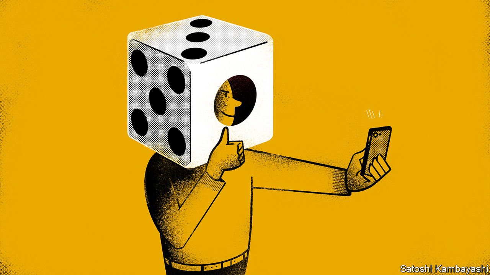

###### Buttonwood

# Retail investors often learn the wrong lessons from success 

##### A study of Indian IPOs suggest investors confuse luck with skill 

 

> Dec 10th 2020 


IT IS better to be lucky than good. This is the customary quip of poker players who owe success in a big pot to an improbable draw from the deck. In card games it is usually clear whom fortune has favoured. Not so in investing. The randomness of financial markets makes it hard to distinguish a good investor from a lucky one. It is especially hard for people to assess their own skills.


This long-understood problem has fresh resonance. In the spring no-cost brokerages that cater to small investors reported a surge in new accounts and in trading activity. Many of these newbie investors made money. “Learning from Noise”, a forthcoming paper in the Journal of Financial Economics by Santosh Anagol, Vimal Balasubramaniam and Tarun Ramadorai, sheds light on how these investors might misinterpret their success. Their study’s main finding is that retail investors who were randomly allocated shares in successful Indian IPOs view their good fortune as evidence of skill. There are dangers for new investors in misunderstanding the markets. But the bigger hazard might lie in misunderstanding themselves.


India is fertile ground for the study of retail investing. Its regulators require companies to set aside up to 35% of the shares issued in an IPO to small shareholders. Each IPO has a minimum allotment size. Where there is lots of interest from retail investors, there may not be enough small lots to go round. In such cases shares are allocated randomly by lottery. The “Learning from Noise” paper is based on a sample of 85 of the 240 IPOs that took place in India between March 2007 and March 2012. Of these, 54 were subject to lotteries. The study’s main focus is the randomly allocated IPOs that enjoyed a first-day increase in price—which is most of them.


IPO lotteries create a natural experiment. Some retail investors (the treatment group) get shares and some (the control group) do not. The two groups have similar characteristics. What separates them is sheer luck. Yet they subsequently behave very differently. The treatment group are more active in trading shares other than the allocated stock in the period after an IPO that enjoys a first-day “pop” in its price. Trading volume is 7.4 percentage points higher after two months than for the control group. The difference in trading activity fades over time but is still marked six months after the IPO.


Hyperactive trading by lottery winners cannot be put down to their skill at picking stocks. After all, lottery losers opt for the same IPO stocks, they pick the same winners, but they do not trade as actively. Lottery winners seem to draw something else from their involvement. Perhaps the lived experience of positive returns leads to naive extrapolation—the lesson learned being that stocks go up, so you should buy more of them. But lottery winners respond to good luck by churning their portfolios: they buy more stocks and they also sell more. Having ruled out other explanations the authors plump for the likeliest remaining one—that retail investors “misinterpret random gains and losses as signals about their own ability”. They misconstrue noise as information. They mistake luck for skill.


This seems to confirm much of the prevailing wisdom about retail investors—that they have a habit of over-trading to the detriment of their returns and this tendency is linked to over-confidence. It sits comfortably alongside the psychology literature, which says people often interpret results in ways that are favourable to their self-image. But there is a bit more to this study. Investors, it seems to suggest, might suffer from “under-confidence” as well as overconfidence.


Those in the treatment group who were allocated IPO stocks that went down in value on the first day’s trading subsequently traded less actively than the control group. They took bad luck as a sign of an absence of skill. The paper also casts light on how people learn about themselves. The best investors are often introspective, but many people reflect on themselves as an external observer would—by watching their own actions. You notice that you took part in a successful IPO. You then infer from this that you must be good at trading stocks.


There are stock traders who are genuinely good and not merely lucky. But the number of investors who can trade in and out of shares frequently and profitably is vanishingly small. The “Learning from Noise” study shows how easy it might be for you to convince yourself that you are one of them. But it is probably wise to assume that you are not.

