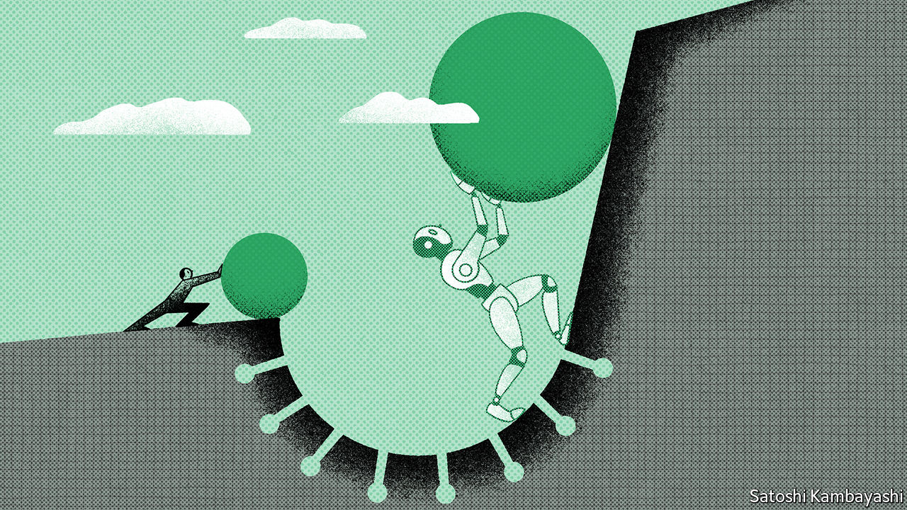
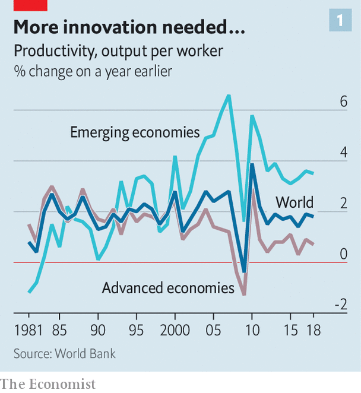
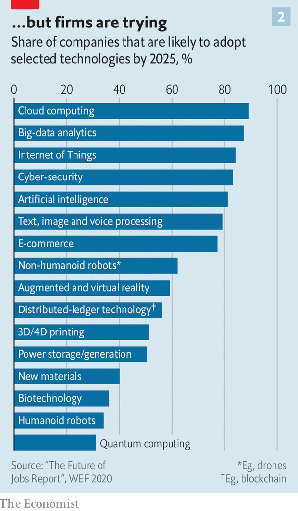

###### Reasons to be cheerful

# The pandemic could give way to an era of rapid productivity growth 

##### Businesses have adopted new processes and technologies—and there are signs that they may pay off 

 

> Dec 8th 2020 


THE PROSPECTS for a productivity resurgence may seem grim. After all, the past decade has featured plenty of technological fatalism: in 2013 Peter Thiel, a venture capitalist, mused of the technological advances of the moment that “we wanted flying cars, instead we got 140 characters”. Robert Gordon of Northwestern University has echoed this sentiment, speculating that humanity might never again invent something so transformative as the flush toilet. Throughout the decade, data largely supported the views of the pessimists.


What is more, some studies of past pandemics and analyses of the economic effects of this one suggest that covid-19 might make the productivity performance worse. According to research by the World Bank, countries struck by pandemic outbreaks in the 21st century (not including covid) experienced a marked decline in labour productivity of 9% after three years relative to unaffected countries.


And yet, stranger things have happened. The brutal years of the 1930s were followed by the most extraordinary economic boom in history. A generation ago economists had nearly abandoned hope of ever matching the post-war performance when a computer-powered productivity explosion took place. And today there are tantalising hints that the economic and social traumas of the first two decades of this century may soon give way to a new period of economic dynamism.


Productivity is the magic elixir of economic growth. Increases in the size of the labour force or the stock of capital can raise output, but the effect of such contributions diminishes unless better ways are found to make use of those resources. Productivity growth—wringing more output from available resources—is the ultimate source of long-run increases in incomes. It’s not everything, as Paul Krugman, a Nobel economics laureate, once noted, but in the long run it’s almost everything.


Economists know less about how to boost productivity than they would like, however. Increases in labour productivity (that is, more output per worker per hour) seem to follow improvements in educational levels, increases in investment (which raise the level of capital per worker), and adoption of new innovations. A rise in total factor productivity—or the efficiency with which an economy uses its productive inputs—may require the discovery of new ways of producing goods and services, or the reallocation of scarce resources from low-productivity firms and places to high-productivity ones.


Globally, productivity growth decelerated sharply in the 1970s from scorchingly high rates in the post-war decades. A burst of higher productivity growth in the rich world, led by America, unfolded from the mid-1990s into the early 2000s. Emerging markets, too, enjoyed rapid productivity growth in the decade prior to the global financial crisis, powered by high levels of investment and an expansion of trade which brought more sophisticated techniques and technologies to the developing-economy participants in global supply chains. Since the crisis, however, a broad-based and stubbornly persistent slowdown in productivity growth has set in (see chart 1). About 70% of the world’s economies have been affected, according to the World Bank.

 


Accounting for the slowdown is a fraught process. The World Bank reckons that slowing trade growth and fewer opportunities to adopt and adapt new technology from richer countries may have helped depress productivity advances in the emerging world. Across all economies, sluggish investment in the aftermath of the global financial crisis looks a culprit: a particular problem in places with ageing and shrinking workforces. Yet while these headwinds surely matter, the bigger question is why new technologies like improved robotics, cloud computing and artificial intelligence have not prompted more investment and higher productivity growth.


Broadly speaking, three hypotheses compete to explain these doldrums. One, voiced by the techno-pessimists, insists that for all the enthusiasm about world-changing technologies, recent innovations are simply not as transformative as the optimists insist. Though it is possible that this will turn out to be correct, continued technological progress makes it look ever less plausible as an explanation for the doldrums. AI may not have transformed the world economy at the dramatically disruptive pace some expected five to ten years ago, but it has become significantly, and in some cases startlingly, more capable. GPT-3, a language-prediction model developed by OpenAI, a research firm, has demonstrated a remarkable ability to carry on conversations, draft long texts and write code in surprisingly human-like fashion.


Though the potential of the web to support an economy in which the constraints of distance do not bind has long underwhelmed, cloud computing and video-conferencing proved their economic worth over the past year, enabling vast amounts of productive activity to continue with scarcely an interruption despite the shuttering of many offices. New technologies are clearly able to do more than has generally been asked of them in recent years.


That strengthens the case for a second explanation for slow productivity growth: chronically weak demand. In this view, expressed most vociferously by Larry Summers of Harvard University, governments’ inability to stoke enough spending constrains investment and growth. More public investment is needed to unlock the economy’s potential. Chronically low rates of interest and inflation, limp private investment and lacklustre wage growth since the turn of the millennium clearly indicate that demand has been inadequate for most of the past two decades. Whether this meaningfully undercuts productivity growth is difficult to say. But in the years before the pandemic, as unemployment fell and wage growth ticked up, American labour productivity growth appeared to be accelerating, from an annual increase of just 0.3% in 2016 to a rise of 1.7% in 2019: the fastest pace of growth since 2010.


But a third explanation provides the strongest case for optimism: it takes time to work out how to use new technologies effectively. AI is an example of what economists call a “general-purpose technology”, like electricity, which has the potential to boost productivity across many industries. But making best use of such technologies takes time and experimentation. This accumulation of know-how is really an investment in “intangible capital”.


Recent work by Erik Brynjolfsson and Daniel Rock, of MIT, and Chad Syverson, of the University of Chicago, argues that this pattern leads to a phenomenon they call the “productivity J-curve”. As new technologies are first adopted, firms shift resources towards investment in intangibles: developing new business processes. This shift in resources means that firm output suffers in a way that cannot be fully explained by shifts in the measured use of labour and tangible capital, and which is thus interpreted as a decline in productivity growth. Later, as intangible investments bear fruit, measured productivity surges because output rockets upward in a manner unexplained by measured inputs of labour and tangible capital.


Back in 2010, the failure to account for intangible investment in software made little difference to the productivity numbers, the authors reckon. But productivity has increasingly been understated; by the end of 2016, productivity growth was probably about 0.9 percentage points higher than official estimates suggested.


This pattern has occurred before. In 1987 Robert Solow, another Nobel prizewinner, remarked that computers could be seen everywhere except the productivity statistics. Nine years later American productivity growth began an acceleration which evoked the golden age of the 1950s and 1960s. These processes are not always sexy. In the late 1990s, the soaring share prices of internet startups hogged the headlines. The fillip to productivity growth had other sources, like improvements in manufacturing techniques, better inventory management and rationalisation of logistics and production processes made possible by the digitisation of firm records and the deployment of clever software.

 


The J-curve provides a way to reconcile tech optimism and adoption of new technologies with lousy productivity statistics. The role of intangible investments in unlocking the potential of new technologies may also mean that the pandemic, despite its economic damage, has made a productivity boom more likely to develop. Office closures have forced firms to invest in digitisation and automation, or to make better use of existing investments. Old analogue habits could no longer be tolerated. Though it will not show up in any economic statistics, in 2020 executives around the world invested in the organisational overhauls needed to make new technologies work effectively (see chart 2). Not all of these efforts will have led to productivity improvements. But as covid-19 recedes, the firms which did transform their activities will retain and build on their new ways of doing things.

The crisis forced change


Early evidence suggests that some transformations are very likely to stick, and that the pandemic quickened the pace of technology adoption. A survey of global firms conducted by the World Economic Forum this year found that more than 80% of employers intend to accelerate plans to digitise their processes and provide more opportunities for remote work, while 50% plan to accelerate automation of production tasks. About 43% expect changes like these to generate a net reduction in their workforces: a development which could pose labour-market challenges but which almost by definition implies improvements in productivity.


Harder to assess is the possibility that the movement of so much work into the cloud could have productivity-boosting effects for national economies or at the global level. High housing and property costs in rich, productive cities have locked firms and workers out of places where they might have done more with less resources. If tech workers can more easily contribute to top firms while living in affordable cities away from America’s coasts, say, then strict zoning rules in the bay area of California will become less of a bottleneck. Office space in San Francisco or London freed up by increases in remote work could be occupied by firms which really do need their workers to operate in close physical proximity. Beyond that, and politics permitting, the boost to distance education and telemedicine delivered by the pandemic could help drive a period of growth in services trade, and the achievement of economies of scale in sectors which have long proved resistant to productivity-boosting measures.


None of this can be taken for granted. Making the most of new private-sector investments in technology and know-how will require governments to engineer a rapid recovery in demand, to make complementary investments in public goods like broadband, and to focus on tackling the educational shortfalls so many students have suffered as a consequence of school closures. But the raw materials for a new productivity boom appear to be falling into place, in a way not seen for at least two decades. This year’s darkness may in fact mean that dawn is just over the horizon.■

