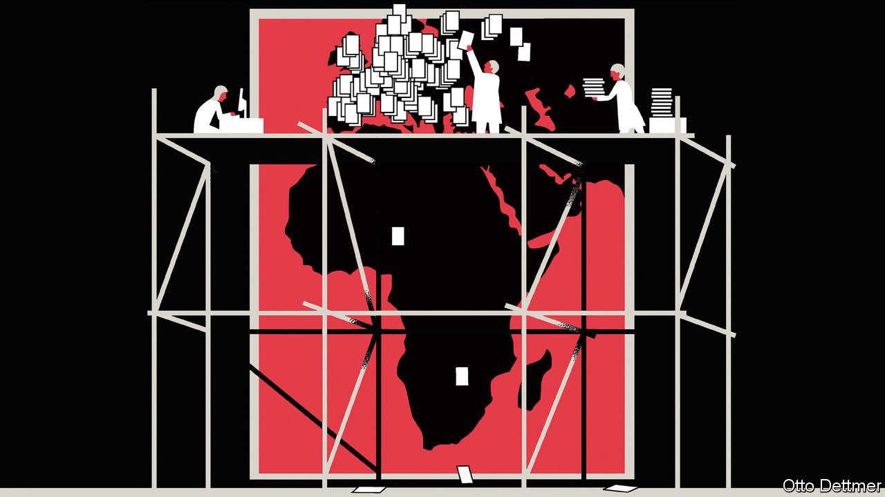

###### Free exchange

# Where economists focus their research 

##### They don’t always look in the right places 

 

> Dec 10th 2020 


AN OLD joke: a policeman sees an inebriated man searching for his keys under a lamp post and offers to help find them. After a few fruitless minutes, the officer asks the man whether he’s certain he dropped his keys at that particular location. No, says the man, he lost them in the park. Then why search here, asks the officer. The man answers: “Because that’s where the light is.” For years, the story has been used to illustrate the simple point, of great relevance to social scientists, that what you find depends on where you look. And for much of its history, economics has examined a very narrow set of countries. An analysis by The Economist of more than 900,000 papers published in economics journals (see ), finds that as recently as 1990, roughly two-thirds of published papers focused on the rich English-speaking countries: America, Australia, Britain, Canada and New Zealand.


A boom in the emerging world and a greater focus within economics on empirical work have broadened the reach of the lamplight. The share of papers mentioning countries in the Middle East, Africa, Asia or Latin America has risen from 17% in 1990 to 41% today. Yet many parts of the world, such as poor African countries, remain heavily under-studied. Even within regions, some places receive outsized attention. A recent survey of Africa by Obie Porteous of Middlebury College found that 65% of papers about African economies published in the leading five economics journals focus on just five: Kenya, South Africa, Ghana, Uganda, and Malawi. Some overlooked places might count that a blessing; attention from economists has not always been followed by economic success. But the more of the world that economists study, the better their guidance is likely to be. It is thus in everyone’s interest for the profession to continue to broaden its geographic reach.


Patterns of economic research are mostly explained by just a few factors. The size of a country’s economy is the most significant, accounting for nearly 80% of the variation in research attention, according to our analysis. The importance of economic output in shaping research choices has a certain logic. Developed, complex economies provide rich terrain for scholars to explore. If the lessons learned from large economies can be translated into better policy in those places, then such research stands to benefit more people than if scholars focused on minnows. (About half of humanity lives within the world’s ten largest economies.) The quality and availability of data matter too, though less than economic size, as does a country’s use of English. About 90% of the papers in our sample are written in English.


Professional incentives also play a role. An analysis by the World Bank of more than 76,000 empirical papers published between 1985 and 2004 found that top-five economics journals published about 6.5% of all papers written about America over that span, compared with just 1.5% of papers about other nations. Top economists are more likely to write about America. And even if you adjust for the prestige of the authors’ institutions it does not entirely eliminate the gap.


Do countries which receive less attention necessarily suffer as a consequence? The recent increase in developing-world research has not been an unalloyed good. It has been driven, in part, by the rise of the randomised controlled trial—in which scholars randomly assign participants to different groups, only some of which receive a “treatment” (like a microloan or access to education). Well-constructed experiments can provide valuable guidance on how best to alleviate the worst harms of poverty. Yet critics argue that such trials provide little information about how to generate sustained economic development. They also raise ethical questions: regarding whether desperate people and governments can truly give informed consent, for example. As Angus Deaton, a Nobel laureate, noted in 2019, such experiments are nearly always conducted “by better-heeled, better-educated and paler people on lower income, less-educated and darker people”, creating a persistent risk of exploitation.


However, countries dogged by poor policy stand to benefit most from rigorous examinations of how bad policies fail. According to The Economist’s analysis, regional success stories, like Chile or the Czech Republic, receive far more attention than you would expect given their underlying characteristics relative to failing places in the same regions, like Venezuela or Belarus. Reform-minded governments in understudied places, should they come to power, could be hamstrung by a dearth of quality research, outlining how past missteps contributed to present penury. Research biases could also mean that too little light is shone on the failures of interventions by institutions like the IMF which may have exacerbated the problems of struggling countries.

Attention, please


Indeed, another reason for economists to spend more time on under-examined places is that a broadening of horizons would improve the profession itself, and thus enable economists to serve governments better. There are too many unanswered questions in economics for some corners of humanity to receive so little attention. The 70 least-studied countries account for just 1% of all mentions in economics papers over the past three decades.


And while the profession’s increasing focus on empirical work is welcome, concentrating research within the cone of light that data provide means that some questions are asked much more often than others: in particular, those which can be answered with statistical analysis. An effort to pay more attention to the places least able to provide high-quality data, which often face the toughest roads to development, would force economists to grapple with qualitative matters. If critical contributions to development come from difficult-to-quantify variations in cultural factors, a geographically limited discipline will find it hard to detect them. And both the world and the profession will be poorer for it.■

