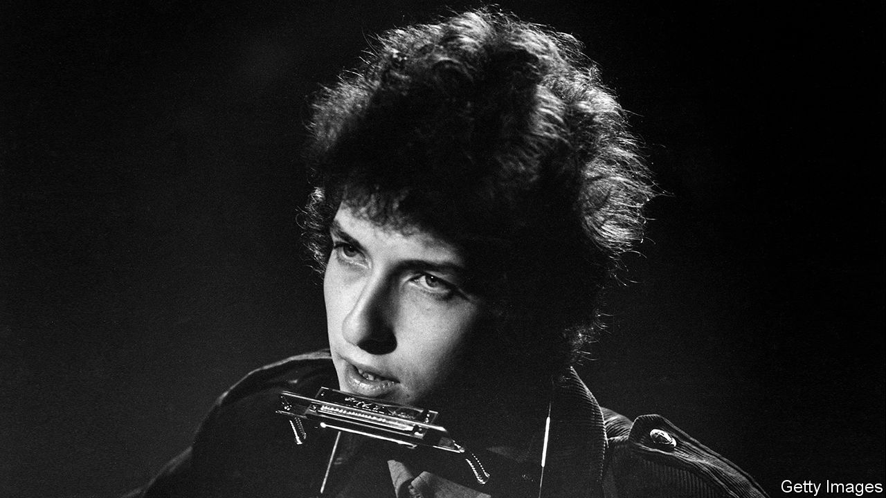

###### Knock-knock-knockin’ on Jody’s door

# A song for Dylan’s deal with Universal 

##### Selling your catalogue makes sound commercial sense. But it may not always fit the brand 

 

> Dec 12th 2020 


THIS WEEK Bob Dylan sold his song catalogue to Universal Music Publishing Group. Mr Dylan, like other musicians, has not been able to tour during the pandemic. Cashing in now will spare him the bureaucracy of future tax payments. Universal’s chief executive, Jody Gerson, has not disclosed how much the group paid. Mr Dylan has put his thoughts about the deal into ballad-form. It came into our hands thanks to a Mr Tambourine Man.


©Universal Music Publishing Group■

