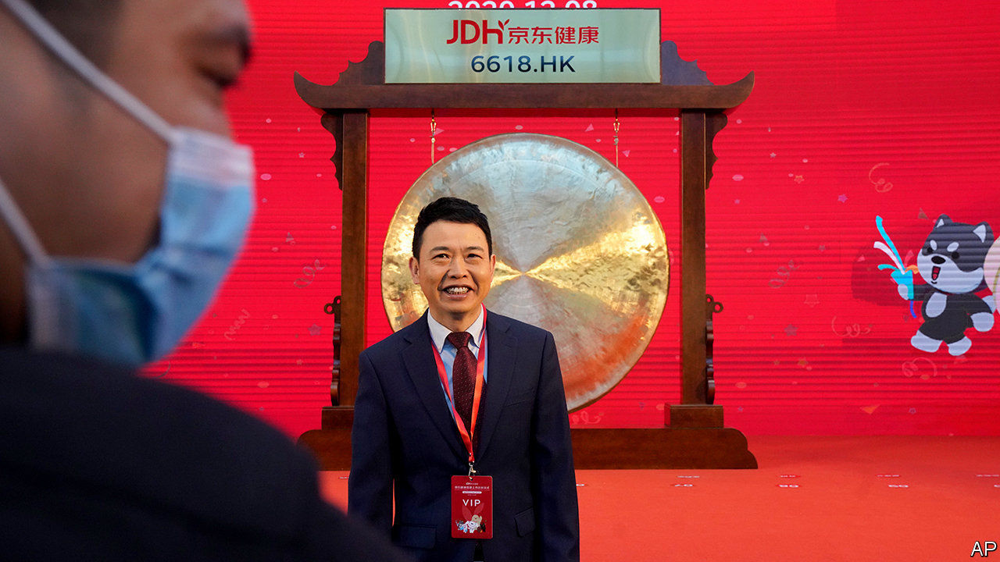

###### Public markets

# Will the IPO bonanza last? 

##### From Airbnb to Tesla, 2020 will be a bumper year for capital-raising 

 

> Dec 12th 2020 


FOR OVER a decade many people in finance have worried about the decline of the public company. Big firms were shrinking their capital bases by buying back shares. And fast-growing firms, including several hundred tech “unicorns”—startups worth over $1bn—chose to remain in private hands rather than bother with an initial public offering (IPO). The result was riskier corporate balance-sheets and the exclusion of ordinary investors from the ownership of the economy’s most exciting firms.


This year has seen a reversal of this trend with an equity-raising bonanza (see ). In the past few days Tesla has said it will sell $5bn of new shares, while DoorDash, a food-delivery company, raised $3.4bn in an IPO. In Hong Kong shares of JD Health, a digital-medicine star, rose by over 50% on their first day of trading after its $3.5bn IPO. As we went to press Airbnb, one of the largest unicorns, was listing at a valuation of over $40bn. Worldwide, some $800bn of equity has been raised in 2020 by non-financial firms, the highest sum on record. In America in the last quarter the proceeds should roughly match the amount of shares that companies have bought back.


Equity is more expensive than borrowing, but has attractions. It is permanent capital that does not need to be repaid. And because it does not come with interest payments it is flexible, making firms more resilient. It is back in fashion for several reasons. Some firms need to repair the damage from the pandemic, for example Rolls-Royce, an aircraft-engine maker, and Carnival Cruises. The tech boom means unicorns can go public at sky-high valuations. Frothy share prices allow the founders of firms that are already listed to raise capital without diluting their own stake by as much—something Tesla’s Elon Musk has spotted.


There are other factors, too. More Chinese firms are coming of age. This year Nongfu Spring, China’s answer to Evian, floated, making its founder the country’s richest man. Investors are experimenting with legal structures that they think are more efficient than IPOs, including SPACs (special purpose acquisition companies). Finally, because covid-19 has led many firms to cut their buybacks there is less equity being retired than normal.


Investors are euphoric but they face several risks. One is that prices are too high. Another is that it is not yet clear whether overall corporate indebtedness will fall, partly because the damage from lockdowns is still mounting. For non-financial companies in America’s S&amp;P 500 index, net debt (debt less cash), dropped only slightly in the third quarter of this year, and remains above its level in 2019. Some firms are still burning cash and perhaps a fifth of S&amp;P 500 firms are overborrowed. As the pandemic abates, firms may reinstate buybacks and dividends.


The last danger stems from a cohort of firms having too much cash. In the 1970s Michael Jensen, a scholar, argued that debt forced discipline on managers. His ideas were taken too far by Wall Street’s junk-bond salesmen, but the risk of executives wasting cash on deals or vanity projects is real. The five biggest tech firms have over $550bn sitting around. They might try big takeovers—think of Apple buying Netflix. Meanwhile, some newly listed firms have oodles of cash, but give outside investors only limited voting power, making managers unaccountable.


Governments should welcome the equity boom. For years libertarians have argued that the only way to revive IPOs is by watering down corporate-governance rules. They have been proved wrong. Many politicians long to ban buybacks, which they accuse of all sorts of evils (in fact they are similar to dividends but more flexible, which came in handy this year). If politicians really want to sustain healthy equity markets, they should instead reform tax codes, which almost everywhere favour debt by making interest costs tax-deductible. Removing the tax break for debt and putting equity on a level playing field should be the priority. It has the added advantage that the proceeds should help governments repay their own colossal debts.■

