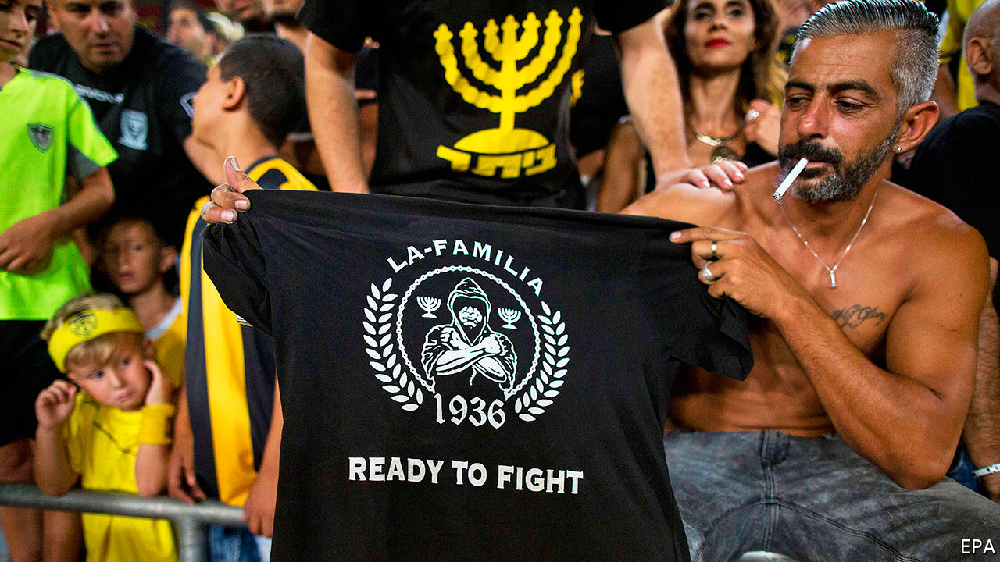

###### A shock result

# Beitar Jerusalem, the most racist football club in Israel... 

##### ...gets an Arab owner 

 

> Dec 10th 2020 


MATCH DAY at Teddy stadium, home of Beitar Jerusalem, can get pretty nasty. Supporters of the football club proudly sing about how it is “the most racist team” in Israel. They scream epithets, such as “terrorist”, at the Arabs who play for opposing squads. Though Arabs make up 21% of Israel’s population, Beitar Jerusalem has never itself fielded one, in keeping with fans’ claim to be “forever pure”. After the club signed two Muslim players from Chechnya in 2013, a group of fans burned down its offices. When one of the Chechens scored his first goal, many Beitar supporters walked out of the stadium. The players soon moved on.


But on December 7th the Holy Land received proof that God has a sense of irony, as Sheikh Hamad bin Khalifa al-Nahyan purchased a 50% stake in Beitar Jerusalem. Sheikh Hamad is an Arab Muslim. He is also a cousin of Muhammad bin Zayed, the crown prince and de facto ruler of the United Arab Emirates (UAE), which formally normalised diplomatic and other relations with Israel in September.


Some of Beitar Jerusalem’s fans have protested against the deal, spray-painting on the stadium’s walls that “the war has just begun”. But their collective attitude had already been changing. A documentary called “Forever Pure”, released in 2016, shone a spotlight on the club’s more despicable supporters and caused shame among the rest. Moshe Hogeg, who bought the club in 2018 and remains a co-owner, pressed fans to change their racist lyrics. Most seem elated with Sheikh Hamad’s promise to invest $100m over the next decade in the club, which hasn’t won the league since 2008.


It helps that Israel’s warmer ties with the Arab world are seen as the personal achievement of Binyamin Netanyahu, the prime minister and leader of the Likud party. Beitar Jerusalem was founded in 1936 by the youth wing of the Zionist-Revisionist movement, from which Likud descends. The club remains a bastion of working-class Mizrahi Jews, who emigrated to Israel from Arab lands. Encouraged by Mr Netanyahu, they tend to resent the old Ashkenazi elite that calls for compromise with the Palestinians. Likud bigwigs can often be seen glad-handing at Teddy stadium. Mr Netanyahu himself claims to be a lifelong supporter of Beitar Jerusalem.


That is perhaps one reason for Sheikh Hamad’s purchase: it is an investment by the ruling family of Abu Dhabi in Israel’s ruling party and its supporters. Mr Hogeg, a Jew of Moroccan and Tunisian descent, hopes it will also lead to more change. Eventually he would like to field Arab players. For now, though, he is relying on Jewish help. Before signing the deal he obtained the blessing of an Israeli ultraOrthodox rabbi. ■

